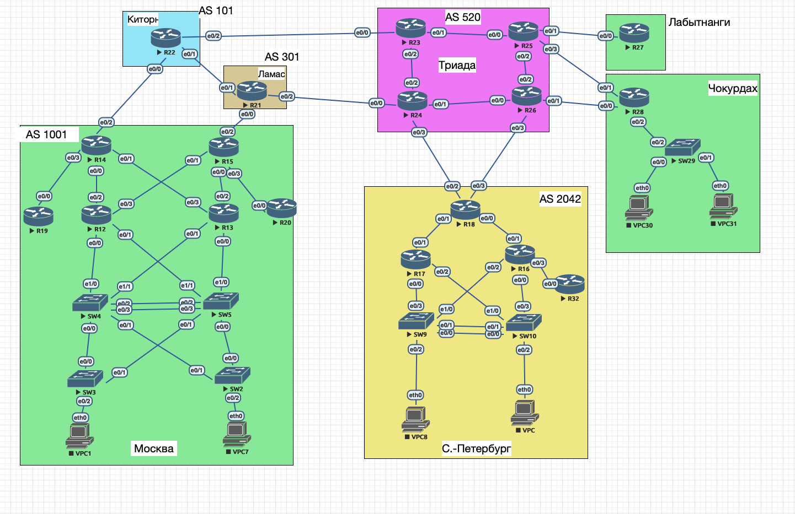

# Настройка сети

## Цель рассмотреть различные сетевые топологии и архитектуры. Изучить виды топологий для кампусных сетей и сетей цодов. Произвести первоначальную настройку сети



Для перлвоначальной насьтройки необходимо составить план адресации


## Адресный план между сетевым оборудованием

| № | Линия (название сетевого оборудования)| Адрес первого узла | Адрес второго узла |
|---:|---|---|---|
| 1 | R14 e0/2 — R22 e0/0 | 10.0.0.1/29 | 10.0.0.2/29 |
| 2 | R14 e0/3 — R19 e0/0 | 10.0.1.1/29 | 10.0.1.2/29 |
| 3 | R14 e0/1 — R13 e0/3 | 10.0.2.1/29 | 10.0.2.2/29 |
| 4 | R14 e0/0 — R12 e0/2 | 10.0.3.1/29 | 10.0.3.2/29 |
| 5 | R12 e0/3 — R15 e0/1 | 10.0.4.1/29 | 10.0.4.2/29 |
| 6 | R13 e0/2 — R15 e0/0 | 10.0.5.1/29 | 10.0.5.2/29 |
| 7 | R13 e0/0 — R20 e0/0 | 10.0.6.1/29 | 10.0.6.2/29 |
| 8 | R12 e0/1 — SW5 e1/1 | 10.0.7.1/29 | 10.0.7.2/29 |
| 9 | R13 e0/1 — SW4 e1/1 | 10.0.8.1/29 | 10.0.8.2/29 |
| 10 | R12 e0/0 — SW4 e1/0 | 10.0.9.1/29 | 10.0.9.2/29 |
| 11 | R13 e1/0 — SW5 e1/0 | 10.0.10.1/29 | 10.0.10.2/29 |
| 12 | SW4 e0/0 — SW3 e0/0 | 10.0.11.1/29 | 10.0.11.2/29 |
| 13 | SW4 e0/1 — SW2 e0/1 | 10.0.12.1/29 | 10.0.12.2/29 |
| 14 | SW5 e0/1 — SW3 e0/1 | 10.0.13.1/29 | 10.0.13.2/29 |
| 15 | SW5 e0/0 — SW2 e0/0 | 10.0.14.1/29 | 10.0.14.2/29 |
| 16 | R15 e0/2 — R21 e0/1 | 10.0.15.1/29 | 10.0.15.2/29 |
| 17 | R21 e0/2 — R24 e0/0 | 10.0.16.1/29 | 10.0.16.2/29 |
| 18 | R22 e0/2 — R23 e0/0 | 10.0.17.1/29 | 10.0.17.2/29 |
| 19 | R23 e0/1 — R25 e0/0 | 10.0.18.1/29 | 10.0.18.2/29 |
| 20 | R23 e0/2 — R24 e0/2 | 10.0.19.1/29 | 10.0.19.2/29 |
| 21 | R24 e0/1 — R26 e0/0 | 10.0.20.1/29 | 10.0.20.2/29 |
| 22 | R25 e0/2 — R26 e0/2 | 10.0.21.1/29 | 10.0.21.2/29 |
| 23 | R25 e0/3 — R27 e0/0 | 10.0.22.1/29 | 10.0.22.2/29 |
| 24 | R26 e0/1 — R28 e0/0 | 10.0.23.1/29 | 10.0.23.2/29 |
| 25 | R24 e0/3 — R18 e0/2 | 10.0.24.1/29 | 10.0.24.2/29 |
| 26 | R26 e0/3 — R18 e0/3 | 10.0.25.1/29 | 10.0.25.2/29 |
| 27 | R18 e0/1 — R17 e0/1 | 10.0.26.1/29 | 10.0.26.2/29 |
| 28 | R18 e0/0 — R16 e0/1 | 10.0.27.1/29 | 10.0.27.2/29 |
| 29 | R17 e0/3 — SW9 e1/0 | 10.0.28.1/29 | 10.0.28.2/29 |
| 30 | R17 e0/2 — SW10 e1/0 | 10.0.29.1/29 | 10.0.29.2/29 |
| 31 | R16 e0/2 — SW9 e1/1 | 10.0.30.1/29 | 10.0.30.2/29 |
| 32 | R16 e0/3 — SW10 e1/1 | 10.0.31.1/29 | 10.0.31.2/29 |
| 33 | SW9 e0/0 — SW10 e0/0 | 10.0.32.1/29 | 10.0.32.2/29 |
| 34 | R16 e0/0 — R32 e0/0 | 10.0.33.1/29 | 10.0.33.2/29 |
| 35 | R28 e0/2 — SW29 e0/2 | 10.0.34.1/29 | 10.0.34.2/29 |
| 36 | SW4 e0/3 — SW5 e0/3 | 10.0.35.1/29 | 10.0.35.2/29 |


Кое-где адресацию могу упустить, но если что в процессе работы буду добавлять по такому же принципу

## Клиентская адресация

| Узел | Адрес / маска | Шлюз |
|---|---|---|
| PC1 (Москва) | 192.168.0.10/24 | 192.168.0.1 |
| PC7 (Москва) | 192.168.1.10/24 | 192.168.1.1 |
| VPC8 (С.-Петербург) | 192.168.2.10/24 | 192.168.2.1 |
| VPC1 (С.-Петербург) | 192.168.3.10/24 | 192.168.3.1 |
| VPC30 (Чокурдах) | 192.168.4.10/24 | 192.168.4.1 |
| VPC31 (Чокурдах) | 192.168.5.10/24 | 192.168.5.1 |


Далее необходимо прописать на всех узлах адреса согласно списку 


 

После чего проверяем сетевую связанность между узлами там где это необходимо. Но я лично после настройки каждой настройки проверяю сразу что бы по 10 раз не возвращаться в случае дебага


В целях экономии времени я не буду описывать настройку ip адреса на каждом узле.
После того как адреса на каждом сетевом узле будут настроены необходимо настроить сетевую связанность между ними, я решил использовать в данной топологии протокол osfp, для этого на каждом маршрутизаторе и L3 коммутаторах необходимо прописать:


```
en
conf t
router ospf 1
 network 10.0.0.0 0.0.255.255 area 0
 network 192.168.0.0 0.0.255.255 area 0
end
write memory
```
SW2–SW5, SW9, SW10, SW29 — L3-коммутаторы. Поэтому перед IP на межузловом порту используется no switchport.

А на каждом L3-коммутаторе:

```
ip routing
```

После чего проверяем таблицу маршрутов osfp


После того как все прописали проверяем сетевую связанность с "дальними узлами":


Так же для каждого сетевого узла неплохо было бы настроить баннер и задать логин и пароль для подключения по ssh протоколу для каждого сетевого утсройства, но в целях экономии времени и сокращения времени настройки оборудования не стал этого делать, к тому же эта тема ативно рассматривалась на курсах начального сетевого инженера. 


