# Организация сети офиса с двумя ЦОД

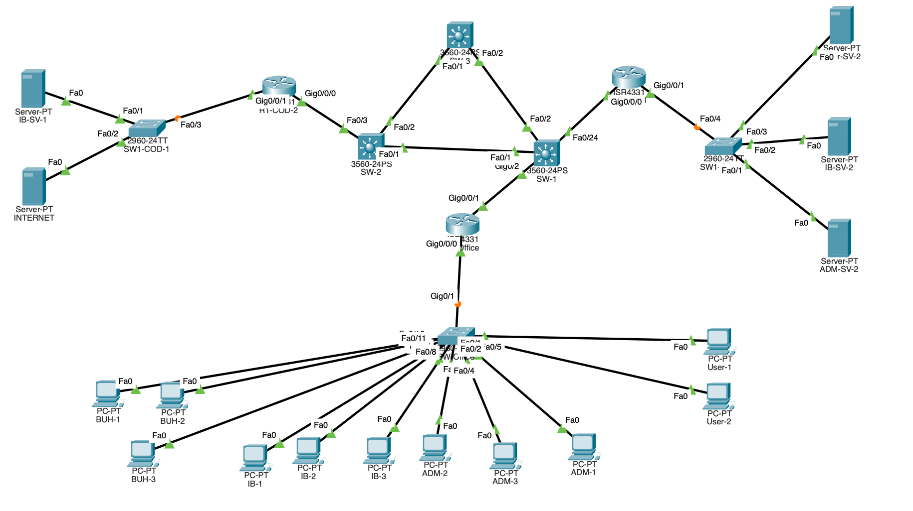

С целью реализации сети офиса с двумя ЦОД необходимо запланировать ip адресацию с разделением по VLAN, далее ниже приведена таблица подсетей с указанием VLAN. 
### VLAN и подсети
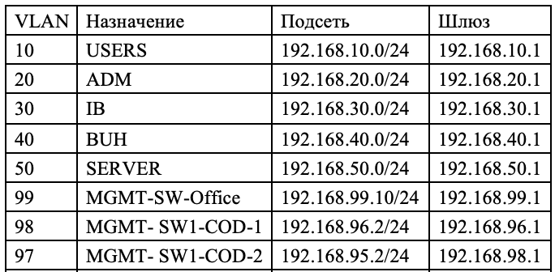

### Стыковочные сети между сетевыми оборудованиями (узлами)
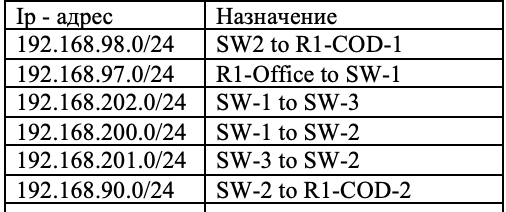
Далее необходимо назначить ip адреса для парка серверов. Ниже приведена таблица с адресацией по серверам.
### SERVER NETWORK
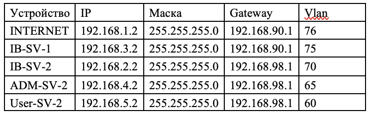

DNS можно указать 192.168.50.10, 8.8.8.8

### Пояснение:
ADM – отдел системных администраторов;
IB – отдел информационной безопасности (далее ИБ); 
BUH – бухгалтерия; 
SERVER – сеть для парка серверов;
MGMT – отдельная подсеть для администрирования; 
USERS – остальные пользователи или гостевая сеть.
INTERNET – сервер выхода в интернет, может выступать как сервер так и маршрутизатор;
IB-SV-1 – сервер отдела информационной безопасности в ЦОД – 2;
IB-SV-2 – сервер отдела информационной безопасности в ЦОД – 1;
ADM-SV-1 – сервер отдела системных администраторов;
User-SV-1 – сервер для остальных пользователей (или гостевых), который может служить для хранения временных файлом и иных сервисов компании;
«Config:» - конфигурация настроек;
«Ход выполнения настроек:» - процесс конфигурирования оборудования и хода выполнения работы.
Схема организации сети будет выглядеть следующем образом:

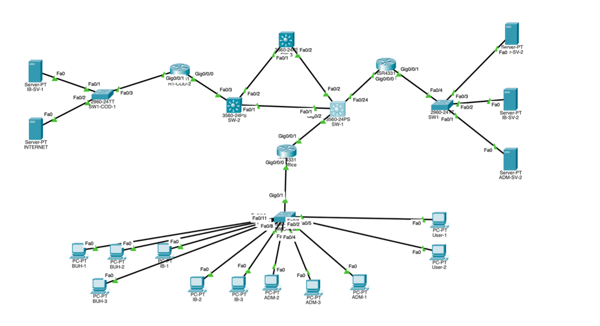


### Сеть должна отвечать следующим требованиям:

1. User 1 и User 2 должны иметь доступ только Server-PT INTERNET и Server-PT User-SV-1
2. ADM-1, ADM-2, ADM-3 должны иметь доступ ко всем системам кроме  IB-SV-1 (2)
3. IB-1, IB-2, IB-3 должны иметь доступ  только к IB-SV-1 (2)
4. На всех сетевых устройствах должен быть установлен логин - adm и пароль - gfhjkm и открыть доступ по ssh для ADM-1, ADM-2, ADM-3 для остальных доступ по ssh должен быть закрыт
5. На всех сетевых устройствах неиспользуемые порты должны быть выключены
6. Между свитчами SW-1, SW-2, SW-3, должен быть настроен протокол osfp
7. BUH-1, BUH-2 должны иметь доступ только на User-SV-1, а BUH-3 только на User-SV-1 и Server-INTERNET только протоколу 80
8. User-1, User-2 не должны иметь сетевого взаимодействия с BUH-1, BUH-2 и BUH-3 но ADM-1, ADM-2, ADM-3, IB-1, IB-2, IB-3 должны иметь сетевое взаимодействие с User-1, User-2, BUH-1, BUH-2 и BUH-3.
9. Роутер R1-Office - является dhcp сервером для User-1, User-2, ADM-1, ADM-2, ADM-3, IB-1, IB-2, IB-3, BUH-1, BUH-2, BUH-3

Первым делом необходимо настроить сеть офиса, назначить на коммутаторе  VLAN:


### Настройка SW Office
## Создание VLAN

## Config:
```
configure terminal
hostname SW-Office
vlan 10
name USERS
vlan 20
name ADM
vlan 30
name IB
vlan 40
name BUH
vlan 50
name SERVERS
vlan 99
name MGMT
```
## Ход выполнения настроек:
```
Switch(config)#host
Switch(config)#hostname SW-Office
SW-Office(config)#vla
SW-Office(config)#vlan 10
SW-Office(config-vlan)#na
SW-Office(config-vlan)#name USERS
SW-Office(config-vlan)#exit
SW-Office(config)#vla
SW-Office(config)#vlan 20
SW-Office(config-vlan)#na
SW-Office(config-vlan)#name ADM
SW-Office(config-vlan)#exit
SW-Office(config)#vla
SW-Office(config)#vlan 30
SW-Office(config-vlan)#name IB
SW-Office(config-vlan)#exit
SW-Office(config)#vla
SW-Office(config)#vlan 40
SW-Office(config-vlan)#BUH
^
% Invalid input detected at '^' marker.
SW-Office(config-vlan)#name BUH
SW-Office(config-vlan)#exit
SW-Office(config)#vlan 50
SW-Office(config-vlan)#name SERVERS
SW-Office(config-vlan)#exit
SW-Office(config)#vlan
SW-Office(config)#vlan 99
SW-Office(config-vlan)#name MGMT
SW-Office(config-vlan)#exit
SW-Office(config)#
```


### Назначение портов
## Config:
### USERS
```
interface range fa0/1-2
switchport mode access
switchport access vlan 10
spanning-tree portfast
```

## Ход выполнения настроек:
```
SW-Office#conf t
Enter configuration commands, one per line. End with CNTL/Z.
SW-Office(config)#int
SW-Office(config)#interface ra
SW-Office(config)#interface range fa0/1-2
SW-Office(config-if-range)#swi
SW-Office(config-if-range)#switchport mo
SW-Office(config-if-range)#switchport mode acc
SW-Office(config-if-range)#switchport mode access 
SW-Office(config-if-range)#swi
SW-Office(config-if-range)#switchport acc
SW-Office(config-if-range)#switchport access vlan 10
SW-Office(config-if-range)#sp
SW-Office(config-if-range)#spa
SW-Office(config-if-range)#spanning-tree po
SW-Office(config-if-range)#spanning-tree portfast 
%Warning: portfast should only be enabled on ports connected to a single
host. Connecting hubs, concentrators, switches, bridges, etc... to this
interface when portfast is enabled, can cause temporary bridging loops.
Use with CAUTION

%Portfast has been configured on FastEthernet0/1 but will only
have effect when the interface is in a non-trunking mode.
%Warning: portfast should only be enabled on ports connected to a single
host. Connecting hubs, concentrators, switches, bridges, etc... to this
interface when portfast is enabled, can cause temporary bridging loops.
Use with CAUTION

%Portfast has been configured on FastEthernet0/2 but will only
have effect when the interface is in a non-trunking mode.
```
## Config
### ADM
```
interface range fa0/3-5
switchport mode access
switchport access vlan 20
spanning-tree portfast
```
## Ход выполнения настроек:
```
SW-Office#conf t
Enter configuration commands, one per line. End with CNTL/Z.
SW-Office(config)#int
SW-Office(config)#interface ra
SW-Office(config)#interface range fa0/3-5
SW-Office(config-if-range)#swi
SW-Office(config-if-range)#switchport mo
SW-Office(config-if-range)#switchport mode acc
SW-Office(config-if-range)#switchport mode access 
SW-Office(config-if-range)#swi
SW-Office(config-if-range)#switchport acc
SW-Office(config-if-range)#switchport access vl
SW-Office(config-if-range)#switchport access vlan 20
SW-Office(config-if-range)#sp
SW-Office(config-if-range)#spa
SW-Office(config-if-range)#spanning-tree port
SW-Office(config-if-range)#spanning-tree portfast 
%Warning: portfast should only be enabled on ports connected to a single
host. Connecting hubs, concentrators, switches, bridges, etc... to this
interface when portfast is enabled, can cause temporary bridging loops.
Use with CAUTION

%Portfast has been configured on FastEthernet0/3 but will only
have effect when the interface is in a non-trunking mode.
%Warning: portfast should only be enabled on ports connected to a single
host. Connecting hubs, concentrators, switches, bridges, etc... to this
interface when portfast is enabled, can cause temporary bridging loops.
Use with CAUTION

%Portfast has been configured on FastEthernet0/4 but will only
have effect when the interface is in a non-trunking mode.
%Warning: portfast should only be enabled on ports connected to a single
host. Connecting hubs, concentrators, switches, bridges, etc... to this
interface when portfast is enabled, can cause temporary bridging loops.
Use with CAUTION

%Portfast has been configured on FastEthernet0/5 but will only
have effect when the interface is in a non-trunking mode.
```
## Config:
### IB

```
interface range fa0/6-8
switchport mode access
switchport access vlan 30
spanning-tree portfast
```
## Ход выполнения настроек:
```
SW-Office#
SW-Office#conf t
Enter configuration commands, one per line. End with CNTL/Z.
SW-Office(config)#int
SW-Office(config)#interface ra
SW-Office(config)#interface range fa0/6-8
SW-Office(config-if-range)#
SW-Office(config-if-range)#swi
SW-Office(config-if-range)#switchport mo
SW-Office(config-if-range)#switchport mode acc
SW-Office(config-if-range)#switchport mode access 
SW-Office(config-if-range)#swi
SW-Office(config-if-range)#switchport acc
SW-Office(config-if-range)#switchport access vl
SW-Office(config-if-range)#switchport access vlan 30
SW-Office(config-if-range)#spa
SW-Office(config-if-range)#spanning-tree po
SW-Office(config-if-range)#spanning-tree portfast 
%Warning: portfast should only be enabled on ports connected to a single
host. Connecting hubs, concentrators, switches, bridges, etc... to this
interface when portfast is enabled, can cause temporary bridging loops.
Use with CAUTION

%Portfast has been configured on FastEthernet0/6 but will only
have effect when the interface is in a non-trunking mode.
%Warning: portfast should only be enabled on ports connected to a single
host. Connecting hubs, concentrators, switches, bridges, etc... to this
interface when portfast is enabled, can cause temporary bridging loops.
Use with CAUTION

%Portfast has been configured on FastEthernet0/7 but will only
have effect when the interface is in a non-trunking mode.
%Warning: portfast should only be enabled on ports connected to a single
host. Connecting hubs, concentrators, switches, bridges, etc... to this
interface when portfast is enabled, can cause temporary bridging loops.
Use with CAUTION

%Portfast has been configured on FastEthernet0/8 but will only
have effect when the interface is in a non-trunking mode.
```
## Config:
## BUH
```
interface range fa0/9-11
switchport mode access
switchport access vlan 40
spanning-tree portfast

```
Ход выполнения настроек:

```
SW-Office(config)#int
SW-Office(config)#interface ra
SW-Office(config)#interface range fa0/9-11
SW-Office(config-if-range)#swi
SW-Office(config-if-range)#switchport m
SW-Office(config-if-range)#switchport mode acc
SW-Office(config-if-range)#switchport mode access 
SW-Office(config-if-range)#swi
SW-Office(config-if-range)#switchport acc
SW-Office(config-if-range)#switchport access vl
SW-Office(config-if-range)#switchport access vlan 40
SW-Office(config-if-range)#spa
SW-Office(config-if-range)#spanning-tree po
SW-Office(config-if-range)#spanning-tree portfast 
%Warning: portfast should only be enabled on ports connected to a single
host. Connecting hubs, concentrators, switches, bridges, etc... to this
interface when portfast is enabled, can cause temporary bridging loops.
Use with CAUTION

%Portfast has been configured on FastEthernet0/9 but will only
have effect when the interface is in a non-trunking mode.
%Warning: portfast should only be enabled on ports connected to a single
host. Connecting hubs, concentrators, switches, bridges, etc... to this
interface when portfast is enabled, can cause temporary bridging loops.
Use with CAUTION

%Portfast has been configured on FastEthernet0/10 but will only
have effect when the interface is in a non-trunking mode.
%Warning: portfast should only be enabled on ports connected to a single
host. Connecting hubs, concentrators, switches, bridges, etc... to this
interface when portfast is enabled, can cause temporary bridging loops.
Use with CAUTION

%Portfast has been configured on FastEthernet0/11 but will only
have effect when the interface is in a non-trunking mode.
SW-Office(config-if-range)#
```
## Транк к R1-Office
## Config:

```
interface giga0/24

switchport mode trunk
switchport trunk allowed vlan 10,20,30,40,50,99
```
Ход выполнения настроек:
```
SW-Office(config)#
SW-Office(config)#int
SW-Office(config)#interface giga0/1
SW-Office(config-if)#swi
SW-Office(config-if)#switchport tr
SW-Office(config-if)#switchport trunk ?
allowed Set allowed VLAN characteristics when interface is in trunking mode
native Set trunking native characteristics when interface is in trunking
mode
SW-Office(config-if)#switchport mode trunk 
SW-Office(config-if)#switchport trunk all
SW-Office(config-if)#switchport trunk allowed vl
SW-Office(config-if)#switchport trunk allowed vlan 10?
WORD 
SW-Office(config-if)#switchport trunk allowed vlan 10,20,30,40,50,99
SW-Office(config-if)#
```
## Management IP
## Config:
```
interface vlan 99
ip address 192.168.99.10 255.255.255.0
no shutdown
ip default-gateway 192.168.99.1
```

Ход выполнения настроек:
```
SW-Office#
SW-Office#conf t
Enter configuration commands, one per line. End with CNTL/Z.
SW-Office(config)#int
SW-Office(config)#interface vl
SW-Office(config)#interface vlan 99
SW-Office(config-if)#
%LINK-5-CHANGED: Interface Vlan99, changed state to up

SW-Office(config-if)#ip add
SW-Office(config-if)#ip address 192.168.99.10 255.255.255.0
SW-Office(config-if)#no shu
SW-Office(config-if)#no shutdown 
SW-Office(config-if)#ip de
SW-Office(config-if)#ip dee
SW-Office(config-if)#ip def
SW-Office(config-if)#exit
SW-Office(config)#ip def
SW-Office(config)#ip default-gateway 192.168.99.1
SW-Office(config)#exit
SW-Office#
```
## SSH 
## Config:
```
ip domain-name corp.local
crypto key generate rsa
1024

username adm privilege 15 secret gfhjkm

line vty 0 15
login local
transport input ssh
access-class 10 in

ip access-list standard 10
permit 192.168.20.0 0.0.0.255
```
Ход выполнения настроек:
```
SW-Office#
SW-Office#conf t
Enter configuration commands, one per line. End with CNTL/Z.
SW-Office(config)#ip do
SW-Office(config)#ip dom
SW-Office(config)#ip ?
access-list Named access-list
arp IP ARP global configuration
default-gateway Specify default gateway (if not routing IP)
dhcp Configure DHCP server and relay parameters
domain IP DNS Resolver
domain-lookup Enable IP Domain Name System hostname translation
domain-name Define the default domain name
ftp FTP configuration commands
host Add an entry to the ip hostname table
name-server Specify address of name server to use
scp Scp commands
ssh Configure ssh options
SW-Office(config)#ip domain-name corp.local
SW-Office(config)#cry
SW-Office(config)#crypto k
SW-Office(config)#crypto key get
SW-Office(config)#crypto key gen
SW-Office(config)#crypto key generate rsa
The name for the keys will be: SW-Office.corp.local
Choose the size of the key modulus in the range of 360 to 2048 for your
General Purpose Keys. Choosing a key modulus greater than 512 may take
a few minutes.

How many bits in the modulus [512]: 1024
% Generating 1024 bit RSA keys, keys will be non-exportable...[OK]

SW-Office(config)#user
*Mar 1 1:14:33.646: %SSH-5-ENABLED: SSH 1.99 has been enabled
SW-Office(config)#username adm pri
SW-Office(config)#username adm privilege 15 sec
SW-Office(config)#username adm privilege 15 secret gfhjkm
SW-Office(config)#lin
SW-Office(config)#line vty 0 15
SW-Office(config-line)#lo
SW-Office(config-line)#log
SW-Office(config-line)#login local
SW-Office(config-line)#tr
SW-Office(config-line)#transport in
SW-Office(config-line)#transport input ssh
SW-Office(config-line)#acc
SW-Office(config-line)#acce
SW-Office(config-line)#access-class 10 in
SW-Office(config-line)#exit
SW-Office(config)#ip acc
SW-Office(config)#ip access-list sta
SW-Office(config)#ip access-list standard 10
SW-Office(config-std-nacl)#rerm
SW-Office(config-std-nacl)#per
SW-Office(config-std-nacl)#permit 192.168.20.0 0.0.0.255
SW-Office(config-std-nacl)#exit
SW-Office(config)#do wr mem
Building configuration...
[OK]
SW-Office(config)#
```
## NTP SERVER
## Config:
```
ntp master 1

```
Ход выполнения настроек:
```
SW-Office(config)#nt
SW-Office(config)#ntp ma
SW-Office(config)#ntp master 1
SW-Office(config)#
```

## Отключение неиспользуемых портов
## Config:
```
interface range fa0/12-23,g0/1-2
shutdown
```
Ход выполнения настроек:

```
SW-Office(config)#
SW-Office(config)#int
SW-Office(config)#interface ra
SW-Office(config)#interface range fa0/12-23, g0/1-2
SW-Office(config-if-range)#shu
SW-Office(config-if-range)#shutdown 

%LINK-5-CHANGED: Interface FastEthernet0/12, changed state to administratively down

%LINK-5-CHANGED: Interface FastEthernet0/13, changed state to administratively down

%LINK-5-CHANGED: Interface FastEthernet0/14, changed state to administratively down

%LINK-5-CHANGED: Interface FastEthernet0/15, changed state to administratively down

%LINK-5-CHANGED: Interface FastEthernet0/16, changed state to administratively down

%LINK-5-CHANGED: Interface FastEthernet0/17, changed state to administratively down

%LINK-5-CHANGED: Interface FastEthernet0/18, changed state to administratively down

%LINK-5-CHANGED: Interface FastEthernet0/19, changed state to administratively down

%LINK-5-CHANGED: Interface FastEthernet0/20, changed state to administratively down

%LINK-5-CHANGED: Interface FastEthernet0/21, changed state to administratively down

%LINK-5-CHANGED: Interface FastEthernet0/22, changed state to administratively down

%LINK-5-CHANGED: Interface FastEthernet0/23, changed state to administratively down

%LINK-5-CHANGED: Interface GigabitEthernet0/1, changed state to administratively down

%LINK-5-CHANGED: Interface GigabitEthernet0/2, changed state to administratively down
SW-Office(config-if-range)#do wr mem
Building configuration...
[OK]
SW-Office(config-if-range)#
```
## Настройка R1-Office
## Config:
```
hostname R1-Office

ip domain-name corp.local
crypto key generate rsa
1024

username adm privilege 15 secret gfhjkm

line vty 0 15
login local
transport input ssh
access-class 10 in

ip access-list standard 10
permit 192.168.20.0 0.0.0.255
```
Ход выполнения настроек:
```
Router>en
Router#conf t
Enter configuration commands, one per line. End with CNTL/Z.
Router(config)#hos
Router(config)#hostname R1-Office
R1-Office(config)#cr
R1-Office(config)#ip do
R1-Office(config)#ip domain-name corp.local
R1-Office(config)#cry
R1-Office(config)#crypto k
R1-Office(config)#crypto key gen
R1-Office(config)#crypto key generate rsa
The name for the keys will be: R1-Office.corp.local
Choose the size of the key modulus in the range of 360 to 2048 for your
General Purpose Keys. Choosing a key modulus greater than 512 may take
a few minutes.

How many bits in the modulus [512]: 1024
% Generating 1024 bit RSA keys, keys will be non-exportable...[OK]

R1-Office(config)#usern
*Mar 1 2:5:36.163: %SSH-5-ENABLED: SSH 1.99 has been enabled
R1-Office(config)#username adm pri
R1-Office(config)#username adm privilege 15 se
R1-Office(config)#username adm privilege 15 secret gfhjkm
R1-Office(config)#lin
R1-Office(config)#line vty 0 15
R1-Office(config-line)#login local
R1-Office(config-line)#tra
R1-Office(config-line)#transport in
R1-Office(config-line)#transport input ssh
R1-Office(config-line)#acc
R1-Office(config-line)#acce
R1-Office(config-line)#access-class 10 in
R1-Office(config-line)#exit
R1-Office(config)#ip acc
R1-Office(config)#ip access-list sta
R1-Office(config)#ip access-list standard 10
R1-Office(config-std-nacl)#perm
R1-Office(config-std-nacl)#permit 192.168.20.0 0.0.0.255
R1-Office(config-std-nacl)#do wr mem
Building configuration...
[OK]
R1-Office(config-std-nacl)#
```

## Далее настраивам VLAN
```
interface g0/0/0
no shutdown

```
Ход выполнения
```
R1-Office(config)#int
R1-Office(config)#interface g0/0/0
R1-Office(config-if)#no shu
R1-Office(config-if)#no shutdown 

R1-Office(config-if)#
%LINK-5-CHANGED: Interface GigabitEthernet0/0/0, changed state to up

%LINEPROTO-5-UPDOWN: Line protocol on Interface GigabitEthernet0/0/0, changed state to up

R1-Office(config-if)#
```
### VLAN 10 USERS
```
interface g0/0/0.10
encapsulation dot1Q 10
ip address 192.168.10.1 255.255.255.0
```
Ход работы
```
R1-Office(config)#
R1-Office(config)#int
R1-Office(config)#interface g0/0/0.10
R1-Office(config-subif)#
%LINK-5-CHANGED: Interface GigabitEthernet0/0/0.10, changed state to up

%LINEPROTO-5-UPDOWN: Line protocol on Interface GigabitEthernet0/0/0.10, changed state to up

R1-Office(config-subif)#en
R1-Office(config-subif)#encapsulation do
R1-Office(config-subif)#encapsulation dot1Q 10
R1-Office(config-subif)#ipadd
R1-Office(config-subif)#ip add
R1-Office(config-subif)#ip address 192.168.10.1 255.255.255.0
R1-Office(config-subif)#exit
R1-Office(config)#
```
##  VLAN 20 ADM
```
interface g0/0/0.20
encapsulation dot1Q 20
ip address 192.168.20.1 255.255.255.0
```
```
R1-Office(config)#
R1-Office(config)#interface g0/0/0.20
R1-Office(config-subif)#encapsulation dot1Q 20
R1-Office(config-subif)#ip address 192.168.20.1 255.255.255.0
%LINK-5-CHANGED: Interface GigabitEthernet0/0/0.20, changed state to up

%LINEPROTO-5-UPDOWN: Line protocol on Interface GigabitEthernet0/0/0.20, changed state to up

R1-Office(config-subif)#
R1-Office(config-subif)#exit
R1-Office(config)#
```
## VLAN 30 IB
```
interface g0/0/0.30
encapsulation dot1Q 30
ip address 192.168.30.1 255.255.255.0
```
```
R1-Office(config)#
R1-Office(config)#interface g0/0/0.30
R1-Office(config-subif)#
R1-Office(config-subif)#encapsulation dot1Q 30
R1-Office(config-subif)#
R1-Office(config-subif)#ip address 192.168.30.1 255.255.255.0
R1-Office(config-subif)#
R1-Office(config-subif)#
%LINK-5-CHANGED: Interface GigabitEthernet0/0/0.30, changed state to up

%LINEPROTO-5-UPDOWN: Line protocol on Interface GigabitEthernet0/0/0.30, changed state to up

R1-Office(config-subif)#exit
R1-Office(config)#
```
## VLAN 40 BUH
```
interface g0/0/0.40
encapsulation dot1Q 40
ip address 192.168.40.1 255.255.255.0
```

```
R1-Office(config)#
R1-Office(config)#interface g0/0/0.40
R1-Office(config-subif)#
R1-Office(config-subif)#encapsulation dot1Q 40
R1-Office(config-subif)#
R1-Office(config-subif)#ip address 192.168.40.1 255.255.255.0
R1-Office(config-subif)#
R1-Office(config-subif)#
%LINK-5-CHANGED: Interface GigabitEthernet0/0/0.40, changed state to up

%LINEPROTO-5-UPDOWN: Line protocol on Interface GigabitEthernet0/0/0.40, changed state to up

R1-Office(config-subif)#exit
R1-Office(config)#
```
 
## DHCP
```
ip dhcp excluded-address 192.168.10.1 192.168.10.20
ip dhcp excluded-address 192.168.20.1 192.168.20.20
ip dhcp excluded-address 192.168.30.1 192.168.30.20
ip dhcp excluded-address 192.168.40.1 192.168.40.20
```


```
R1-Office(config)#ip dh
R1-Office(config)#ip dhcp ex
R1-Office(config)#ip dhcp excluded-address 192.168.10.1 192.168.10.20
R1-Office(config)#ip dhcp excluded-address 192.168.20.1 192.168.20.20
R1-Office(config)#
R1-Office(config)#ip dhcp excluded-address 192.168.30.1 192.168.30.20
R1-Office(config)#
R1-Office(config)#ip dhcp excluded-address 192.168.40.1 192.168.40.20
```
## USERS
```
ip dhcp pool USERS
network 192.168.10.0 255.255.255.0
default-router 192.168.10.1
dns-server 8.8.8.8
```
```
R1-Office(config)#
R1-Office(config)#ip dh
R1-Office(config)#ip dhcp poo
R1-Office(config)#ip dhcp pool USERS
R1-Office(dhcp-config)#net
R1-Office(dhcp-config)#network 192.168.10.0 255.255.255.0
R1-Office(dhcp-config)#def
R1-Office(dhcp-config)#default-router 192.168.10.1
R1-Office(dhcp-config)#dn
R1-Office(dhcp-config)#dns-server 192.168.50.10, 8.8.8.8
^
% Invalid input detected at '^' marker.
R1-Office(dhcp-config)#dns-server ?
A.B.C.D Set ip address of DNS server
R1-Office(dhcp-config)#dns-server 192.168.50.10
R1-Office(dhcp-config)#dns-server 192.168.50.10,8.8.8.8
^
% Invalid input detected at '^' marker.
R1-Office(dhcp-config)#dns-server 8.8.8.8
R1-Office(dhcp-config)#exit
R1-Office(config)#
```
## ADM
```
ip dhcp pool ADM
network 192.168.20.0 255.255.255.0
default-router 192.168.20.1
dns-server 8.8.8.8
```
```
R1-Office(config)#
R1-Office(config)#ip dhcp pool ADM
R1-Office(dhcp-config)#
R1-Office(dhcp-config)#network 192.168.20.0 255.255.255.0
R1-Office(dhcp-config)#
R1-Office(dhcp-config)#default-router 192.168.20.1
R1-Office(dhcp-config)#
R1-Office(dhcp-config)#dns-server 8.8.8.8
R1-Office(dhcp-config)#
R1-Office(dhcp-config)#exit
R1-Office(config)#
```
## IB
```
ip dhcp pool IB
network 192.168.30.0 255.255.255.0
default-router 192.168.30.1
dns-server 8.8.8.8
```
```
R1-Office(config)#
R1-Office(config)#ip dhcp pool IB
R1-Office(dhcp-config)#
R1-Office(dhcp-config)#network 192.168.30.0 255.255.255.0
R1-Office(dhcp-config)#
R1-Office(dhcp-config)#default-router 192.168.30.1
R1-Office(dhcp-config)#
R1-Office(dhcp-config)#dns-server 8.8.8.8
R1-Office(dhcp-config)#
R1-Office(dhcp-config)#exit
R1-Office(config)#
```
## BUH
```
ip dhcp pool BUH
network 192.168.40.0 255.255.255.0
default-router 192.168.40.1
dns-server 8.8.8.8
```
```
R1-Office(config)#
R1-Office(config)#ip dhcp pool BUH
R1-Office(dhcp-config)#
R1-Office(dhcp-config)#network 192.168.40.0 255.255.255.0
R1-Office(dhcp-config)#
R1-Office(dhcp-config)#default-router 192.168.40.1
R1-Office(dhcp-config)#
R1-Office(dhcp-config)#dns-server 8.8.8.8
R1-Office(dhcp-config)#
R1-Office(dhcp-config)#
R1-Office(dhcp-config)#exit
```
Для получения ip адреса по DHCP на клиентских компьютерах необходимо настроить получение сетевых настроек по протоколу DHCP:

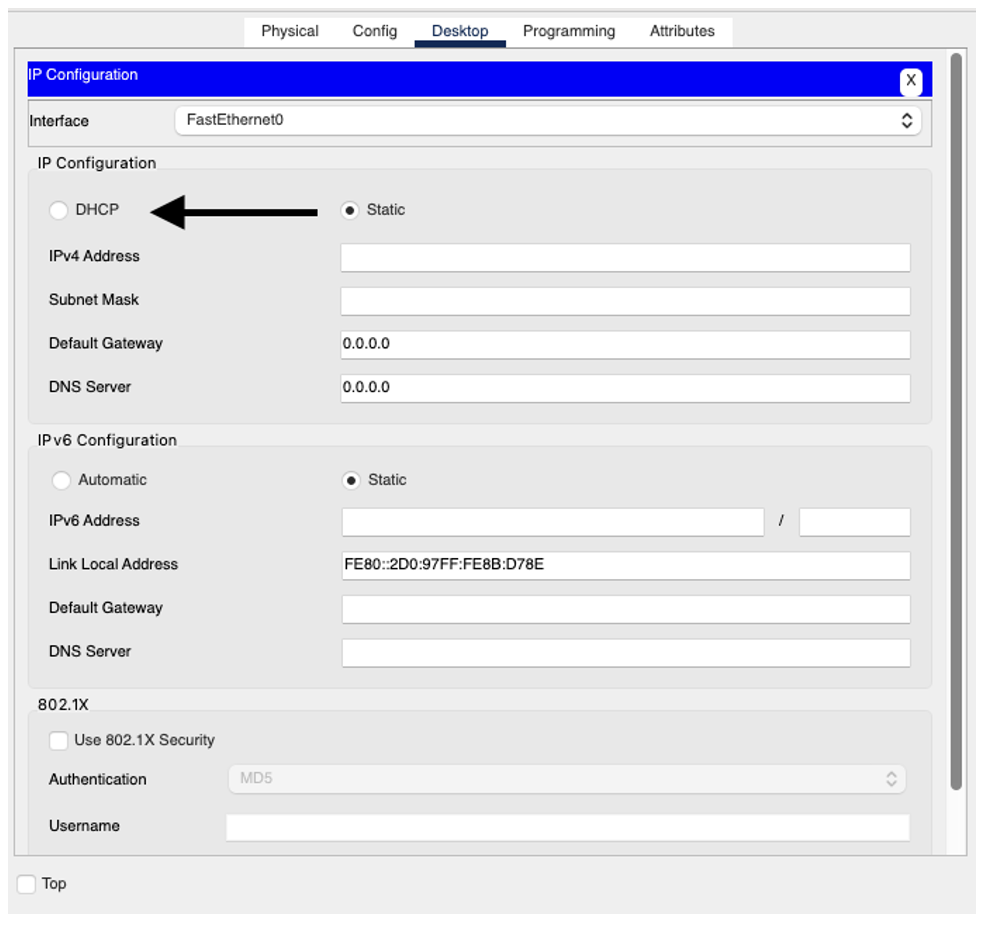

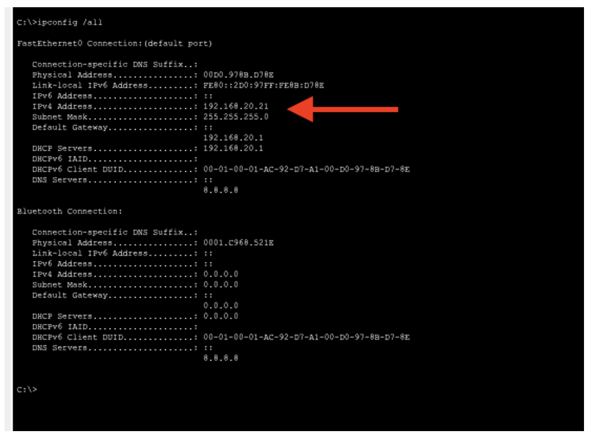

Так как в нашей схеме будет использоваться протокол OSPF, то можем настроить его на нашем R1-Office, такой подход упростит эксплуатацию сети и минимизирует ошибки в маршрутизации.

### OSPF
```
router ospf 1
router-id 10.10.10.10
log-adjacency-changes
network 192.168.98.0 0.0.0.255 area 0
network 192.168.99.0 0.0.0.255 area 0
network 192.168.97.0 0.0.0.255 area 0
network 192.168.10.0 0.0.0.255 area 0
network 192.168.20.0 0.0.0.255 area 0
network 192.168.30.0 0.0.0.255 area 0
network 192.168.40.0 0.0.0.255 area 0
```
```
R1-Office(config)#
R1-Office(config)#ntp server 192.168.99.10
R1-Office(config)#ntp server 192.168.99.11
R1-Office(config)#ntp server 192.168.99.12
R1-Office(config)#rou
R1-Office(config)#router os
R1-Office(config)#router ospf 1
R1-Office(config-router)#rou
R1-Office(config-router)#router-id 10.10.10.10
R1-Office(config-router)#net
R1-Office(config-router)#network 192.168.99.0 0.0.0.255 area 0
R1-Office(config-router)#exit
R1-Office(config)#
………
```
## Настройка SW1-COD-1
Config:

```
configure terminal
hostname SW1-COD-1
interface vlan 98
ip address 192.168.96.2 255.255.255.0
no shutdown
ip default-gateway 192.168.96.1
ip domain-name corp.local
crypto key generate rsa
1024
username adm privilege 15 secret gfhjkm
line vty 0 15
login local
transport input ssh
access-class 10 in
ip access-list standard 10
permit 192.168.20.0 0.0.0.255
ntp master 2
interface range fa0/3-24,g0/1-2
shutdown
```
Ход выполнения настроек:
```
Switch>
Switch>conf t
^
% Invalid input detected at '^' marker.
Switch>en
Switch#conf t
Enter configuration commands, one per line. End with CNTL/Z.
Switch(config)#host
Switch(config)#hostname SW1-COD-1
SW1-COD-1(config)#int
SW1-COD-1(config)#interface vla
SW1-COD-1(config)#interface vlan 98
SW1-COD-1(config-if)#ip add
SW1-COD-1(config-if)#ip address 192.168.96.2 255.255.255.0
SW1-COD-1(config-if)#no shu
SW1-COD-1(config-if)#no shutdown 
SW1-COD-1(config-if)#exit
SW1-COD-1(config)#ip def
SW1-COD-1(config)#ip default-gateway 192.168.96.1
SW1-COD-1(config)#ip dom
SW1-COD-1(config)#ip doma
SW1-COD-1(config)#ip doma
SW1-COD-1(config)#ip ?
access-list Named access-list
arp IP ARP global configuration
default-gateway Specify default gateway (if not routing IP)
dhcp Configure DHCP server and relay parameters
domain IP DNS Resolver
domain-lookup Enable IP Domain Name System hostname translation
domain-name Define the default domain name
ftp FTP configuration commands
host Add an entry to the ip hostname table
name-server Specify address of name server to use
scp Scp commands
ssh Configure ssh options
SW1-COD-1(config)#ip domain-name corp.local
SW1-COD-1(config)#cry
SW1-COD-1(config)#crypto k
SW1-COD-1(config)#crypto key gen
SW1-COD-1(config)#crypto key generate rsa
The name for the keys will be: SW1-COD-1.corp.local
Choose the size of the key modulus in the range of 360 to 2048 for your
General Purpose Keys. Choosing a key modulus greater than 512 may take
a few minutes.

How many bits in the modulus [512]: 1024
% Generating 1024 bit RSA keys, keys will be non-exportable...[OK]

SW1-COD-1(config)#use
*Mar 1 1:28:6.431: %SSH-5-ENABLED: SSH 1.99 has been enabled
SW1-COD-1(config)#username adm pri
SW1-COD-1(config)#username adm privilege 15 sec
SW1-COD-1(config)#username adm privilege 15 secret gfhjkm
SW1-COD-1(config)#li
SW1-COD-1(config)#line vt
SW1-COD-1(config)#line vty 0 15
SW1-COD-1(config-line)#login local
SW1-COD-1(config-line)#tra
SW1-COD-1(config-line)#transport in
SW1-COD-1(config-line)#transport input ssh
SW1-COD-1(config-line)#acc
SW1-COD-1(config-line)#acce
SW1-COD-1(config-line)#access-class 10 in
SW1-COD-1(config-line)#exit
SW1-COD-1(config)#ip acc
SW1-COD-1(config)#ip access-list sta
SW1-COD-1(config)#ip access-list standard 10
SW1-COD-1(config-std-nacl)#perm
SW1-COD-1(config-std-nacl)#permit 192.168.20.0 0.0.0.255
SW1-COD-1(config-std-nacl)#exit
SW1-COD-1(config)#ntp master 2
SW1-COD-1(config)#exit
SW1-COD-1#
%SYS-5-CONFIG_I: Configured from console by console

SW1-COD-1#int
SW1-COD-1#conf t
Enter configuration commands, one per line. End with CNTL/Z.
SW1-COD-1(config)#int
SW1-COD-1(config)#interface range fa0/3-24,g0/1-2
SW1-COD-1(config-if-range)#shu
SW1-COD-1(config-if-range)#shutdown 

%LINK-5-CHANGED: Interface FastEthernet0/3, changed state to administratively down

%LINK-5-CHANGED: Interface FastEthernet0/4, changed state to administratively down

%LINK-5-CHANGED: Interface FastEthernet0/5, changed state to administratively down

%LINK-5-CHANGED: Interface FastEthernet0/6, changed state to administratively down

%LINK-5-CHANGED: Interface FastEthernet0/7, changed state to administratively down

%LINK-5-CHANGED: Interface FastEthernet0/8, changed state to administratively down

%LINK-5-CHANGED: Interface FastEthernet0/9, changed state to administratively down

%LINK-5-CHANGED: Interface FastEthernet0/10, changed state to administratively down

%LINK-5-CHANGED: Interface FastEthernet0/11, changed state to administratively down

%LINK-5-CHANGED: Interface FastEthernet0/12, changed state to administratively down

%LINK-5-CHANGED: Interface FastEthernet0/13, changed state to administratively down

%LINK-5-CHANGED: Interface FastEthernet0/14, changed state to administratively down

%LINK-5-CHANGED: Interface FastEthernet0/15, changed state to administratively down

%LINK-5-CHANGED: Interface FastEthernet0/16, changed state to administratively down

%LINK-5-CHANGED: Interface FastEthernet0/17, changed state to administratively down

%LINK-5-CHANGED: Interface FastEthernet0/18, changed state to administratively down

%LINK-5-CHANGED: Interface FastEthernet0/19, changed state to administratively down

%LINK-5-CHANGED: Interface FastEthernet0/20, changed state to administratively down

%LINK-5-CHANGED: Interface FastEthernet0/21, changed state to administratively down

%LINK-5-CHANGED: Interface FastEthernet0/22, changed state to administratively down

%LINK-5-CHANGED: Interface FastEthernet0/23, changed state to administratively down

%LINK-5-CHANGED: Interface FastEthernet0/24, changed state to administratively down

%LINK-5-CHANGED: Interface GigabitEthernet0/1, changed state to administratively down

%LINK-5-CHANGED: Interface GigabitEthernet0/2, changed state to administratively down
SW1-COD-1(config-if-range)#do wr mem
Building configuration...
[OK]
SW1-COD-1(config-if-range)#exit
SW1-COD-1(config)#
SW1-COD-1(config)#interface vlan 99
SW1-COD-1(config-if)#no shu
SW1-COD-1(config-if)#no shutdown 
SW1-COD-1(config-if)#do wr mem
Building configuration...
[OK]
SW1-COD-1(config-if)#

```
Далее прописываем VLAN на порты к которым подключены сервера IB-SV-1 и INTERNET
```
interface FastEthernet0/1
switchport access vlan 75
switchport mode access
spanning-tree portfast

interface FastEthernet0/2
switchport access vlan 80
switchport mode access
spanning-tree portfast
```
Ход выполнения
```
SW1-COD-1#conf t
Enter configuration commands, one per line. End with CNTL/Z.
SW1-COD-1(config)#int
SW1-COD-1(config)#interface fas
SW1-COD-1(config)#interface fastEthernet 0/2
SW1-COD-1(config-if)#switchport mode access
SW1-COD-1(config-if)#switchport access vlan 80
SW1-COD-1(config-if)#spanning-tree portfast
%Warning: portfast should only be enabled on ports connected to a single
host. Connecting hubs, concentrators, switches, bridges, etc... to this
interface when portfast is enabled, can cause temporary bridging loops.
Use with CAUTION

%Portfast has been configured on FastEthernet0/2 but will only
have effect when the interface is in a non-trunking mode.
SW1-COD-1(config-if)#
SW1-COD-1#conf t
Enter configuration commands, one per line. End with CNTL/Z.
SW1-COD-1(config)#int
SW1-COD-1(config)#interface fas
SW1-COD-1(config)#interface fastEthernet 0/1
SW1-COD-1(config-if)#switchport mode access
SW1-COD-1(config-if)#switchport access vlan 75
SW1-COD-1(config-if)#spanning-tree portfast
%Warning: portfast should only be enabled on ports connected to a single
host. Connecting hubs, concentrators, switches, bridges, etc... to this
interface when portfast is enabled, can cause temporary bridging loops.
Use with CAUTION

%Portfast has been configured on FastEthernet0/1 but will only
have effect when the interface is in a non-trunking mode.
SW1-COD-1(config-if)#
```
Прописываем транк на порт который смотрит в сторону R1-COD-2

## Config
```
interface FastEthernet0/3
switchport trunk allowed vlan 75,80
switchport mode trunk
```
Ход выполнения
```
SW1-COD-1(config)#int
SW1-COD-1(config)#interface fa
SW1-COD-1(config)#interface fastEthernet 0/3
SW1-COD-1(config-if)#int
SW1-COD-1(config-if)#swi
SW1-COD-1(config-if)#switchport mo
SW1-COD-1(config-if)#switchport mode tr
SW1-COD-1(config-if)#switchport mode trunk 
SW1-COD-1(config-if)#switchport trunk allowed vlan 80,75
SW1-COD-1(config-if)#exit
SW1-COD-1(config)#
```

По аналогии настраивается SW1-COD-2, с целью экономии времени приведу полный конфиг всех настроек 

```
SW1-COD-2#sh run
Building configuration...

Current configuration : 1963 bytes
!
version 15.0
no service timestamps log datetime msec
no service timestamps debug datetime msec
no service password-encryption
!
hostname SW1-COD-2
!
!
!
ip domain-name corp.local
!
username adm secret 5 $1$mERr$dhtQRO3V3.BiYJQdvhPy71
!
!
!
spanning-tree mode pvst
spanning-tree extend system-id
!
interface FastEthernet0/1
switchport access vlan 65
switchport mode access
spanning-tree portfast
!
interface FastEthernet0/2
switchport access vlan 70
switchport mode access
spanning-tree portfast
!
interface FastEthernet0/3
switchport access vlan 60
switchport mode access
spanning-tree portfast
!
interface FastEthernet0/4
switchport trunk allowed vlan 60,65,70,80,97
switchport mode trunk
!
interface FastEthernet0/5
switchport access vlan 80
switchport mode access
!
interface FastEthernet0/6
shutdown
!
interface FastEthernet0/7
shutdown
!
interface FastEthernet0/8
shutdown
!
interface FastEthernet0/9
shutdown
!
interface FastEthernet0/10
shutdown
!
interface FastEthernet0/11
shutdown
!
interface FastEthernet0/12
shutdown
!
interface FastEthernet0/13
shutdown
!
interface FastEthernet0/14
shutdown
!
interface FastEthernet0/15
shutdown
!
interface FastEthernet0/16
shutdown
!
interface FastEthernet0/17
shutdown
!
interface FastEthernet0/18
shutdown
!
interface FastEthernet0/19
shutdown
!
interface FastEthernet0/20
shutdown
!
interface FastEthernet0/21
shutdown
!
interface FastEthernet0/22
shutdown
!
interface FastEthernet0/23
shutdown
!
interface FastEthernet0/24
shutdown
!
interface GigabitEthernet0/1
shutdown
!
interface GigabitEthernet0/2
shutdown
!
interface Vlan1
no ip address
shutdown
!
interface Vlan80
ip address 192.168.95.2 255.255.255.0
!
ip default-gateway 192.168.95.1
!
!
!
!
access-list 10 permit 192.168.20.0 0.0.0.255
line con 0
!
line vty 0 4
access-class 10 in
login local
transport input ssh
line vty 5 15
access-class 10 in
login local
transport input ssh
!
!
!
ntp master 3
!
end


SW1-COD-2# 
```
В приведенной конфигурации есть небольшие отличия, а именно то что есть пустой интерфейс
```
interface FastEthernet0/5
switchport access vlan 80
switchport mode access
……..
interface Vlan80
ip address 192.168.95.2 255.255.255.0

```
Это объясняется тем что на обычном L2-свитче в Cisco Packet Tracer loopback-интерфейсов нет, потому что:
•	Loopback — это логический интерфейс маршрутизатора или L3-коммутатора. 
•	Большинство свитчей — это L2 switch, такие свитчи умеют маршрутизировать и не поддерживают interface loopback. 
Поэтому вместо loopback на свитче обычно используют SVI — интерфейс VLAN, а для того что бы иметь сетевую связанность от ADM-1(2,3) необходимо настроить VLAN.
Анналогично как и R1-Office настраивается и R1-COD-1(2), с целью экономии приведу основные моменты, а именно:
1 – настройка ospf
2 – настройка VLAN
```
!
interface GigabitEthernet0/0/0
ip address 192.168.98.1 255.255.255.0
duplex auto
speed auto
!
interface GigabitEthernet0/0/1
no ip address
duplex auto
speed auto
!
interface GigabitEthernet0/0/1.60
encapsulation dot1Q 60
ip address 192.168.5.1 255.255.255.0
!
interface GigabitEthernet0/0/1.65
encapsulation dot1Q 65
ip address 192.168.4.1 255.255.255.0
!
interface GigabitEthernet0/0/1.70
encapsulation dot1Q 70
ip address 192.168.2.1 255.255.255.0
!
interface GigabitEthernet0/0/1.80
encapsulation dot1Q 80
ip address 192.168.95.1 255.255.255.0
!
interface GigabitEthernet0/0/2
no ip address
duplex auto
speed auto
shutdown
!
interface Vlan1
no ip address
shutdown
!
router ospf 1
router-id 20.20.20.20
log-adjacency-changes
network 192.168.98.0 0.0.0.255 area 0
network 192.168.5.0 0.0.0.255 area 0
network 192.168.95.0 0.0.0.255 area 0
network 192.168.2.0 0.0.0.255 area 0
network 192.168.4.0 0.0.0.255 area 0
!
ip classless
!
```


После чего необходимо настроить коммутаторы SW-1, SW-2 и SW-3.
Для всех свитчей необходимо осуществить первоначальную настройку, задать имя хосту логин и пароль для подключения, ниже приведен конфиг для SW-1:

Config:

hostname SW-1
ip routing


ip domain-name corp.local
crypto key generate rsa
1024

username adm privilege 15 secret gfhjkm

line vty 0 15
login local
transport input ssh
access-class 10 in

ip access-list standard 10
permit 192.168.20.0 0.0.0.255

```
Switch>en
Switch#conf t
Enter configuration commands, one per line. End with CNTL/Z.
Switch(config)#ho
Switch(config)#hostname SW-1
SW-1(config)#ip ro
SW-1(config)#ip rou
SW-1(config)#ip routing
SW-1(config)#ip dom
SW-1(config)#ip doma
SW-1(config)#ip domai
SW-1(config)#ip domai-name corp.local
^
% Invalid input detected at '^' marker.
SW-1(config)#ip domain-name corp.local
SW-1(config)#cry
SW-1(config)#crypto k
SW-1(config)#crypto key ge
SW-1(config)#crypto key generate rsa
The name for the keys will be: SW-1.corp.local
Choose the size of the key modulus in the range of 360 to 2048 for your
General Purpose Keys. Choosing a key modulus greater than 512 may take
a few minutes.

How many bits in the modulus [512]: 1024
% Generating 1024 bit RSA keys, keys will be non-exportable...[OK]

SW-1(config)#user
*Mar 1 1:54:37.205: %SSH-5-ENABLED: SSH 1.99 has been enabled
SW-1(config)#username adm pri
SW-1(config)#username adm privilege 15 sec
SW-1(config)#username adm privilege 15 secret gfhjkm
SW-1(config)#lin
SW-1(config)#line vt
SW-1(config)#line vty 0 15
SW-1(config-line)#login local
SW-1(config-line)#tra
SW-1(config-line)#transport in
SW-1(config-line)#transport input ssh
SW-1(config-line)#acce
SW-1(config-line)#access-class 10 in
SW-1(config-line)#exit
SW-1(config)#ip acc
SW-1(config)#ip access-list sta
SW-1(config)#ip access-list standard 10
SW-1(config-std-nacl)#perm
SW-1(config-std-nacl)#permit 192.168.20.0 0.0.0.255
SW-1(config-std-nacl)#do wr mem
Building configuration...
[OK]
SW-1(config-std-nacl)#
```
Далее необходимо настроить osfp на каждом коммутаторе и прописать стыковочные сети между ними, с целью экономии дплее будут приводиться канфигурация каждого устройства:


## Для SW-1
## OSPF
```
router ospf 1
router-id 1.1.1.1
log-adjacency-changes
network 192.168.98.0 0.0.0.255 area 0
network 192.168.97.0 0.0.0.255 area 0
network 192.168.200.0 0.0.0.255 area 0
network 192.168.201.0 0.0.0.255 area 0
network 192.168.202.0 0.0.0.255 area 0
```

## Для SW-2
## OSPF
```
router ospf 1
router-id 2.2.2.2
log-adjacency-changes
network 192.168.200.0 0.0.0.255 area 0
network 192.168.90.0 0.0.0.255 area 0
network 192.168.201.0 0.0.0.255 area 0
```

## Для SW-3
## OSPF
```
router ospf 1
router-id 3.3.3.3
log-adjacency-changes
network 192.168.201.0 0.0.0.255 area 0
network 192.168.202.0 0.0.0.255 area 0
```


На каждом необходимо указать сервер NTP

```
ntp server 192.168.99.1
```
А так же выключить неиспользуемые порты
```
interface range fa0/5-24,g0/1-2
shutdown
```
После чего необходимо проверить сетевую связанность со всеми узлами

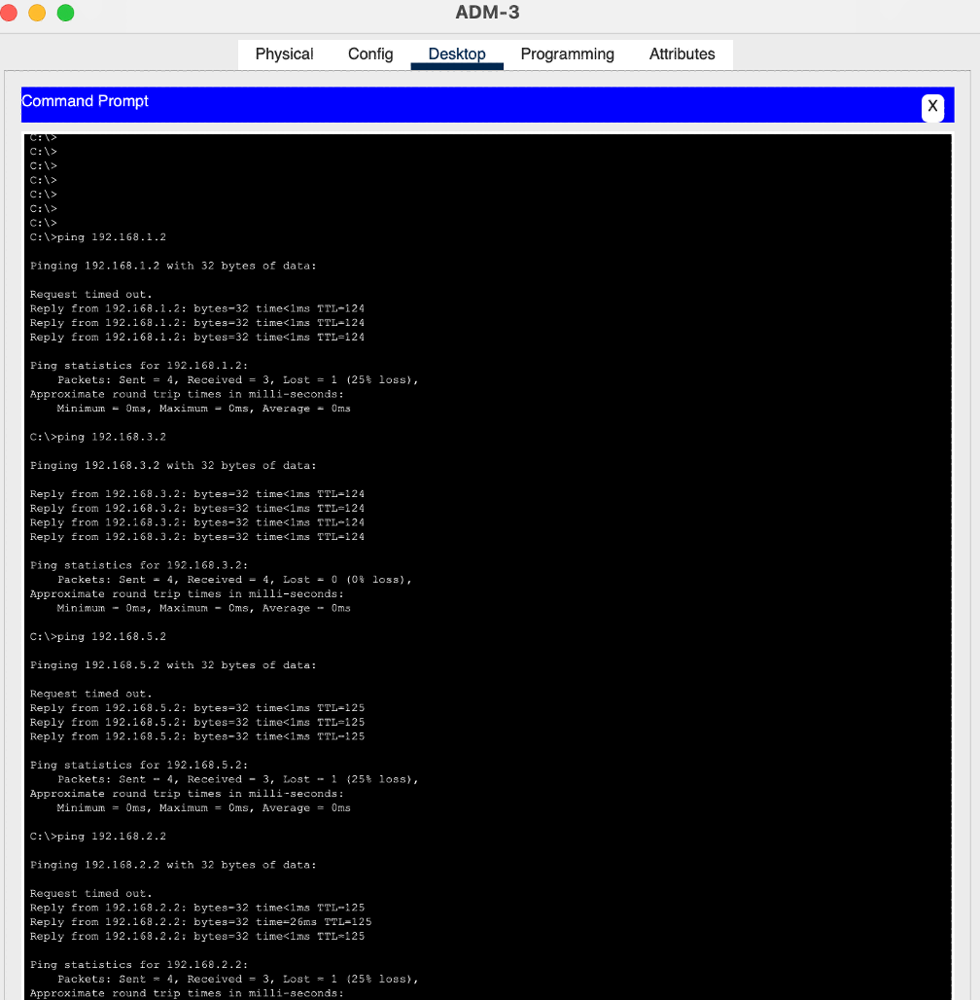

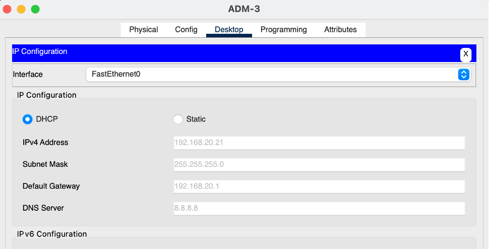

Как видно сетевая связанность есть со всеми конечными узлами.

Так же проверить работу osfp протокола, для этого с ADM-3 пропингуем адрес 192.168.1.2 с включенным интерфейсом на SW-1 Fa0/1

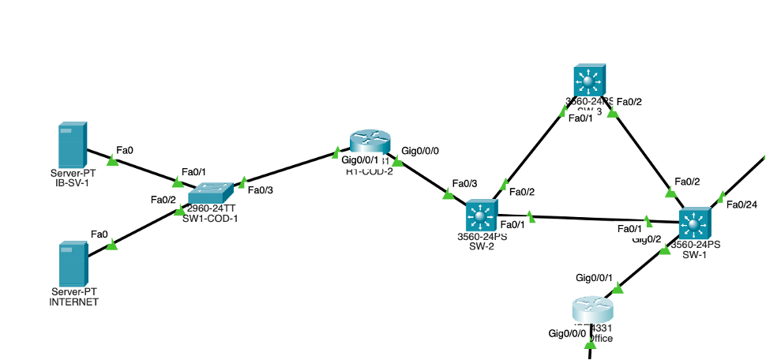
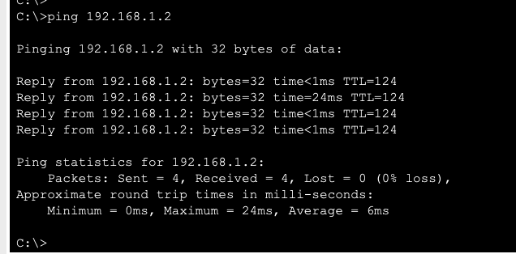


Далее выключим его и понаблюдаем за тем как будет вести себя трафик
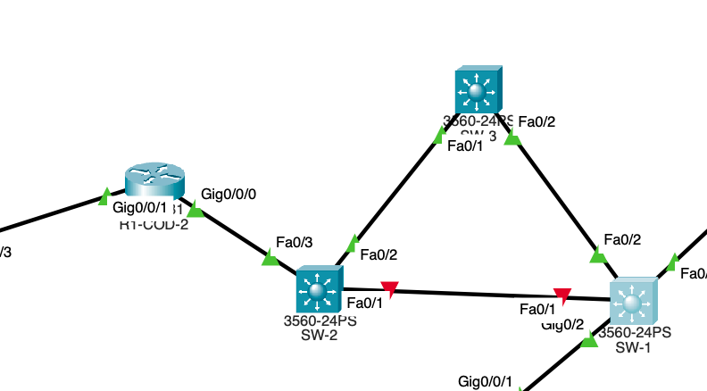

Как видим трафик перестроился

```
SW-2#show ip ospf neighbor 


Neighbor ID Pri State Dead Time Address Interface
3.3.3.3 1 FULL/DR 00:00:37 192.168.201.1 FastEthernet0/2
30.30.30.30 1 FULL/DR 00:00:38 192.168.90.1 FastEthernet0/3
SW-2#
SW-2#show ip route 
Codes: C - connected, S - static, I - IGRP, R - RIP, M - mobile, B - BGP
D - EIGRP, EX - EIGRP external, O - OSPF, IA - OSPF inter area
N1 - OSPF NSSA external type 1, N2 - OSPF NSSA external type 2
E1 - OSPF external type 1, E2 - OSPF external type 2, E - EGP
i - IS-IS, L1 - IS-IS level-1, L2 - IS-IS level-2, ia - IS-IS inter area
* - candidate default, U - per-user static route, o - ODR
P - periodic downloaded static route

Gateway of last resort is not set

O 192.168.1.0/24 [110/2] via 192.168.90.1, 01:37:08, FastEthernet0/3
O 192.168.2.0/24 [110/4] via 192.168.201.1, 00:03:30, FastEthernet0/2
O 192.168.3.0/24 [110/2] via 192.168.90.1, 02:19:08, FastEthernet0/3
O 192.168.4.0/24 [110/4] via 192.168.201.1, 00:03:30, FastEthernet0/2
O 192.168.5.0/24 [110/4] via 192.168.201.1, 00:03:30, FastEthernet0/2
O 192.168.10.0/24 [110/4] via 192.168.201.1, 00:03:30, FastEthernet0/2
O 192.168.20.0/24 [110/4] via 192.168.201.1, 00:03:30, FastEthernet0/2
O 192.168.30.0/24 [110/4] via 192.168.201.1, 00:03:30, FastEthernet0/2
O 192.168.40.0/24 [110/4] via 192.168.201.1, 00:03:30, FastEthernet0/2
C 192.168.90.0/24 is directly connected, FastEthernet0/3
O 192.168.95.0/24 [110/4] via 192.168.201.1, 00:03:30, FastEthernet0/2
O 192.168.97.0/24 [110/3] via 192.168.201.1, 00:03:30, FastEthernet0/2
O 192.168.98.0/24 [110/3] via 192.168.201.1, 00:03:30, FastEthernet0/2
O 192.168.99.0/24 [110/4] via 192.168.201.1, 00:03:30, FastEthernet0/2
C 192.168.201.0/24 is directly connected, FastEthernet0/2
O 192.168.202.0/24 [110/2] via 192.168.201.1, 00:03:30, FastEthernet0/2

```
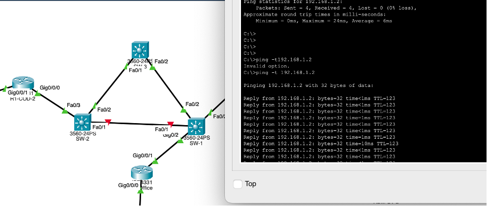

Далее необходимо ограничить доступ согласно требованиям. Ограничение необходимо прописывать на R1-Office
## ACL
## 1. USERS
Только INTERNET и User-SV-1

```

ip access-list extended USERS_ACL
permit ip 192.168.10.0 0.0.0.255 host 192.168.1.2
permit ip 192.168.10.0 0.0.0.255 host 192.168.5.2
deny ip 192.168.10.0 0.0.0.255 192.168.40.0 0.0.0.255
permit icmp 192.168.20.0 0.0.0.255 192.168.10.0 0.0.0.255
permit icmp 192.168.30.0 0.0.0.255 192.168.10.0 0.0.0.255
deny ip any any
interface g0/0/0.10
ip access-group USERS_ACL in
```

## 2. ADM
Доступ везде кроме IB-SV-1
```
ip access-list extended ADM_ACL
deny ip 192.168.20.0 0.0.0.255 host 192.168.3.2
permit ip any any
interface g0/0/0.20
ip access-group ADM_ACL in
```
 
## 3. IB
Запрет к ADM-SV-1 и сетевым устройствам
```
ip access-list extended IB_ACL
 permit ip 192.168.30.0 0.0.0.255 host 192.168.2.2
permit ip 192.168.30.0 0.0.0.255 host 192.168.3.2
deny ip any any
 interface g0/0/0.30
ip access-group IB_ACL in
```
 
## 4. BUH
BUH-1 и BUH-2 только User-SV-1
```
ip access-list extended BUH_ACL
 permit ip host 192.168.40.21 host 192.168.5.2
 permit ip host 192.168.40.22 host 192.168.5.2
BUH-3 только HTTP к INTERNET и User-SV-1
 permit tcp host 192.168.40.23 host 192.168.1.2 eq 80
 permit tcp host 192.168.40.23 host 192.168.5.2 eq 80
 deny ip any any
interface g0/0/0.40
ip access-group BUH_ACL in
```
Далее необходимо настроить на всех устройствах доступ по ssh для ADM, для этого на сетевых устройствах небходимо прописать следующие настройки:

```
ip domain-name corp.local
crypto key generate rsa
1024


username adm privilege 15 secret gfhjkm
line vty 0 15
login local
transport input ssh
access-class 10 in
exit
ip access-list standard 10
permit 192.168.20.0 0.0.0.255
do wr mem

```
Таким образом, была произведена настройка трех сегментов сети с использованием протокола ospf, списков доступа, DHCP протокола тем самым достигнув отказоустойчивости в сетевой связанности со всеми элементами инфраструктуры.

В ходе выполнения данной проектной работы была разработана и настроена сетевая инфраструктура компании в среде Cisco Packet Tracer.
Была реализована сегментация сети с использованием VLAN и списков контроля доступа (ACL), что позволило разграничить права пользователей различных отделов и обеспечить необходимый уровень информационной безопасности.
Настроены динамическая маршрутизация OSPF, DHCP-сервис, NTP-синхронизация и защищённый удалённый доступ по SSH только для администраторов сети. Также были отключены неиспользуемые порты коммутаторов для повышения безопасности и отказоустойчивости сети.
В результате получилась централизованная, масштабируемая и безопасная сеть. Реализованная схема обеспечивает корректное взаимодействие между подразделениями компании и ограничивает доступ пользователей только к разрешённым ресурсам.


