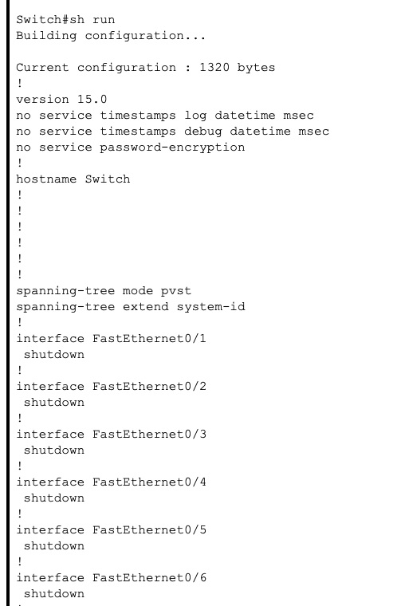
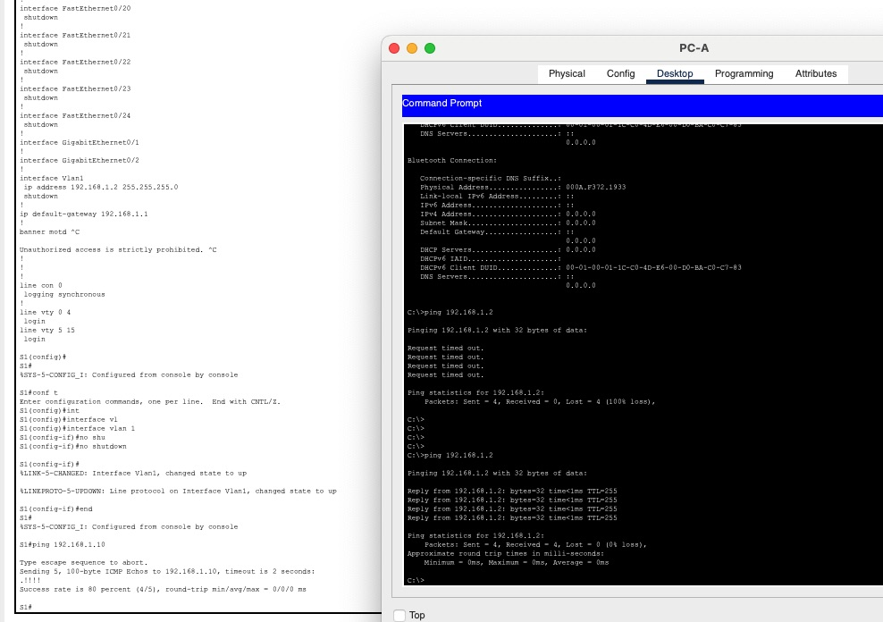

# Лабораторная работа. Базовая настройка коммутатора


| Устройство    | Интерфейс       | IP-адрес / префикс |
| :------------ |:---------------:| ------------------:|
| S1            | VLAN 1          |  192.168.1.2 /24   |
| PC-A          | NIC             |  192.168.1.10 /24  |
|               |                 |                    |

### Задачи
+ Часть 1. Проверка конфигурации коммутатора по умолчанию
+ Часть 2. Создание сети и настройка основных параметров устройства
  + Настройте базовые параметры коммутатора.
  + Настройте IP-адрес для ПК.
+ Часть 3. Проверка сетевых подключений
  + Отобразите конфигурацию устройства.
  + Протестируйте сквозное соединение, отправив эхо-запрос.
  + Протестируйте возможности удаленного управления с помощью Telnet.

В ходе лабораторной работы использовался коммутатор Cisco 2960 (ver ios 15.0(2)SE4)


При первом запуске необходимо отключить все интерфейсы коммутатора, для этого необходимо последовательно ввести следующие команды:

```
Switch#conf t
Enter configuration commands, one per line.  End with CNTL/Z.
Switch(config)#int
Switch(config)#interface ran
Switch(config)#interface range fas
Switch(config)#interface range fastEthernet 0/0-24
interface range not validated - command rejected
Switch(config)#interface range fastEthernet 0/1-24
Switch(config-if-range)#shu
Switch(config-if-range)#shutdown
```
После чего убедиться что команда выполнена успешно с помощью команды show running config (sh run):



Для того что бы установить сетевую связанность с рабочей станцией и коммутатором, необходимо назначить ip адресс на рабочей станции (192.168.1.10 /24) и на коммутаторе (192.168.1.2 /24).
Для назначение ip адреса на коммутаторе необходимо выполнить в консоле следующие команды в режиме конфигурации:
```
S1#conf t
Enter configuration commands, one per line.  End with CNTL/Z.
S1(config)#int
S1(config)#interface vl
S1(config)#interface vlan 1
S1(config-if)#no shu
S1(config-if)#no shutdown 

S1(config-if)#
```
После чего проверить сетевую связанность между рабочей станцией и коммутатором:



Далее необходимо настроить удаленный доступ, для этого необходимо для режима виртуальных линий указать протокол подключения (ssh или telnet) и используемую учетную запись для подключения (в данном случае указывается локальная УЗ):


