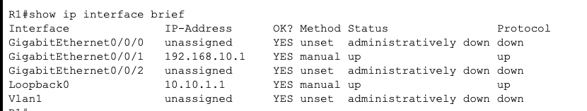
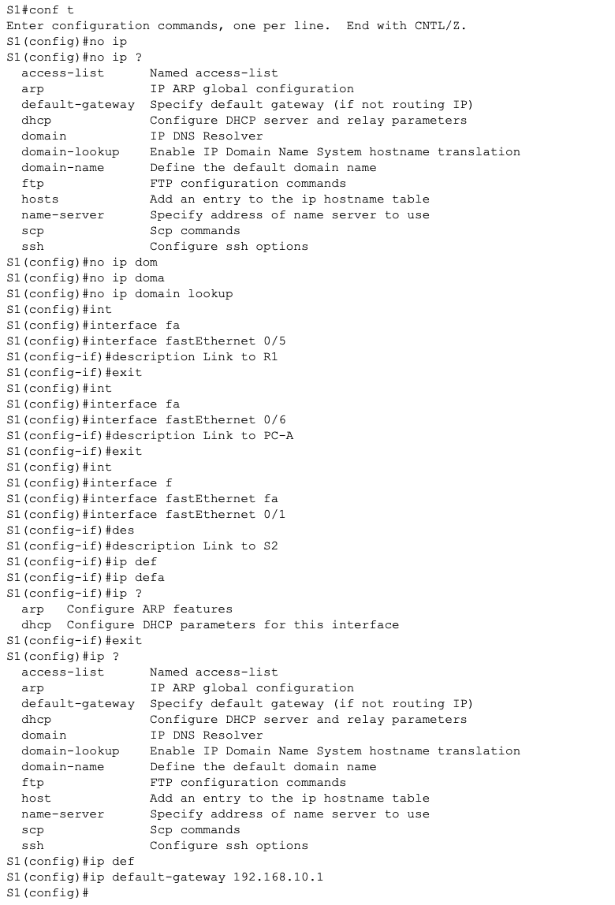
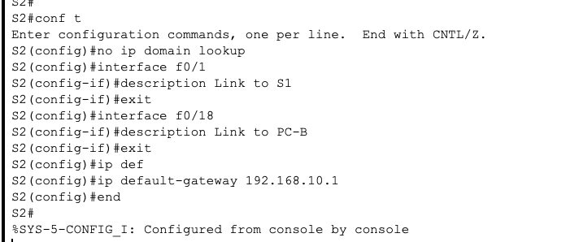
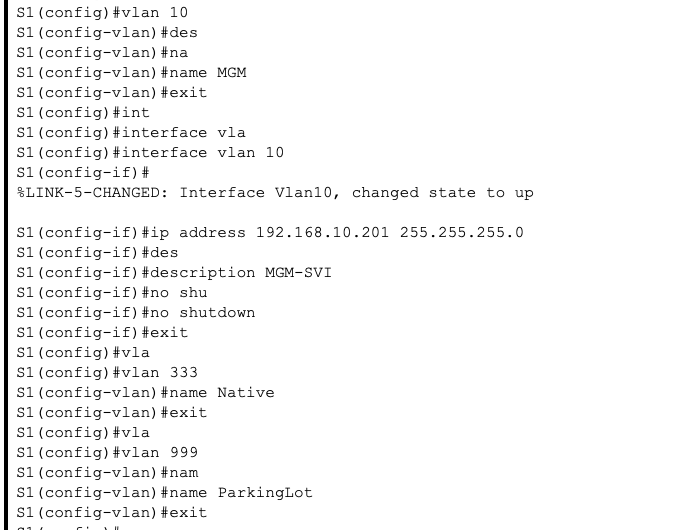
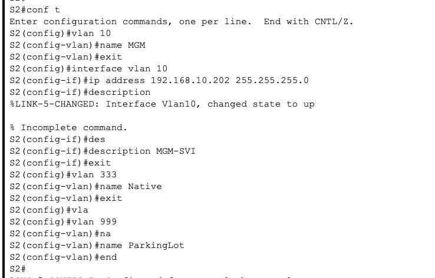

### Таблица адресации
| Устройство           |   Интерфейс     | 		IP-адрес/Маска  |   
|:---------------------|:---------------:|:---------------------|
|R1                    |G0/0/1           | 192.168.10.1/24      |  
|                      |Loopback 0       | 10.10.1.1/24         |
|                      |                 |                      |
|                      |                 |                      |
|S1                    |VLAN 10          | 192.168.10.201/24    | 
|S2                    |VLAN 10          | 192.168.10.202/24    |
|                      |                 |                      |  
|                      |                 |                      | 
|PC-А                  |NIC              |DHCP                  |  
|PC-В                  |NIC              |DHCP                  |  


### Задачи
Цели
Часть 1. Настройка основного сетевого устройства
+ Создайте сеть.
+ Настройте маршрутизатор R1.
+ Настройка и проверка основных параметров коммутатора


### При первом подключении к устройствам, необходимо провести первоначальную настройку на всех сетевых устройствах:

+ Задание паролей пользователя
+ Настройка ssh для подключения
+ Задания баннера


Сам перечень набора команд для R1:

```
en
conf t
hostname R1
banner motd ^The device is the property of the company, any unauthorized change to the configuration is punishable by law.^
ip domain-name otus.ru
no ip domain-lookup
enable secret class
username cisco secret class
service password-encryption 
crypto key generate rsa 
2048
ip ssh version 2
username admin privilege 15 secret Adm1nP@55
line vty 0
logging synchronous
exit
line vty 0 4 
login local
transport input ssh
exit
line vty 5 15
login local
transport input ssh
exit
security password min-length 14
exit
wr mem
```

Сам перечень набора команд для S1:

```
en
conf t
hostname S1
banner motd ^The device is the property of the company, any unauthorized change to the configuration is punishable by law.^
ip domain-name otus.ru
no ip domain-lookup
enable secret class
username cisco secret class
service password-encryption 
crypto key generate rsa 
2048
ip ssh version 2
username admin privilege 15 secret Adm1nP@55
line vty 0
logging synchronous
exit
line vty 0 4 
login local
transport input ssh
exit
line vty 5 15
login local
transport input ssh
exit
security password min-length 14
exit
wr mem
```

Сам перечень набора команд для S2:

```
en
conf t
hostname S2
banner motd ^The device is the property of the company, any unauthorized change to the configuration is punishable by law.^
ip domain-name otus.ru
no ip domain-lookup
enable secret class
username cisco secret class
service password-encryption 
crypto key generate rsa 
2048
ip ssh version 2
username admin privilege 15 secret Adm1nP@55
line vty 0
logging synchronous
exit
line vty 0 4 
login local
transport input ssh
exit
line vty 5 15
login local
transport input ssh
exit
security password min-length 14
exit
wr mem
```
Далее необходимо настроить =====

no ip domain lookup
ip dhcp excluded-address 192.168.10.1 192.168.10.9
ip dhcp excluded-address 192.168.10.201 192.168.10.202
ip dhcp relay information trust-all
ip dhcp pool Students
 network 192.168.10.0 255.255.255.0
 default-router 192.168.10.1
 domain-name CCNA2.Lab-11.6.1
 exit
interface Loopback0
 ip address 10.10.1.1 255.255.255.0
interface GigabitEthernet0/0/1
 description Link to S1
 ip address 192.168.10.1 255.255.255.0
 no shutdown

Проверим конфигурацию:



НАстроим коммутатор S1 и S2:





Далее необходимо настроить VLAN на коммутаторах:



По аналогии проделываем тоже самое и для другого коммутатора

Далее настраивам безопасность колммутатора:

```
S1(config)#
S1(config)#int
S1(config)#interface fa
S1(config)#interface fastEthernet 0/1
S1(config-if)#swi
S1(config-if)#switchport tr
S1(config-if)#switchport trunk na
S1(config-if)#switchport trunk native vl
S1(config-if)#switchport trunk native vlan 333
S1(config-if)#swi
S1(config-if)#switchport mo
S1(config-if)#switchport mode tr
S1(config-if)#switchport mode trunk 

S1(config-if)#
%LINEPROTO-5-UPDOWN: Line protocol on Interface FastEthernet0/1, changed state to down

%LINEPROTO-5-UPDOWN: Line protocol on Interface FastEthernet0/1, changed state to up

%LINEPROTO-5-UPDOWN: Line protocol on Interface Vlan10, changed state to up

S1(config-if)#swi
S1(config-if)#switchport ne
S1(config-if)#switchport nego
S1(config-if)#switchport non
S1(config-if)#switchport nonegotiate 
%CDP-4-NATIVE_VLAN_MISMATCH: Native VLAN mismatch discovered on FastEthernet0/1 (333), with S2 FastEthernet0/1 (1).
%SPANTREE-2-RECV_PVID_ERR: Received BPDU with inconsistent peer vlan id 1 on FastEthernet0/1 VLAN333.

%SPANTREE-2-BLOCK_PVID_LOCAL: Blocking FastEthernet0/1 on VLAN0333. Inconsistent local vlan.


S1(config-if)#do show interface trunk
Port        Mode         Encapsulation  Status        Native vlan
Fa0/1       on           802.1q         trunking      333

Port        Vlans allowed on trunk
Fa0/1       1-1005

Port        Vlans allowed and active in management domain
Fa0/1       1,10,333,999

Port        Vlans in spanning tree forwarding state and not pruned
Fa0/1       10,999

S1(config-if)#do show interfaces f0/1 switchport | include Negotiation
Negotiation of Trunking: Off
S1(config-if)#
```
S2:

```
S2#conf t
Enter configuration commands, one per line.  End with CNTL/Z.
S2(config)#interface f0/1
S2(config-if)#switchport trunk native vlan 333
S2(config-if)#switchport mode trunk
S2(config-if)#switchport nonegotiate%SPANTREE-2-UNBLOCK_CONSIST_PORT: Unblocking FastEthernet0/1 on VLAN0333. Port consistency restored.

%SPANTREE-2-UNBLOCK_CONSIST_PORT: Unblocking FastEthernet0/1 on VLAN0001. Port consistency restored.


S2(config-if)#end
S2#
%SYS-5-CONFIG_I: Configured from console by console

S2#show interface trunk
Port        Mode         Encapsulation  Status        Native vlan
Fa0/1       on           802.1q         trunking      333

Port        Vlans allowed on trunk
Fa0/1       1-1005

Port        Vlans allowed and active in management domain
Fa0/1       1,10,333,999

Port        Vlans in spanning tree forwarding state and not pruned
Fa0/1       1,10,333,999

S2#show interfaces f0/1 switchport | include Negotiation
Negotiation of Trunking: Off
S2#
```
###Настройка портов доступа

```
S1(config)#int
S1(config)#interface fas
S1(config)#interface fastEthernet 0/5
S1(config-if)#swi
S1(config-if)#switchport m
S1(config-if)#switchport mode ac
S1(config-if)#switchport mode access 
S1(config-if)#switchport access vlan 10
S1(config-if)#exit
S1(config)#int fa
S1(config)#int fastEthernet 0/6
S1(config-if)#switchport mode access
S1(config-if)#switchport access vlan 10
S1(config-if)#exit
```
```
S2#conf t
Enter configuration commands, one per line.  End with CNTL/Z.
S2(config)# int
S2(config)# interface fas
S2(config)# interface fastEthernet 0/18
S2(config-if)#switchport mode access
S2(config-if)#switchport access vlan 10
S2(config-if)#end
S2#
%SYS-5-CONFIG_I: Configured from console by console

S2#
```

###Безопасность неиспользуемых портов

S1:

```
S1#conf t
Enter configuration commands, one per line.  End with CNTL/Z.
S1(config)#int
S1(config)#interface ra
S1(config)#interface range f0/2-17, f0/19-24, g0/1-2
S1(config-if-range)#swi
S1(config-if-range)#switchport acc
S1(config-if-range)#switchport access vl
S1(config-if-range)#switchport access vlan 999
S1(config-if-range)#shutdown
S1#
%SYS-5-CONFIG_I: Configured from console by console

S1#
```
S2:

```
S2#
S2#conf t
Enter configuration commands, one per line.  End with CNTL/Z.
S2(config)#int
S2(config)#interface ra
S2(config)#interface range f0/2-17, f0/19-24, g0/1-2
S2(config-if-range)#swi
S2(config-if-range)#switchport mo
S2(config-if-range)#switchport mode acc
S2(config-if-range)#switchport mode access 999
                                           ^
% Invalid input detected at '^' marker.
	
S2(config-if-range)#shutdown
S2(config-if-range)#end
S2#
%SYS-5-CONFIG_I: Configured from console by console

S2#
```

Проверим статус портов:



###Безопасность портов (Port Security)

S1:

```
S1#conf t
Enter configuration commands, one per line.  End with CNTL/Z.
S1(config)#int
S1(config)#interface ra
S1(config)#interface range f0/2-17, f0/19-24, g0/1-2
S1(config-if-range)#swi
S1(config-if-range)#switchport acc
S1(config-if-range)#switchport access vl
S1(config-if-range)#switchport access vlan 999
S1(config-if-range)#end
S1#
%SYS-5-CONFIG_I: Configured from console by console

S1#
S1#
S1#conf t
Enter configuration commands, one per line.  End with CNTL/Z.
S1(config)#int
S1(config)#interface fas
S1(config)#interface fastEthernet 0/6
S1(config-if)#swi
S1(config-if)#switchport port
S1(config-if)#switchport port-security 
S1(config-if)#switchport port-security ma
S1(config-if)#switchport port-security max
S1(config-if)#switchport port-security maximum 3
S1(config-if)#switchport port-security ?
  aging        Port-security aging commands
  mac-address  Secure mac address
  maximum      Max secure addresses
  violation    Security violation mode
  <cr>
S1(config-if)#switchport port-security vi
S1(config-if)#switchport port-security violation ?
  protect   Security violation protect mode
  restrict  Security violation restrict mode
  shutdown  Security violation shutdown mode
S1(config-if)#switchport port-security violation re
S1(config-if)#switchport port-security violation restrict 
S1(config-if)#switchport port-security ag
S1(config-if)#switchport port-security aging ?
  time  Port-security aging time
S1(config-if)#switchport port-security aging ti
S1(config-if)#switchport port-security aging time 60
S1(config-if)#switchport port-security a
S1(config-if)#switchport port-security aging ?
  time  Port-security aging time
S1(config-if)#switchport port-security aging ty
S1(config-if)#switchport port-security aging typ
S1(config-if)#switchport port-security aging type in
S1(config-if)#switchport port-security aging type in?
% Unrecognized command
S1(config-if)#do show port-security interface f0/6
Port Security              : Enabled
Port Status                : Secure-up
Violation Mode             : Restrict
Aging Time                 : 60 mins
Aging Type                 : Absolute
SecureStatic Address Aging : Disabled
Maximum MAC Addresses      : 3
Total MAC Addresses        : 0
Configured MAC Addresses   : 0
Sticky MAC Addresses       : 0
Last Source Address:Vlan   : 0000.0000.0000:0
Security Violation Count   : 0

S1(config-if)#do show port-security address
               Secure Mac Address Table
-----------------------------------------------------------------------------
Vlan    Mac Address       Type                          Ports   Remaining Age
                                                                   (mins)
----    -----------       ----                          -----   -------------
-----------------------------------------------------------------------------
Total Addresses in System (excluding one mac per port)     : 0
Max Addresses limit in System (excluding one mac per port) : 1024
S1(config-if)#
```
Аналогично делаем и для S2:

```
S2#
S2#conf t
Enter configuration commands, one per line.  End with CNTL/Z.
S2(config)#int
S2(config)#interface fa
S2(config)#interface fastEthernet 0/18
S2(config-if)#interface f0/18
S2(config-if)#switchport port-security
S2(config-if)#switchport port-security maximum 2
S2(config-if)#switchport port-security violation protect
S2(config-if)#switchport port-security aging time 60
S2(config-if)#switchport port-security mac-address sticky
S2(config-if)#do show port-security interface f0/18
Port Security              : Enabled
Port Status                : Secure-up
Violation Mode             : Protect
Aging Time                 : 60 mins
Aging Type                 : Absolute
SecureStatic Address Aging : Disabled
Maximum MAC Addresses      : 2
Total MAC Addresses        : 0
Configured MAC Addresses   : 0
Sticky MAC Addresses       : 0
Last Source Address:Vlan   : 0000.0000.0000:0
Security Violation Count   : 0

S2(config-if)#do show port-security address
               Secure Mac Address Table
-----------------------------------------------------------------------------
Vlan    Mac Address       Type                          Ports   Remaining Age
                                                                   (mins)
----    -----------       ----                          -----   -------------
-----------------------------------------------------------------------------
Total Addresses in System (excluding one mac per port)     : 0
Max Addresses limit in System (excluding one mac per port) : 1024
S2(config-if)#
```


###DHCP Snooping

S2:
```
S2(config)#conf t
            ^
% Invalid input detected at '^' marker.
	
S2(config)#ip dh
S2(config)#ip dhcp sn
S2(config)#ip dhcp snooping 
S2(config)#ip dhcp snooping vl
S2(config)#ip dhcp snooping vlan 10
S2(config)#int
S2(config)#interface fa
S2(config)#interface fastEthernet 0/1
S2(config-if)#ip dh
S2(config-if)#ip dhcp sn
S2(config-if)#ip dhcp snooping tru
S2(config-if)#ip dhcp snooping trust 
S2(config-if)#exit
S2(config)#int
S2(config)#interface fa
S2(config)#interface fastEthernet 0/18
S2(config-if)#ip dh
S2(config-if)#ip dhcp sn
S2(config-if)#ip dhcp snooping lim
S2(config-if)#ip dhcp snooping limit ra
S2(config-if)#ip dhcp snooping limit rate ?
  <1-2048>  DHCP snooping rate limit
S2(config-if)#ip dhcp snooping limit rate 5
S2(config-if)#end
S2#
%SYS-5-CONFIG_I: Configured from console by console
```
ПроверкаЖ

```
S2#show ip dhcp snooping
Switch DHCP snooping is enabled
DHCP snooping is configured on following VLANs:
10
Insertion of option 82 is enabled
Option 82 on untrusted port is not allowed
Verification of hwaddr field is enabled
Interface                  Trusted    Rate limit (pps)
-----------------------    -------    ----------------
FastEthernet0/1            yes        unlimited       
FastEthernet0/18           no         5               
S2#
S2#show ip dhcp snooping binding
MacAddress          IpAddress        Lease(sec)  Type           VLAN  Interface
------------------  ---------------  ----------  -------------  ----  -----------------
Total number of bindings: 0
```

###PortFast и BPDU Guard

Для S1:

```
S1(config)#int
S1(config)#interface fa
S1(config)#interface fastEthernet 0/5
S1(config-if)#sp
S1(config-if)#spa
S1(config-if)#spanning-tree ?
  bpduguard  Don't accept BPDUs on this interface
  cost       Change an interface's spanning tree port path cost
  guard      Change an interface's spanning tree guard mode
  link-type  Specify a link type for spanning tree protocol use
  portfast   Enable an interface to move directly to forwarding on link up
  vlan       VLAN Switch Spanning Tree
S1(config-if)#spanning-tree po
S1(config-if)#spanning-tree portfast 
%Warning: portfast should only be enabled on ports connected to a single
host. Connecting hubs, concentrators, switches, bridges, etc... to this
interface  when portfast is enabled, can cause temporary bridging loops.
Use with CAUTION

%Portfast has been configured on FastEthernet0/5 but will only
have effect when the interface is in a non-trunking mode.
S1(config-if)#exit
S1(config)#int
S1(config)#interface fas
S1(config)#interface fastEthernet 0/6
S1(config-if)#sp
S1(config-if)#spa
S1(config-if)#spanning-tree po
S1(config-if)#spanning-tree portfast 
%Warning: portfast should only be enabled on ports connected to a single
host. Connecting hubs, concentrators, switches, bridges, etc... to this
interface  when portfast is enabled, can cause temporary bridging loops.
Use with CAUTION

%Portfast has been configured on FastEthernet0/6 but will only
have effect when the interface is in a non-trunking mode.
S1(config-if)#spanning-tree ?
  bpduguard  Don't accept BPDUs on this interface
  cost       Change an interface's spanning tree port path cost
  guard      Change an interface's spanning tree guard mode
  link-type  Specify a link type for spanning tree protocol use
  portfast   Enable an interface to move directly to forwarding on link up
  vlan       VLAN Switch Spanning Tree
S1(config-if)#spanning-tree bp
S1(config-if)#spanning-tree bpduguard ?
  disable  Disable BPDU guard for this interface
  enable   Enable BPDU guard for this interface
S1(config-if)#spanning-tree bpduguard en
S1(config-if)#spanning-tree bpduguard enable 
S1(config-if)#end

```


Для S2:

```
S2#conf t
Enter configuration commands, one per line.  End with CNTL/Z.
S2(config)#interface f0/18
S2(config-if)#spanning-tree portfast
%Warning: portfast should only be enabled on ports connected to a single
host. Connecting hubs, concentrators, switches, bridges, etc... to this
interface  when portfast is enabled, can cause temporary bridging loops.
Use with CAUTION

%Portfast has been configured on FastEthernet0/18 but will only
have effect when the interface is in a non-trunking mode.
S2(config-if)#spanning-tree bpduguard enable
S2(config-if)#end
S2#
```


