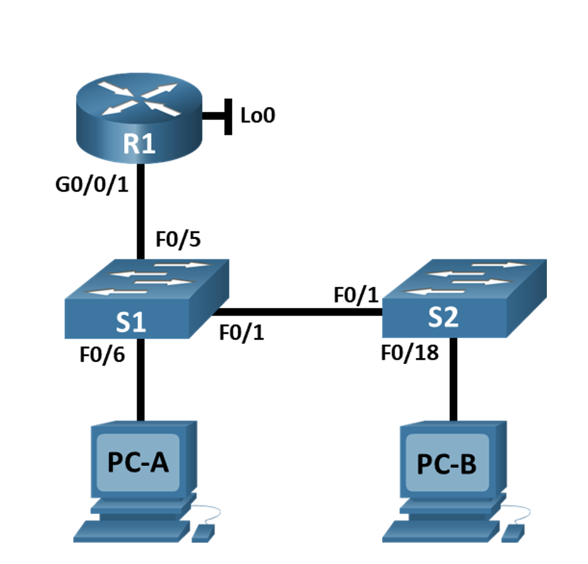

### Таблица адресации
| Устройство           |   Интерфейс     | 		IP-адрес/Маска  |   
|:---------------------|:---------------:|:---------------------|
|R1                    |G0/0/1           | 192.168.10.1/24      |  
|                      |Loopback 0       | 10.10.1.1/24         |
|                      |                 |                      |
|                      |                 |                      |
|S1                    |VLAN 10          | 192.168.10.201/24    | 
|S2                    |VLAN 10          | 192.168.10.202/24    |
|                      |                 |                      |  
|                      |                 |                      | 
|PC-А                  |NIC              |DHCP                  |  
|PC-В                  |NIC              |DHCP                  |  

### Задачи
Цели
Часть 1. Настройка основного сетевого устройства
+ Создайте сеть.
+ Настройте маршрутизатор R1.
+ Настройка и проверка основных параметров коммутатора
