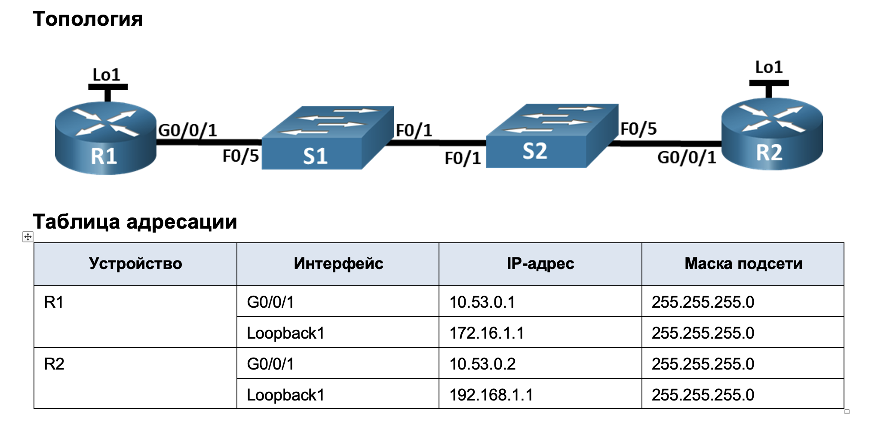
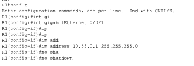
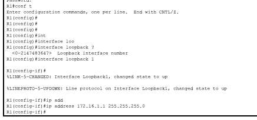
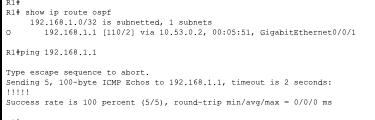
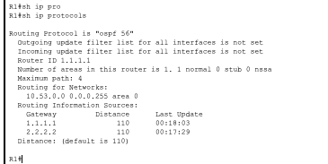
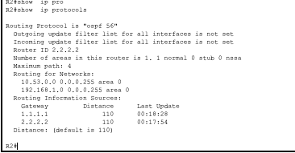
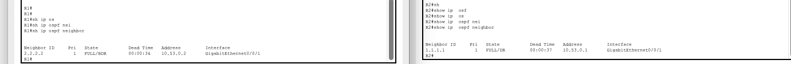
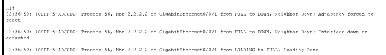
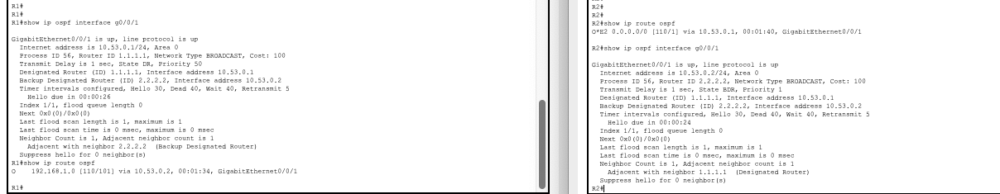

### Задачи
+ Часть 1. Создание сети и настройка основных параметров устройства
+ Часть 2. Настройка и проверка базовой работы протокола  OSPFv2 для одной области
+ Часть 3. Оптимизация и проверка конфигурации OSPFv2 для одной области

Основные параметры для настройки маршрутизатора и комутатора 
Сам перечень набора команд для R1(R2):

```
en
conf t
hostname R2
banner motd ^The device is the property of the company, any unauthorized change to the configuration is punishable by law.^
ip domain-name otus.ru
no ip domain-lookup
enable secret class
username cisco secret class
service password-encryption 
crypto key generate rsa 
2048
ip ssh version 2
username admin privilege 15 secret Adm1nP@55
line vty 0
logging synchronous
exit
line vty 0 4 
login local
transport input ssh
exit
line vty 5 15
login local
transport input ssh
exit
security password min-length 14
exit
wr mem
```

Сам перечень набора команд для S1(S2):

```
en
conf t
hostname S1
banner motd ^The device is the property of the company, any unauthorized change to the configuration is punishable by law.^
ip domain-name otus.ru
no ip domain-lookup
enable secret class
username cisco secret class
service password-encryption 
crypto key generate rsa 
2048
ip ssh version 2
username admin privilege 15 secret Adm1nP@55
line vty 0
logging synchronous
exit
line vty 0 4 
login local
transport input ssh
exit
line vty 5 15
login local
transport input ssh
exit
security password min-length 14
exit
wr mem
```

А так же настройка ip адреса на соответсвующих интерфейсах для каждого маршрутизатора



И интерфейс loopback согласно таблице для обоих роутерах



Далее настраиваем OSPF

### Для R1

```
R1#conf t
Enter configuration commands, one per line.  End with CNTL/Z.
R1(config)#rou
R1(config)#router os
R1(config)#router ospf 56
R1(config-router)#ro
R1(config-router)#router-id 1.1.1.1
R1(config-router)#net
R1(config-router)#network 10.53.0.0 0.0.0.255 ?
  area  Set the OSPF area ID
R1(config-router)#network 10.53.0.0 0.0.0.255 ar
R1(config-router)#network 10.53.0.0 0.0.0.255 area 0
R1(config-router)#exit
R1(config)#
```
### Для R2

```
R2#conf t
Enter configuration commands, one per line.  End with CNTL/Z.
R2(config)#rou
R2(config)#router os
R2(config)#router ospf 56
R2(config-router)#rout
R2(config-router)#router-id 2.2.2.2
R2(config-router)#net
R2(config-router)#network 10.53.0.0 0.0.0.255 area 0
R2(config-router)#network 10.53.0.0 0.0.0.255 area 0
01:51:22: %OSPF-5-ADJCHG: Process 56, Nbr 1.1.1.1 on GigabitEthernet0/0/1 f
R2(config-router)#
R2(config-router)#network 192.168.1.0 0.0.0.255 area 0
R2(config-router)#
R2(config-router)#exit
```
После внесения настроек необходимо убедиться в сетевой связанности:







### Часть 3. Оптимизация и проверка конфигурации OSPFv2 для одной области

## Настройки на R1

```
R1#conf t
Enter configuration commands, one per line.  End with CNTL/Z.
R1(config)#int
R1(config)#interface gig
R1(config)#interface gigabitEthernet 0/0/1
R1(config-if)#ip os
R1(config-if)#ip ospf pri
R1(config-if)#ip ospf priority ?
  <0-255>  Priority
R1(config-if)#ip ospf priority 50
R1(config-if)#ip os hello
R1(config-if)#ip os hello-interval 30
R1(config-if)#exit
```
ip ospf priority - определяющий роль маршрутизатора при выборе выделенного маршрутизатора (DR) в сети OSPF
ip os hello-interval - интервал (в секундах), определяющий частоту отправки hello-пакетов маршрутизатором для обнаружения и поддержания соседства 

```
R1#conf t
Enter configuration commands, one per line.  End with CNTL/Z.
R1(config)#ip route 0.0.0.0 0.0.0.0 loopback1
%Default route without gateway, if not a point-to-point interface, may impact performance
R1(config)#ro
R1(config)#router os
R1(config)#router ospf 56
R1(config-router)#def
R1(config-router)#default-information or
R1(config-router)#default-information originate 
R1(config-router)#
```

default-information originate - маршрутизатор анонсирует маршрут по умолчанию своим соседям. 

## Настройки на R2

```
R2(config)#interface gigabitEthernet 0/0/1
R2(config-if)#ip so
R2(config-if)#ip os
R2(config-if)#ip ospf hell
R2(config-if)#ip ospf hello-interval 30
R2(config-if)#exit
R2(config)#int loo
R2(config)#int loopback 1
R2(config-if)#ip os
R2(config-if)#ip ospf net
R2(config-if)#ip ospf network po
R2(config-if)#ip ospf network point-to-point 
R2(config-if)#ip 
02:27:58: %OSPF-5-ADJCHG: Process 56, Nbr 1.1.1.1 on GigabitEthernet0/0/1 from LOADING to FULL, Loading Done
os
```

## На R2 и R1 выполнить:

R2(config)#router ospf 56
R2(config-router)#aut
R2(config-router)#auto-cost re
R2(config-router)#auto-cost reference-bandwidth 10000
% OSPF: Reference bandwidth is changed.
        Please ensure reference bandwidth is consistent across all routers.
R2(config-router)#auto-cost reference-bandwidth ?
  <1-4294967>  The reference bandwidth in terms of Mbits per second
R2(config-router)#exit

auto-cost reference-bandwidth 10000 - устанавливает эталонную пропускную способность в 10 000 Мбит/с (10 Гбит/с) для расчета метрики (стоимости)

Далее необходимо перезапустить процесс OSPF:



### Проверка



```
R2#ping 172.16.1.1 

Type escape sequence to abort.
Sending 5, 100-byte ICMP Echos to 172.16.1.1, timeout is 2 seconds:
!!!!!
Success rate is 100 percent (5/5), round-trip min/avg/max = 0/0/0 ms

R2#
```


