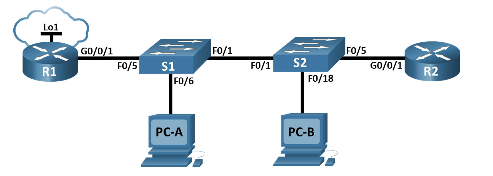
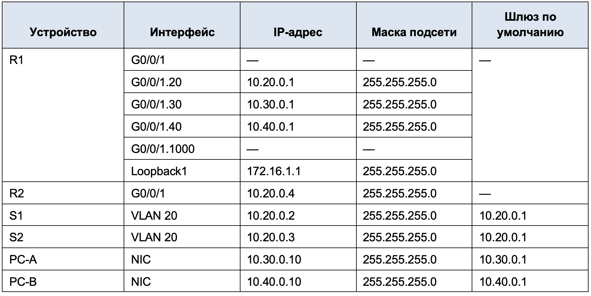
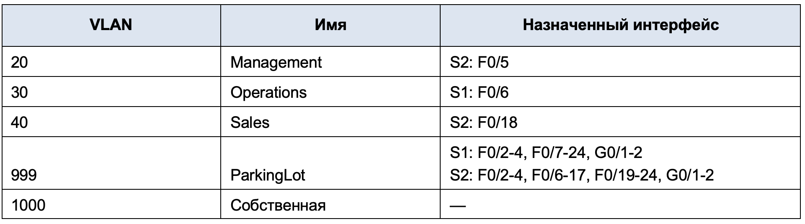
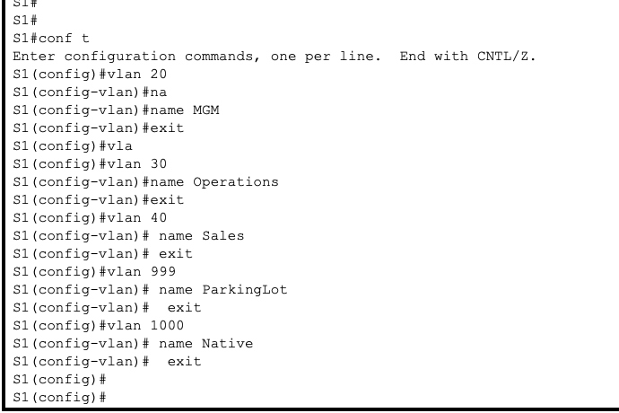
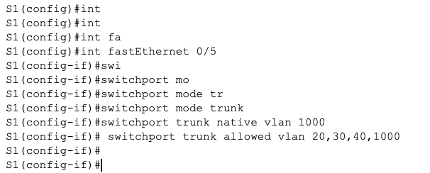
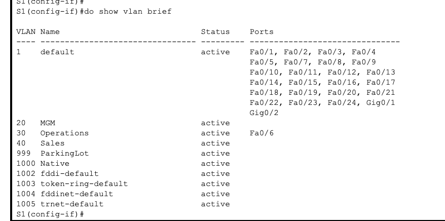
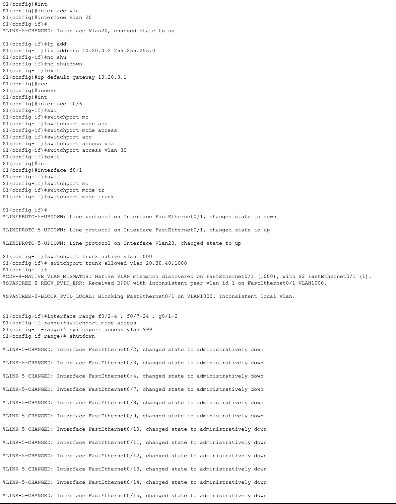
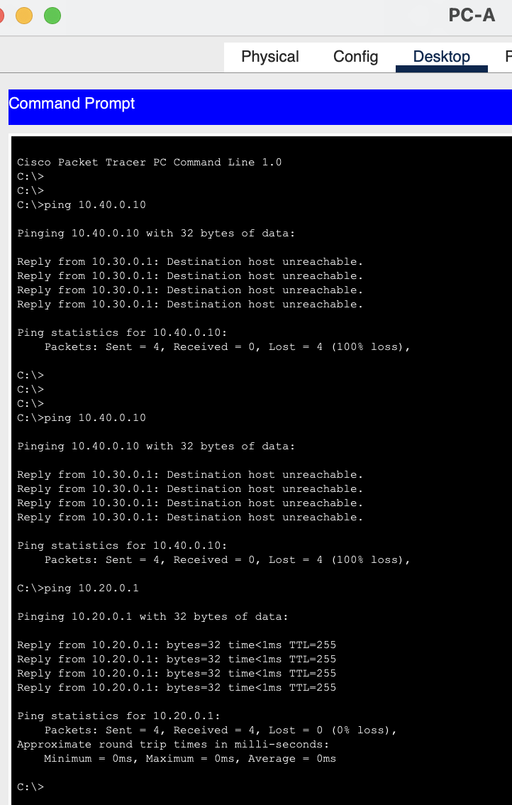
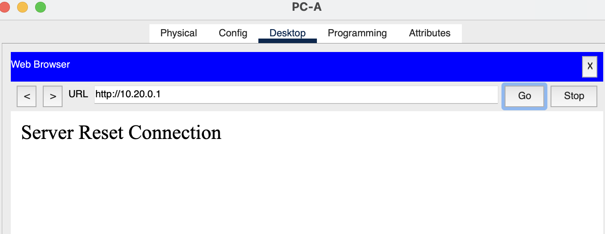
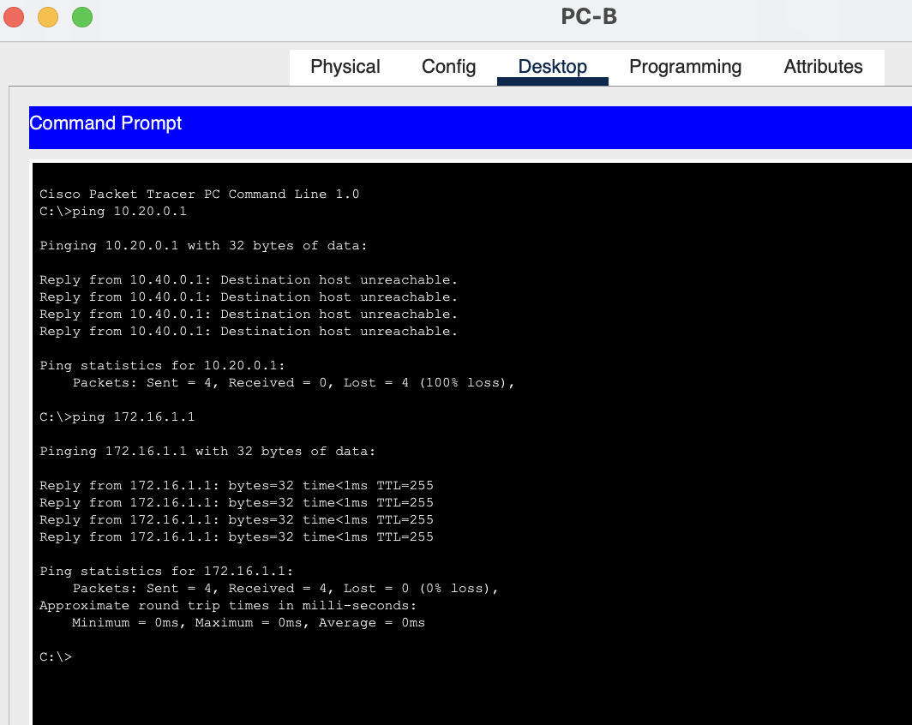

### Задачи

+ Часть 1. Создание сети и настройка основных параметров устройства
+ Часть 2. Настройка и проверка списков расширенного контроля доступа

### Таблица адресации



### Таблица VLAN




Основные параметры для настройки маршрутизатора и комутатора
Сам перечень набора команд для R1(R2):

```
en
conf t
hostname R1
banner motd ^The device is the property of the company, any unauthorized change to the configuration is punishable by law.^
ip domain-name otus.ru
no ip domain-lookup
enable secret class
username cisco secret class
service password-encryption
crypto key generate rsa
2048
ip ssh version 2
username admin privilege 15 secret Adm1nP@55
line vty 0
logging synchronous
exit
line vty 0 4
login local
transport input ssh
exit
line vty 5 15
login local
transport input ssh
exit
security password min-length 14
exit
wr mem
```

Сам перечень набора команд для S1(S2):

```
en
conf t
hostname S2
banner motd ^The device is the property of the company, any unauthorized change to the configuration is punishable by law.^
ip domain-name otus.ru
no ip domain-lookup
enable secret class
username cisco secret class
service password-encryption
crypto key generate rsa
2048
ip ssh version 2
username admin privilege 15 secret Adm1nP@55
line vty 0
logging synchronous
exit
line vty 0 4
login local
transport input ssh
exit
line vty 5 15
login local
transport input ssh
exit
security password min-length 14
exit
wr mem
```

### Настройка сетей VLAN на коммутаторах.





Чтобы убедиться что сети VLAN назначены правильным интерфейсам выполним соответствующу команду




Настраиваем дальше согласно таблице




По аналогии настраиваем и другой коммутатор

```
S2#
S2#conf t
Enter configuration commands, one per line.  End with CNTL/Z.
S2(config)#vlan 20
S2(config-vlan)# name Management
S2(config-vlan)# exit
S2(config)#vlan 30
S2(config-vlan)# name Operations
S2(config-vlan)#  exit
S2(config)#vlan 40
S2(config-vlan)# name Sales
S2(config-vlan)#  exit
S2(config)#vlan 999
S2(config-vlan)# name ParkingLot
S2(config-vlan)#  exit
S2(config)#vlan 1000
S2(config-vlan)# name Native
S2(config-vlan)#  exit
S2(config)#
S2(config)#int vlan 20
S2(config-if)#ip address 10.20.0.3 255.255.255.0
S2(config-if)# no shutdown
S2(config-if)#  exit
%LINK-5-CHANGED: Interface Vlan20, changed state to up

%LINEPROTO-5-UPDOWN: Line protocol on Interface Vlan20, changed state to up

S2(config)#
%CDP-4-NATIVE_VLAN_MISMATCH: Native VLAN mismatch discovered on FastEthernet0/1 (1), with S1 FastEthernet0/1 (1000).

S2(config)#ip def
S2(config)#ip default-gateway 10.20.0.1
S2(config)#int
S2(config)#interface f0/5
S2(config-if)#
%CDP-4-NATIVE_VLAN_MISMATCH: Native VLAN mismatch discovered on FastEthernet0/1 (1), with S1 FastEthernet0/1 (1000).

S2(config-if)#switchport mode access
S2(config-if)# switchport access vlan 20
S2(config-if)#exit
S2(config)#interface f0/18
S2(config-if)# switchport mode access
S2(config-if)# switchport access vlan 40
S2(config-if)#exit
S2(config)#interface f0/1
S2(config-if)# switchport mode trunk
S2(config-if)# switchport trunk native vlan 1000
S2(config-if)# switchport trunk allowed vlan 20,30,40,1000
S2(config-if)#exit
S2(config)#interface range f0/2-4 , f0/6-17 , f0/19-24 , g0/1-2
S2(config-if-range)# switchport mode access
S2(config-if-range)# switchport access vlan 999
S2(config-if-range)# shutdown

%LINK-5-CHANGED: Interface FastEthernet0/2, changed state to administratively down

%LINK-5-CHANGED: Interface FastEthernet0/3, changed state to administratively down

%LINK-5-CHANGED: Interface FastEthernet0/4, changed state to administratively down

%LINK-5-CHANGED: Interface FastEthernet0/6, changed state to administratively down

%LINK-5-CHANGED: Interface FastEthernet0/7, changed state to administratively down

%LINK-5-CHANGED: Interface FastEthernet0/8, changed state to administratively down

%LINK-5-CHANGED: Interface FastEthernet0/9, changed state to administratively down

%LINK-5-CHANGED: Interface FastEthernet0/10, changed state to administratively down

%LINK-5-CHANGED: Interface FastEthernet0/11, changed state to administratively down

%LINK-5-CHANGED: Interface FastEthernet0/12, changed state to administratively down

%LINK-5-CHANGED: Interface FastEthernet0/13, changed state to administratively down

%LINK-5-CHANGED: Interface FastEthernet0/14, changed state to administratively down

%LINK-5-CHANGED: Interface FastEthernet0/15, changed state to administratively down

%LINK-5-CHANGED: Interface FastEthernet0/16, changed state to administratively down

%LINK-5-CHANGED: Interface FastEthernet0/17, changed state to administratively down

%LINK-5-CHANGED: Interface FastEthernet0/19, changed state to administratively down

%LINK-5-CHANGED: Interface FastEthernet0/20, changed state to administratively down

%LINK-5-CHANGED: Interface FastEthernet0/21, changed state to administratively down

%LINK-5-CHANGED: Interface FastEthernet0/22, changed state to administratively down

%LINK-5-CHANGED: Interface FastEthernet0/23, changed state to administratively down

%LINK-5-CHANGED: Interface FastEthernet0/24, changed state to administratively down

%LINK-5-CHANGED: Interface GigabitEthernet0/1, changed state to administratively down

%LINK-5-CHANGED: Interface GigabitEthernet0/2, changed state to administratively down
S2(config-if-range)#
S2(config-if-range)#exit
S2(config)#
```

### Производим настройку на R1:

```
R1>
R1>
R1>en
Password:
R1#conf t
Enter configuration commands, one per line.  End with CNTL/Z.
R1(config)#ip domain-name ccna-lab.com
R1(config)#ip ?
  access-list       Named access-list
  cef               Cisco Express Forwarding
  default-gateway   Specify default gateway (if not routing IP)
  default-network   Flags networks as candidates for default routes
  dhcp              Configure DHCP server and relay parameters
  domain            IP DNS Resolver
  domain-lookup     Enable IP Domain Name System hostname translation
  domain-name       Define the default domain name
  flow-export       Specify host/port to send flow statistics
  forward-protocol  Controls forwarding of physical and directed IP broadcasts
  ftp               FTP configuration commands
  host              Add an entry to the ip hostname table
  inspect           Context-based Access Control Engine
  ips               Intrusion Prevention System
  local             Specify local options
  name-server       Specify address of name server to use
  nat               NAT configuration commands
  route             Establish static routes
  routing           Enable IP routing
  scp               Scp commands
  ssh               Configure ssh options
  tcp               Global TCP parameters
R1(config)#ip htt
R1(config)#ip htt
R1(config)#ip http
R1(config)#ip http
R1(config)#ip http
R1(config)#int
R1(config)#interface g0/0/1
R1(config-if)#no
R1(config-if)#no shu
R1(config-if)#no shutdown

R1(config-if)#
%LINK-5-CHANGED: Interface GigabitEthernet0/0/1, changed state to up

%LINEPROTO-5-UPDOWN: Line protocol on Interface GigabitEthernet0/0/1, changed state to up

R1(config-if)#exit
R1(config)#int g0/0/1.20
R1(config-subif)#
%LINK-5-CHANGED: Interface GigabitEthernet0/0/1.20, changed state to up

%LINEPROTO-5-UPDOWN: Line protocol on Interface GigabitEthernet0/0/1.20, changed state to up

R1(config-subif)#en
R1(config-subif)#encapsulation do
R1(config-subif)#encapsulation dot1Q 20
R1(config-subif)#ip add
R1(config-subif)#ip address 10.20.0.1 255.255.255.0
R1(config-subif)#de
R1(config-subif)#des
R1(config-subif)#description MGM
R1(config-subif)#exit
R1(config)#int
R1(config)#interface g0/0/1.30
R1(config-subif)# encapsulation dot1Q 30
R1(config-subif)# ip address 10.30.0.1 255.255.255.0
R1(config-subif)# description Operations
%LINK-5-CHANGED: Interface GigabitEthernet0/0/1.30, changed state to up

%LINEPROTO-5-UPDOWN: Line protocol on Interface GigabitEthernet0/0/1.30, changed state to up

R1(config-subif)#exit
R1(config)#int
R1(config)#interface g0/0/1/40
                          ^
% Invalid input detected at '^' marker.

R1(config)#interface g0/0/1.40
R1(config-subif)#
%LINK-5-CHANGED: Interface GigabitEthernet0/0/1.40, changed state to up

%LINEPROTO-5-UPDOWN: Line protocol on Interface GigabitEthernet0/0/1.40, changed state to up

R1(config-subif)#encapsulation dot1Q 40
R1(config-subif)# ip address 10.40.0.1 255.255.255.0
R1(config-subif)# description Sales
R1(config-subif)#exit
R1(config)#interface g0/0/1.1000
R1(config-subif)# encapsulation dot1Q 1000 native
%LINK-5-CHANGED: Interface GigabitEthernet0/0/1.1000, changed state to up

%LINEPROTO-5-UPDOWN: Line protocol on Interface GigabitEthernet0/0/1.1000, changed state to up

R1(config-subif)#exit
R1(config)#int
R1(config)#interface loo
R1(config)#interface loopback ?
  <0-2147483647>  Loopback interface number
R1(config)#interface loopback 1

R1(config-if)#
%LINK-5-CHANGED: Interface Loopback1, changed state to up

%LINEPROTO-5-UPDOWN: Line protocol on Interface Loopback1, changed state to up

R1(config-if)#ip add
R1(config-if)#ip address 172.16.1.1 255.255.255.0
R1(config-if)#exit
R1(config)#ip acc
R1(config)#ip access-list ex
R1(config)#ip access-list extended SALES_ACL
R1(config-ext-nacl)# deny tcp 10.40.0.0 0.0.0.255 10.20.0.0 0.0.0.255 eq 22
R1(config-ext-nacl)#deny tcp 10.40.0.0 0.0.0.255 10.20.0.0 0.0.0.255 eq 80
R1(config-ext-nacl)# deny tcp 10.40.0.0 0.0.0.255 10.20.0.0 0.0.0.255 eq 443
R1(config-ext-nacl)# deny tcp 10.40.0.0 0.0.0.255 host 10.20.0.1 eq 80
R1(config-ext-nacl)# deny tcp 10.40.0.0 0.0.0.255 host 10.20.0.1 eq 443
R1(config-ext-nacl)# deny icmp 10.40.0.0 0.0.0.255 10.30.0.0 0.0.0.255 echo
R1(config-ext-nacl)# deny icmp 10.40.0.0 0.0.0.255 10.20.0.0 0.0.0.255 echo
R1(config-ext-nacl)# permit ip any any
R1(config-ext-nacl)#
R1(config-ext-nacl)#exit
R1(config)#ip access-list extended OPS_ACL
R1(config-ext-nacl)# deny icmp 10.30.0.0 0.0.0.255 10.40.0.0 0.0.0.255 echo
R1(config-ext-nacl)# permit ip any any
R1(config-ext-nacl)#
R1(config-ext-nacl)#exit
R1(config)#int
R1(config)#interface g0/0/1.40
R1(config-subif)# ip access-group SALES_ACL in
R1(config-subif)#exit
R1(config)#interface g0/0/1.30
R1(config-subif)# ip access-group OPS_ACL in
R1(config-subif)#exit
R1(config)#do wr mem
Building configuration...
[OK]
R1(config)#
```

### Производим настройку на R2:

```
R2>
R2>en
Password:
R2#
R2#
R2#conf  t
Enter configuration commands, one per line.  End with CNTL/Z.
R2(config)#ip domain-name ccna-lab.com
R2(config)#
R2(config)#interface g0/0/1
R2(config-if)# ip address 10.20.0.4 255.255.255.0
R2(config-if)# no shutdown

R2(config-if)#
%LINK-5-CHANGED: Interface GigabitEthernet0/0/1, changed state to up

%LINEPROTO-5-UPDOWN: Line protocol on Interface GigabitEthernet0/0/1, changed state to up

R2(config-if)#exit
R2(config)#ip route 0.0.0.0 0.0.0.0 10.20.0.1
R2(config)#exit
R2#
%SYS-5-CONFIG_I: Configured from console by console

R2#wr mem
Building configuration...
[OK]
R2#
```

### Проверяем:









