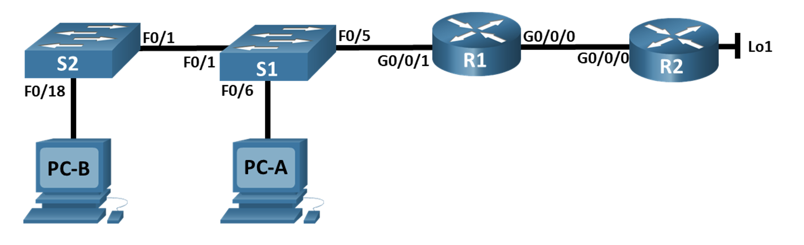
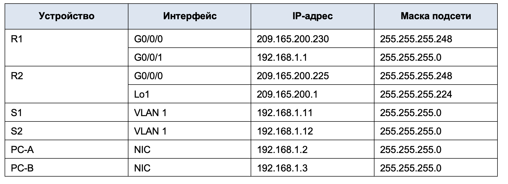
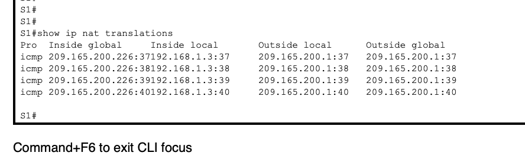
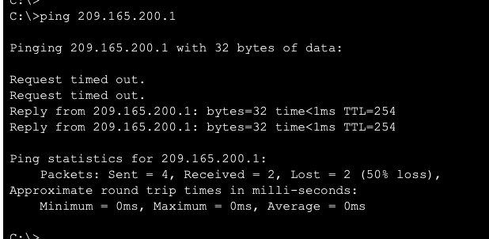
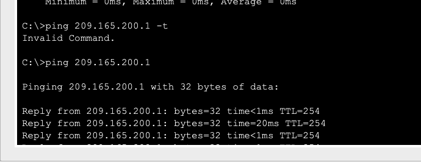

### Задачи

+ Часть 1. Создание сети и настройка основных параметров устройства
+ Часть 2. Настройка и проверка NAT для IPv4
+ Часть 3. Настройка и проверка PAT для IPv4
+ Часть 4. Настройка и проверка статического NAT для IPv4.


### Таблица адресации




### Основные параметры для настройки маршрутизатора и комутатора

##Сам перечень набора команд для R1(R2):

```
en
conf t
hostname R2
banner motd ^The device is the property of the company, any unauthorized change to the configuration is punishable by law.^
ip domain-name otus.ru
no ip domain-lookup
enable secret class
username cisco secret class
service password-encryption
crypto key generate rsa
2048
ip ssh version 2
username admin privilege 15 secret Adm1nP@55
line vty 0
logging synchronous
exit
line vty 0 4
login local
transport input ssh
exit
line vty 5 15
login local
transport input ssh
exit
security password min-length 14
exit
wr mem
```

### Сам перечень набора команд для S1(S2):

```
en
conf t
hostname S2
banner motd ^The device is the property of the company, any unauthorized change to the configuration is punishable by law.^
ip domain-name otus.ru
no ip domain-lookup
enable secret class
username cisco secret class
service password-encryption
crypto key generate rsa
2048
ip ssh version 2
username admin privilege 15 secret Adm1nP@55
line vty 0
logging synchronous
exit
line vty 0 4
login local
transport input ssh
exit
line vty 5 15
login local
transport input ssh
exit
security password min-length 14
exit
wr mem
```


Назначаем  ip фдреса на R1 и R2


```
R1#conf t
Enter configuration commands, one per line.  End with CNTL/Z.
R1(config)#int
R1(config)#interface g0/0/0/0
                          ^
% Invalid input detected at '^' marker.

R1(config)#interface g0/0/0/0
                          ^
% Invalid input detected at '^' marker.

R1(config)#interface g0/0/0
R1(config-if)#ip add
R1(config-if)#ip address 209.165.200.230 255.255.255.248
R1(config-if)#no shu
R1(config-if)#no shutdown

R1(config-if)#
%LINK-5-CHANGED: Interface GigabitEthernet0/0/0, changed state to up

R1(config-if)#exit
R1(config)#int g0/0/1
R1(config-if)#ip add
R1(config-if)#ip address 192.168.1.1 255.255.255.0
R1(config-if)#no shutdown
R1(config-if)#exit
R1(config)#ip route 0.0.0.0 0.0.0.0 209.165.200.225
%LINK-5-CHANGED: Interface GigabitEthernet0/0/1, changed state to up

%LINEPROTO-5-UPDOWN: Line protocol on Interface GigabitEthernet0/0/1, changed state to up

R1(config-if)#do wr mem
Building configuration...
[OK]

```

```
2>en
Password:
R2#conf t
Enter configuration commands, one per line.  End with CNTL/Z.
R2(config)#int
R2(config)#interface gig
R2(config)#interface gigabitEthernet g0/0/0
                                     ^
% Invalid input detected at '^' marker.

R2(config)#interface gigabitEthernet 0/0/0
R2(config-if)#ip add
R2(config-if)#ip address 209.165.200.225 255.255.255.248
R2(config-if)#no shutdown

R2(config-if)#
%LINK-5-CHANGED: Interface GigabitEthernet0/0/0, changed state to up

%LINEPROTO-5-UPDOWN: Line protocol on Interface GigabitEthernet0/0/0, changed state to up

R2(config-if)#exit
R2(config)#int
R2(config)#interface loo
R2(config)#interface loopback 1

R2(config-if)#
%LINK-5-CHANGED: Interface Loopback1, changed state to up

%LINEPROTO-5-UPDOWN: Line protocol on Interface Loopback1, changed state to up

R2(config-if)#ip add
R2(config-if)#
R2(config-if)#ip
R2(config-if)#ip
R2(config-if)#ip add
R2(config-if)#ip address 209.165.200.1 255.255.255.224
R2(config-if)#exit
R2(config)#ip route 192.168.1.0 255.255.255.0 209.165.200.230

```

Далее настраиваем S1 и S2

```
S2>
S2>en
Password:
S2#conf t
Enter configuration commands, one per line.  End with CNTL/Z.
S2(config)#int
S2(config)#interface vlan 1
S2(config-if)#ip add
S2(config-if)#ip address 192.168.1.11 255.255.255.0
S2(config-if)#no shu
S2(config-if)#no shutdown

S2(config-if)#
%LINK-5-CHANGED: Interface Vlan1, changed state to up

%LINEPROTO-5-UPDOWN: Line protocol on Interface Vlan1, changed state to up

S2(config-if)#exit
S2(config)#ip de
S2(config)#ip default-gateway 192.168.1.1
S2(config)#do wr mem
Building configuration...
[OK]
```

```
S1>
S1>en
Password:
S1#conf t
Enter configuration commands, one per line.  End with CNTL/Z.
S1(config)#int
S1(config)#interface vlan 1
S1(config-if)#ip add
S1(config-if)#ip address 192.168.1.12 255.255.255.0
S1(config-if)#no shu
S1(config-if)#no shutdown

S1(config-if)#
%LINK-5-CHANGED: Interface Vlan1, changed state to up

%LINEPROTO-5-UPDOWN: Line protocol on Interface Vlan1, changed state to up

S1(config-if)#exit
S1(config)#ip drf
S1(config)#ip def
S1(config)#ip default-gateway 192.168.1.1
S1(config)#do wr mem
Building configuration...
[OK]

```


### Настраиваем NAT  на R1

```
R1#conf t
Enter configuration commands, one per line.  End with CNTL/Z.
R1(config)#acc
R1(config)#access-list 1 per
R1(config)#access-list 1 permit 192.168.1.0 0.0.0.255
R1(config)#ip nat
R1(config)#ip nat poo
R1(config)#ip nat pool PUBLIC_ACCESS 209.165.200.226 209.165.200.228 netmask 255.255.255.248
R1(config)#ip nat
R1(config)#ip nat  ins
R1(config)#ip nat  inside sou
R1(config)#ip nat  inside source li
R1(config)#ip nat  inside source list 1 poo
R1(config)#ip nat  inside source list 1 pool PU
R1(config)#ip nat  inside source list 1 pool PUB
R1(config)#ip nat  inside source list 1 pool PUBLIC_ACCESS
R1(config)#exit
R1#
%SYS-5-CONFIG_I: Configured from console by console

R1#conf t
Enter configuration commands, one per line.  End with CNTL/Z.
R1(config)#int
R1(config)#interface gi
R1(config)#interface gigabitEthernet 0/0/0
R1(config-if)#ip nat ou
R1(config-if)#ip nat outside
R1(config-if)#exit
R1(config)#int
R1(config)#interface gig
R1(config)#interface gigabitEthernet 0/0/1
R1(config-if)#ip nat ins
R1(config-if)#ip nat inside
```

### Проверка

```
R1#show ip nat translations
Pro  Inside global     Inside local       Outside local      Outside global
icmp 209.165.200.227:41192.168.1.3:41     209.165.200.1:41   209.165.200.1:41
icmp 209.165.200.227:42192.168.1.3:42     209.165.200.1:42   209.165.200.1:42
icmp 209.165.200.227:43192.168.1.3:43     209.165.200.1:43   209.165.200.1:43
icmp 209.165.200.227:44192.168.1.3:44     209.165.200.1:44   209.165.200.1:44
icmp 209.165.200.228:17192.168.1.2:17     209.165.200.1:17   209.165.200.1:17
```








### PAT через Poool

```

R1#conf t
Enter configuration commands, one per line.  End with CNTL/Z.
R1(config)#o ip nat inside source list 1 pool PUBLIC_ACCESS overload
           ^
% Invalid input detected at '^' marker.

R1(config)#
R1(config)#
R1(config)#
R1(config)#
R1(config)#
R1(config)#
R1(config)#
R1(config)#no ip nat inside source list 1 pool PUBLIC_ACCESS overload
R1(config)#no ip nat pool PUBLIC_ACCESS
R1(config)#ip nat ins
R1(config)#ip nat inside so
R1(config)#ip nat inside source li
R1(config)#ip nat inside source list 1 int
R1(config)#ip nat inside source list 1 interface gig
R1(config)#ip nat inside source list 1 interface gigabitEthernet 0/0/0 ov
R1(config)#ip nat inside source list 1 interface gigabitEthernet 0/0/0 overload
R1(config)#cle
R1(config)#clea
R1(config)#exit
R1#
%SYS-5-CONFIG_I: Configured from console by console

R1#cle
R1#clear ip nat tra
R1#clear ip nat translation
% Incomplete command.
R1#clear ip nat st
R1#clear ip nat sta
R1#clear ip nat ?
  translation  Clear dynamic translation
R1#conf t
Enter configuration commands, one per line.  End with CNTL/Z.
R1(config)#ip nat
R1(config)#ip nat ins
R1(config)#ip nat inside sou
R1(config)#ip nat inside source sta
R1(config)#ip nat inside source static 192.168.1.2 209.165.200.229
R1(config)#show ip nat translations
            ^
% Invalid input detected at '^' marker.

R1(config)#exit
R1#
%SYS-5-CONFIG_I: Configured from console by console

R1#sh
R1#show ip nat
R1#show ip nat tra
R1#show ip nat translations
Pro  Inside global     Inside local       Outside local      Outside global
---  209.165.200.229   192.168.1.2        ---                ---

R1#sh
R1#show ip nat sta
R1#show ip nat statistics
Total translations: 1 (1 static, 0 dynamic, 0 extended)
Outside Interfaces: GigabitEthernet0/0/0
Inside Interfaces: GigabitEthernet0/0/1
Hits: 16  Misses: 20
Expired translations: 20
Dynamic mappings:
R1#
```


Проверка


```
R1#show ip nat translations
Pro  Inside global     Inside local       Outside local      Outside global
icmp 209.165.200.230:45192.168.1.3:45     209.165.200.1:45   209.165.200.1:45
icmp 209.165.200.230:46192.168.1.3:46     209.165.200.1:46   209.165.200.1:46
icmp 209.165.200.230:47192.168.1.3:47     209.165.200.1:47   209.165.200.1:47
icmp 209.165.200.230:48192.168.1.3:48     209.165.200.1:48   209.165.200.1:48
icmp 209.165.200.230:49192.168.1.3:49     209.165.200.1:49   209.165.200.1:49
icmp 209.165.200.230:50192.168.1.3:50     209.165.200.1:50   209.165.200.1:50
icmp 209.165.200.230:51192.168.1.3:51     209.165.200.1:51   209.165.200.1:51
icmp 209.165.200.230:52192.168.1.3:52     209.165.200.1:52   209.165.200.1:52
---  209.165.200.229   192.168.1.2        ---                ---

R1#
R1#
R1#
R1#show ip nat translations
Pro  Inside global     Inside local       Outside local      Outside global
icmp 209.165.200.229:21192.168.1.2:21     209.165.200.1:21   209.165.200.1:21
icmp 209.165.200.229:22192.168.1.2:22     209.165.200.1:22   209.165.200.1:22
icmp 209.165.200.229:23192.168.1.2:23     209.165.200.1:23   209.165.200.1:23
icmp 209.165.200.229:24192.168.1.2:24     209.165.200.1:24   209.165.200.1:24
---  209.165.200.229   192.168.1.2        ---                ---

```

При генерации песконечных пингов

```
R1#show ip nat translations
Pro  Inside global     Inside local       Outside local      Outside global
icmp 209.165.200.229:25192.168.1.2:25     209.165.200.1:25   209.165.200.1:25
icmp 209.165.200.229:26192.168.1.2:26     209.165.200.1:26   209.165.200.1:26
icmp 209.165.200.229:27192.168.1.2:27     209.165.200.1:27   209.165.200.1:27
icmp 209.165.200.229:28192.168.1.2:28     209.165.200.1:28   209.165.200.1:28
icmp 209.165.200.229:29192.168.1.2:29     209.165.200.1:29   209.165.200.1:29
icmp 209.165.200.229:30192.168.1.2:30     209.165.200.1:30   209.165.200.1:30
icmp 209.165.200.229:31192.168.1.2:31     209.165.200.1:31   209.165.200.1:31
icmp 209.165.200.229:32192.168.1.2:32     209.165.200.1:32   209.165.200.1:32
icmp 209.165.200.229:33192.168.1.2:33     209.165.200.1:33   209.165.200.1:33
icmp 209.165.200.229:34192.168.1.2:34     209.165.200.1:34   209.165.200.1:34
icmp 209.165.200.229:35192.168.1.2:35     209.165.200.1:35   209.165.200.1:35
icmp 209.165.200.229:36192.168.1.2:36     209.165.200.1:36   209.165.200.1:36
icmp 209.165.200.229:37192.168.1.2:37     209.165.200.1:37   209.165.200.1:37
icmp 209.165.200.229:38192.168.1.2:38     209.165.200.1:38   209.165.200.1:38
icmp 209.165.200.229:39192.168.1.2:39     209.165.200.1:39   209.165.200.1:39
icmp 209.165.200.229:40192.168.1.2:40     209.165.200.1:40   209.165.200.1:40
icmp 209.165.200.229:41192.168.1.2:41     209.165.200.1:41   209.165.200.1:41
icmp 209.165.200.229:42192.168.1.2:42     209.165.200.1:42   209.165.200.1:42
icmp 209.165.200.229:43192.168.1.2:43     209.165.200.1:43   209.165.200.1:43
icmp 209.165.200.229:44192.168.1.2:44     209.165.200.1:44   209.165.200.1:44
icmp 209.165.200.229:45192.168.1.2:45     209.165.200.1:45   209.165.200.1:45
icmp 209.165.200.229:46192.168.1.2:46     209.165.200.1:46   209.165.200.1:46
icmp 209.165.200.230:53192.168.1.3:53     209.165.200.1:53   209.165.200.1:53
icmp 209.165.200.230:54192.168.1.3:54     209.165.200.1:54   209.165.200.1:54
icmp 209.165.200.230:55192.168.1.3:55     209.165.200.1:55   209.165.200.1:55
icmp 209.165.200.230:56192.168.1.3:56     209.165.200.1:56   209.165.200.1:56
icmp 209.165.200.230:57192.168.1.3:57     209.165.200.1:57   209.165.200.1:57
icmp 209.165.200.230:58192.168.1.3:58     209.165.200.1:58   209.165.200.1:58
icmp 209.165.200.230:59192.168.1.3:59     209.165.200.1:59   209.165.200.1:59
icmp 209.165.200.230:60192.168.1.3:60     209.165.200.1:60   209.165.200.1:60
icmp 209.165.200.230:61192.168.1.3:61     209.165.200.1:61   209.165.200.1:61
icmp 209.165.200.230:62192.168.1.3:62     209.165.200.1:62   209.165.200.1:62
icmp 209.165.200.230:63192.168.1.3:63     209.165.200.1:63   209.165.200.1:63
icmp 209.165.200.230:64192.168.1.3:64     209.165.200.1:64   209.165.200.1:64
icmp 209.165.200.230:65192.168.1.3:65     209.165.200.1:65   209.165.200.1:65
icmp 209.165.200.230:66192.168.1.3:66     209.165.200.1:66   209.165.200.1:66
icmp 209.165.200.230:67192.168.1.3:67     209.165.200.1:67   209.165.200.1:67
icmp 209.165.200.230:68192.168.1.3:68     209.165.200.1:68   209.165.200.1:68
icmp 209.165.200.230:69192.168.1.3:69     209.165.200.1:69   209.165.200.1:69
icmp 209.165.200.230:70192.168.1.3:70     209.165.200.1:70   209.165.200.1:70
icmp 209.165.200.230:71192.168.1.3:71     209.165.200.1:71   209.165.200.1:71
icmp 209.165.200.230:72192.168.1.3:72     209.165.200.1:72   209.165.200.1:72
icmp 209.165.200.230:73192.168.1.3:73     209.165.200.1:73   209.165.200.1:73
icmp 209.165.200.230:74192.168.1.3:74     209.165.200.1:74   209.165.200.1:74
icmp 209.165.200.230:75192.168.1.3:75     209.165.200.1:75   209.165.200.1:75
icmp 209.165.200.230:76192.168.1.3:76     209.165.200.1:76   209.165.200.1:76
icmp 209.165.200.230:77192.168.1.3:77     209.165.200.1:77   209.165.200.1:77
icmp 209.165.200.230:78192.168.1.3:78     209.165.200.1:78   209.165.200.1:78
icmp 209.165.200.230:79192.168.1.3:79     209.165.200.1:79   209.165.200.1:79
icmp 209.165.200.230:80192.168.1.3:80     209.165.200.1:80   209.165.200.1:80
icmp 209.165.200.230:81192.168.1.3:81     209.165.200.1:81   209.165.200.1:81
icmp 209.165.200.230:82192.168.1.3:82     209.165.200.1:82   209.165.200.1:82
icmp 209.165.200.230:83192.168.1.3:83     209.165.200.1:83   209.165.200.1:83
icmp 209.165.200.230:84192.168.1.3:84     209.165.200.1:84   209.165.200.1:84
icmp 209.165.200.230:85192.168.1.3:85     209.165.200.1:85   209.165.200.1:85
icmp 209.165.200.230:86192.168.1.3:86     209.165.200.1:86   209.165.200.1:86
icmp 209.165.200.230:87192.168.1.3:87     209.165.200.1:87   209.165.200.1:87
---  209.165.200.229   192.168.1.2        ---                ---
```


