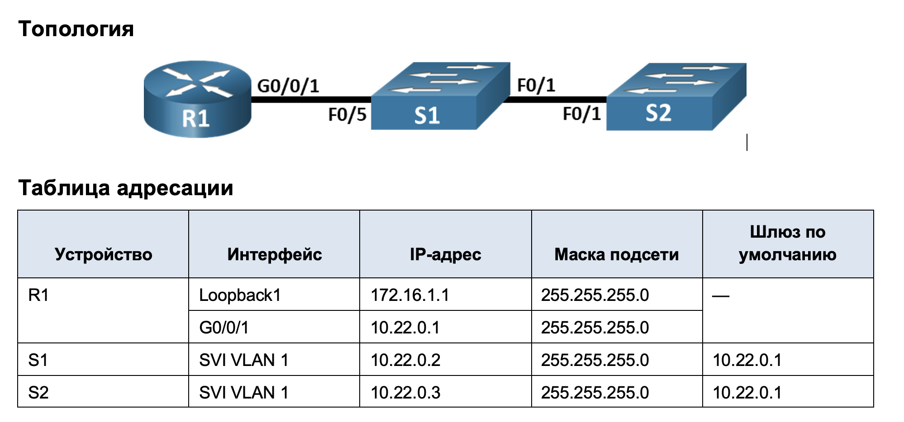

### Задачи

+ Часть 1. Создание сети и настройка основных параметров устройства
+ Часть 2. Обнаружение сетевых ресурсов с помощью протокола CDP
+ Часть 3. Обнаружение сетевых ресурсов с помощью протокола LLDP
+ Часть 4. Настройка и проверка NTP


### Основные параметры для настройки маршрутизатора и комутатора

##Сам перечень набора команд для R1:

```
en
conf t
hostname R2
banner motd ^The device is the property of the company, any unauthorized change to the configuration is punishable by law.^
ip domain-name otus.ru
no ip domain-lookup
enable secret class
username cisco secret class
service password-encryption
crypto key generate rsa
2048
ip ssh version 2
username admin privilege 15 secret Adm1nP@55
line vty 0
logging synchronous
exit
line vty 0 4
login local
transport input ssh
exit
line vty 5 15
login local
transport input ssh
exit
security password min-length 14
exit
wr mem
```

### Сам перечень набора команд для S1(S2):

```
en
conf t
hostname S2
banner motd ^The device is the property of the company, any unauthorized change to the configuration is punishable by law.^
ip domain-name otus.ru
no ip domain-lookup
enable secret class
username cisco secret class
service password-encryption
crypto key generate rsa
2048
ip ssh version 2
username admin privilege 15 secret Adm1nP@55
line vty 0
logging synchronous
exit
line vty 0 4
login local
transport input ssh
exit
line vty 5 15
login local
transport input ssh
exit
security password min-length 14
exit
wr mem
```

Назначаем ip адреса мардшрутизатору и коммутаторам.

### Для R1:

```
R2#conf t
Enter configuration commands, one per line.  End with CNTL/Z.
R2(config)#int
R2(config)#interface gig
R2(config)#interface gigabitEthernet 0/0/1
R2(config-if)#ipadd
R2(config-if)#ip add
R2(config-if)#ip address 10.22.0.1 255.255.255.0
R2(config-if)#no shu
R2(config-if)#no shutdown 

R2(config-if)#
%LINK-5-CHANGED: Interface GigabitEthernet0/0/1, changed state to up

%LINEPROTO-5-UPDOWN: Line protocol on Interface GigabitEthernet0/0/1, changed state to up

R2(config-if)#exit
R2(config)#int loo
R2(config)#int loopback 1

R2(config-if)#
%LINK-5-CHANGED: Interface Loopback1, changed state to up

%LINEPROTO-5-UPDOWN: Line protocol on Interface Loopback1, changed state to up

R2(config-if)#ip add
R2(config-if)#ip address 172.16.1.1 255.255.255.0
R2(config-if)#exit
```
### Для S1:

```
S1#conf t
Enter configuration commands, one per line.  End with CNTL/Z.
S1(config)#int
S1(config)#interface vl
S1(config)#interface vlan 1
S1(config-if)#ip add
S1(config-if)#ip address 10.22.0.2 255.255.255.0
S1(config-if)#no shu
S1(config-if)#no shutdown 

S1(config-if)#
%LINK-5-CHANGED: Interface Vlan1, changed state to up

%LINEPROTO-5-UPDOWN: Line protocol on Interface Vlan1, changed state to up
%IP-4-DUPADDR: Duplicate address 10.22.0.1 on Vlan1, sourced by 00E0.F79B.B002

S1(config-if)#exit
S1(config)#ip def
S1(config)#ip default-gateway 10.22.0.1
S1(config)#int
S1(config)#interface ran
S1(config)#interface range fa0/2-24, g0/1-2
S1(config-if-range)#shu
S1(config-if-range)#shutdown 
```
### Для S1:
```
S2#conf t
Enter configuration commands, one per line.  End with CNTL/Z.
S2(config)#int
S2(config)#interface vla
S2(config)#interface vlan 1
S2(config-if)#ip address 10.22.0.3 255.255.255.0
S2(config-if)#no shutdown

S2(config-if)#exit
%LINK-5-CHANGED: Interface Vlan1, changed state to up

%LINEPROTO-5-UPDOWN: Line protocol on Interface Vlan1, changed state to up

S2(config)#
S2(config)#ip default-gateway 10.22.0.1
S2(config)#interface range fa0/2-24 , g0/1-2
S2(config-if-range)#shu
S2(config-if-range)#shutdown 
```

### Обнаружение сетевых ресурсов с помощью CDP

На R1 используйте соответствующую команду show cdp, чтобы определить, сколько интерфейсов включено CDP, сколько из них включено и сколько отключено.


```
R2#show cdp
Global CDP information:
    Sending CDP packets every 60 seconds
    Sending a holdtime value of 180 seconds
    Sending CDPv2 advertisements is enabled
R2#show cdp interface
Vlan1 is administratively down, line protocol is down
  Sending CDP packets every 60 seconds
  Holdtime is 180 seconds
GigabitEthernet0/0/0 is administratively down, line protocol is down
  Sending CDP packets every 60 seconds
  Holdtime is 180 seconds
GigabitEthernet0/0/1 is up, line protocol is down
  Sending CDP packets every 60 seconds
  Holdtime is 180 seconds
GigabitEthernet0/0/2 is administratively down, line protocol is down
  Sending CDP packets every 60 seconds
  Holdtime is 180 seconds
R2#

```
Активным является интерфейс: GigabitEthernet0/0/1

### Определение версии IOS на S1

```
R2#
R2#
R2#show cdp entry S1

R2#
```
Как видим информация отсутствует, необходимо проверить все ли впорядке на S1:

```
1(config-if-range)#
%LINK-5-CHANGED: Interface FastEthernet0/5, changed state to administratively down
```
Оказалось интерфейс выключен, включим интерлфейс и проверим команду на R1 снова


```
S1#conf t
Enter configuration commands, one per line.  End with CNTL/Z.
S1(config)#int
S1(config)#interface fas
S1(config)#interface fastEthernet 0/5
S1(config-if)#no shu
S1(config-if)#no shutdown 

S1(config-if)#
```
Проверяем команду на R1:

```
R2#show cdp entry S1

Device ID: S1
Entry address(es): 
  IP address : 10.22.0.2
Platform: cisco 2960, Capabilities: Switch
Interface: GigabitEthernet0/0/1, Port ID (outgoing port): FastEthernet0/5
Holdtime: 164

Version :
Cisco IOS Software, C2960 Software (C2960-LANBASEK9-M), Version 15.0(2)SE4, RELEASE SOFTWARE (fc1)
Technical Support: http://www.cisco.com/techsupport
Copyright (c) 1986-2013 by Cisco Systems, Inc.
Compiled Wed 26-Jun-13 02:49 by mnguyen

advertisement version: 2
Duplex: full

R2#

```
На коммутаторе S1 используется:
Cisco IOS Software, C2960 Software (C2960-LANBASEK9-M), Version 15.0(2)SE4, RELEASE SOFTWARE (fc1)


Для определения количества пакетов CDP использдуется команда show cdp traffic
```
S1#show cdp 
Global CDP information:
    Sending CDP packets every 60 seconds
    Sending a holdtime value of 180 seconds
    Sending CDPv2 advertisements is enabled
S1#show cdp traffic
            ^
% Invalid input detected at '^' marker.
	
S1#
S1#
S1#show cdp ne
S1#show cdp neighbors 
Capability Codes: R - Router, T - Trans Bridge, B - Source Route Bridge
                  S - Switch, H - Host, I - IGMP, r - Repeater, P - Phone
Device ID    Local Intrfce   Holdtme    Capability   Platform    Port ID
S2           Fas 0/1          147            S       2960        Fas 0/1
R2           Fas 0/5          132            R       ISR4300     Gig 0/0/1
```
Однако в данной версии ПО команда не отрабатывает но ожидаем был следующий результат:

```
S1# show cdp traffic
CDP counters : 
        Total packets output: 179, Input: 148 
        Hdr syntax: 0, Chksum error: 0, Encaps failed: 0 
        No memory: 0, Invalid packet: 0, 
        CDP version 1 advertisements output: 0, Input: 0 
        CDP version 2 advertisements output: 179, Input: 148
```
### Количество отправленных пакетов CDP:
 Total packets output: 179,
 
 
Так же после настройки SVI VLAN 1 через CDP стал отображаться IP-адрес коммутатора S1 — 10.22.0.2.

R2#show cdp entry S1

Device ID: S1
Entry address(es): 
###  IP address : 10.22.0.2
Platform: cisco 2960, Capabilities: Switch
Interface: GigabitEthernet0/0/1, Port ID (outgoing port): FastEthernet0/5
Holdtime: 164

Version :
Cisco IOS Software, C2960 Software (C2960-LANBASEK9-M), Version 15.0(2)SE4, RELEASE SOFTWARE (fc1)
Technical Support: http://www.cisco.com/techsupport
Copyright (c) 1986-2013 by Cisco Systems, Inc.
Compiled Wed 26-Jun-13 02:49 by mnguyen

advertisement version: 2
Duplex: full

R2#

Однако отсутсвует поле Management address(es) это связано с особенностями ПО т.е. 
а) особенности IOS 15.0;
б) ограничения Packet Tracer;
в) не все модели Catalyst 2960 отправляют отдельный TLV management-address.


### Обнаружение сетевых ресурсов с помощью LLDP

Включение LLDP

На всех устройствах необходимо прописать:

```
configure terminal
lldp run
end
```

Просмотр информации LLDP

На S1:


```
Просмотр информации LLDP

На S1:

```
S1#show lldp ?
  neighbors  LLDP neighbor entries
  <cr>
S1#show lldp entry s2
             ^
% Invalid input detected at '^' marker.
	
S1#show lldp ?
  neighbors  LLDP neighbor entries
  <cr>
S1#show lldp nei
S1#show lldp neighbors 
Capability codes:
    (R) Router, (B) Bridge, (T) Telephone, (C) DOCSIS Cable Device
    (W) WLAN Access Point, (P) Repeater, (S) Station, (O) Other
Device ID           Local Intf     Hold-time  Capability      Port ID
S2                  Fa0/1          120        B               Fa0/1
R2                  Fa0/5          120        R               Gig0/0/1

Total entries displayed: 2
S1#
S1#
S1#
S1#show lldp neighbors ?
  detail  Show detailed information
  <cr>
S1#show lldp neighbors det
S1#show lldp neighbors detail 
------------------------------------------------
Chassis id: 0001.971A.4501
Port id: Fa0/1
Port Description: FastEthernet0/1
System Name: S2
System Description:
Cisco IOS Software, C2960 Software (C2960-LANBASEK9-M), Version 15.0(2)SE4, RELEASE SOFTWARE (fc1)
Technical Support: http://www.cisco.com/techsupport
Copyright (c) 1986-2013 by Cisco Systems, Inc.
Compiled Wed 26-Jun-13 02:49 by mnguyen
Time remaining: 90 seconds
System Capabilities: B
Enabled Capabilities: B
Management Addresses - not advertised
Auto Negotiation - supported, enabled
Physical media capabilities:
    100baseT(FD)
    100baseT(HD)
    1000baseT(HD)
Media Attachment Unit type: 10
Vlan ID: 1
------------------------------------------------
Chassis id: 00E0.F79B.B002
Port id: Gig0/0/1
Port Description: GigabitEthernet0/0/1
System Name: R2
System Description:
Cisco IOS Software [Everest], ISR Software (X86_64_LINUX_IOSD-UNIVERSALK9-M), Version 16.6.4,RELEASE SOFTWARE (fc3)
Technical Support: http://www.cisco.com/techsupport
Copyright (c) 1986-2018 by Cisco Systems, Inc.
Compiled Sun 08-Jul-18 04:33 by mcpre
Time remaining: 90 seconds
System Capabilities: R
Enabled Capabilities: R
Management Addresses - not advertised
Auto Negotiation - supported, enabled
Physical media capabilities:
    1000baseT(HD)
    100baseT(FD)
Media Attachment Unit type: 10
Vlan ID: 1

Total entries displayed: 2
S1#
```
Chassis ID коммутатора S2:
Chassis id: 0001.971A.4501

### Настройка NTP

Просмотр текущего времени

```
S1#
S1#show clock
*1:12:36.190 UTC Mon Mar 1 1993
S1#
```

Установка времени на R1

```
R2#
R2#clock set 12:00:00 May 7 2026
R2#show clock
12:0:9.400 UTC Thu May 7 2026
R2#
```
Настройка R1 как NTP-сервера
```
R2#configure terminal
Enter configuration commands, one per line.  End with CNTL/Z.
R2(config)#ntp master 4
```

Настройка S1 и S2 как клиентов NTP

```
S1#configure terminal
Enter configuration commands, one per line.  End with CNTL/Z.
S1(config)#
S1(config)#ntp server 10.22.0.1
S1(config)#end
S2#show ntp associations

address         ref clock       st   when     poll    reach  delay          offset            disp
 ~10.22.0.1     127.127.1.1     4    14       16      1      0.00           1047211388173.00  0.00
 * sys.peer, # selected, + candidate, - outlyer, x falseticker, ~ configured
S2#
```

