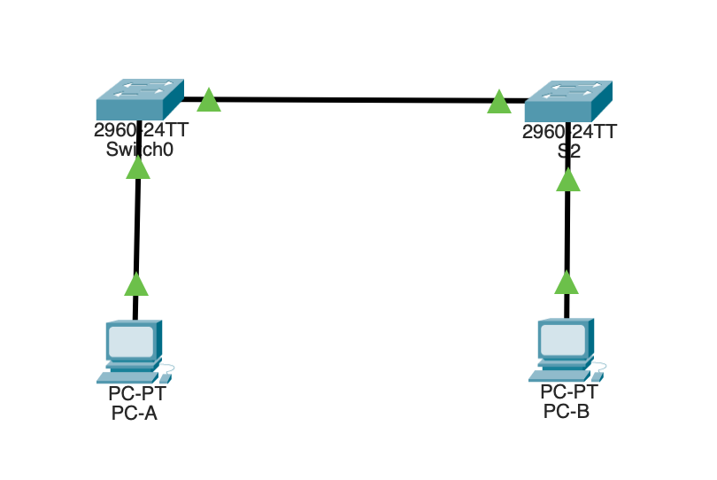
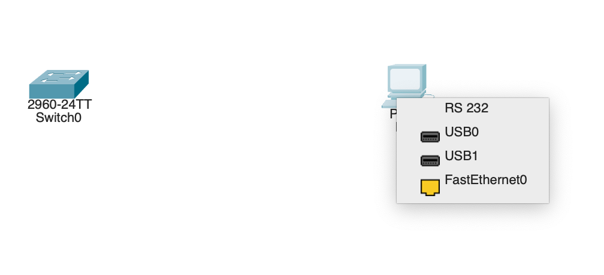
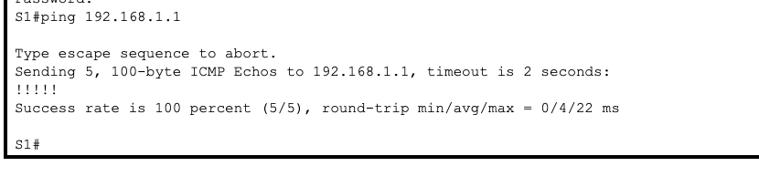
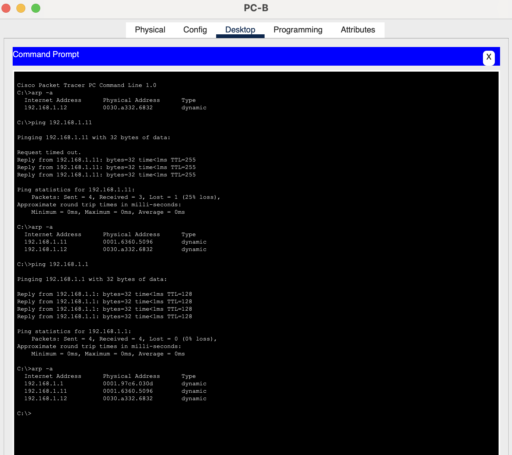

# Лабораторная работа. Просмотр таблицы MAC-адресов коммутатора



| Устройство    | Интерфейс       | IP-адрес / префикс |
| :------------ |:---------------:| ------------------:|
| S1            | VLAN 1          | 192.168.1.11 /24  |
| S2            | VLAN 1          | 192.168.1.12 /24  |
| PC-A          | NIC             | 192.168.1.1/24     |
| PC-B          | NIC             | 192.168.1.2/24     |
|               |                 |                    |


### Цели и задачи 
+ Часть 1. Создание и настройка сети
+ Часть 2. Изучение таблицы МАС-адресов коммутатора


В ходе лабораторной работы использовался коммутатор Cisco 2960 (ver ios 15.0(2)SE4)

Для выполнения данной лабораторной работы необходимо настроить все хосты и коммутаторы и назначить ip адреса согласно таблице приведенной выше. Так же следует задать имя коммутаторам, назначить ip адрес и настроить дистанционное подключение по протоколу telnet, предварительно подключившись через консоль управления.



Логин и пароль следует задать везде одинаковый:  cisco:class.

Перечень выполняемых команд приводится ниже:

```
hostname S1
no ip domain-lookup

banner motd ^C!!!!!!!Lab-2!!!!!!!^C
no ip domain-lookup
enable secret class
username cisco secret class
interface vlan 1
ip address 192.168.1.11 255.255.255.0
ip default-gateway 192.168.1.1
no shutdown

line con 0
 logging synchronous
exit
line vty 0 4
 login local
 transport input telnet
exit
line vty 5 15
 login local
 transport input telnet
exit

```
После чего стоит проверить сетевую связанность с помощью эхо ответов:



Далее стоит подключиться по telnet с PC-B на S2 и убедиться что mac адреса появились в таблице, после чего очистить таблицу и убедиться что mac адрес хоста пропал. После чего пропинговать хобст и снова убедиться что mac адрес снова появился.




