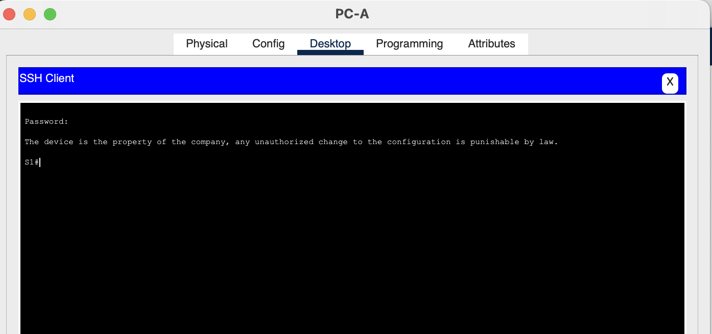
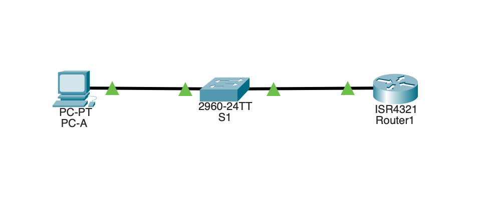
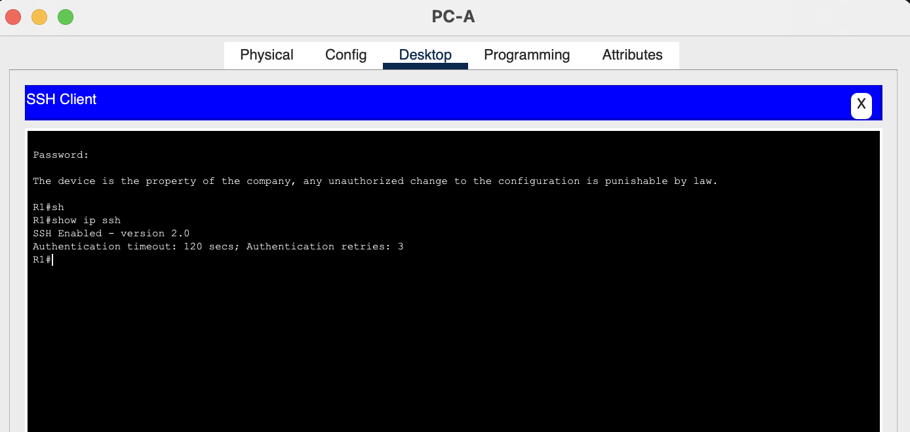
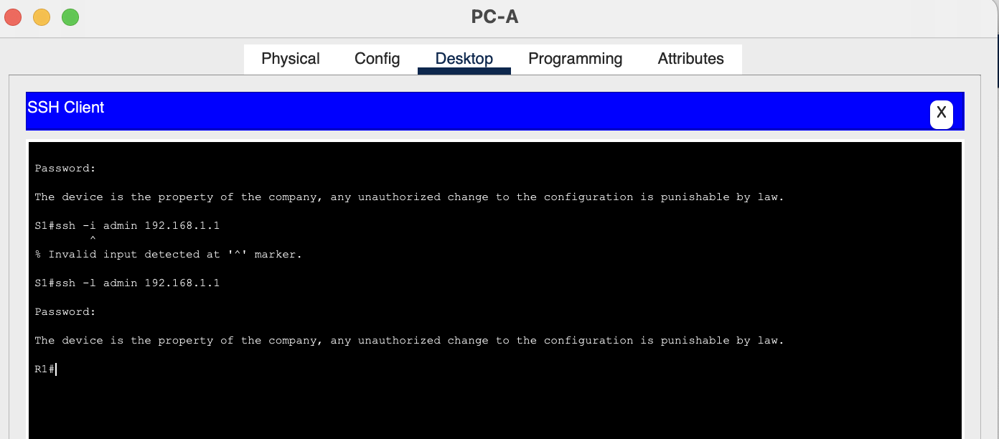

# Лабораторная работа. Доступ к сетевым устройствам по протоколу SSH




| 						Устройство      |   Интерфейс     | 						IPv6-адрес     |   Link local IPv6-адрес     | 						Длина префикса      |   Шлюз по умолчанию     |
| :---------------------|:---------------:|:---------------------|:---------------------------:|:--------------------------|:-----------------------:|
| R1                    |G0/0/0           | 2001:db8:acad:a::1   |  fe80::1                    | 64                        |                         |
|                       |G0/0/1           |   2001:db8:acad:1::1 |  fe80::1                    | 64                        |                         |
|S1                  	  |VLAN1            |   2001:db8:acad:1::b |  fe80::b                    | 64                        |                         |
|PC-A                   |NIC              |   2001:db8:acad:1::3 |  SLACC                      | 64                        |fe80::1                  |
|PC-B                	  |NIC              |   2001:db8:acad:a::3 |  SLACC                      | 64                        | fe80::1                 |


### Задачи
+ Часть 1. Настройка топологии и конфигурация основных параметров маршрутизатора и коммутатора
+ Часть 2. Ручная настройка IPv6-адресов
+ Часть 3. Проверка сквозного соединения


### Общие сведения/сценарий
В этой лабораторной работе  вы будете настраивать хосты и интерфейсы устройств с IPv6-адресами.  Для просмотра индивидуальных и групповых IPv6-адресов вы будете использовать команду show. Вы также будете проверять сквозное соединение с помощью команд ping and traceroute.

Шаблон default bias, который по умолчанию используется диспетчером SDM (диспетчер базы данных коммутатора), не предоставляет возможностей адресации IPv6. Убедитесь, что SDM использует шаблон dual-ipv4-and-ipv6 или lanbase-routing. Новый шаблон будет использоваться после перезагрузки. 
```
Switch>en
Switch#conf t
Enter configuration commands, one per line.  End with CNTL/Z.
Switch(config)#host
Switch(config)#hostname S1
S1(config)#exit
S1#
%SYS-5-CONFIG_I: Configured from console by console

S1#sh
S1#show sd
S1#show sdm pr
S1#show sdm prefer 
 The current template is "default" template.
 The selected template optimizes the resources in
 the switch to support this level of features for
 0 routed interfaces and 1024 VLANs.

  number of unicast mac addresses:                  8K
  number of IPv4 IGMP groups + multicast routes:    0.25K
  number of IPv4 unicast routes:                    0
  number of IPv6 multicast groups:                  0
  number of directly-connected IPv6 addresses:      0
  number of indirect IPv6 unicast routes:           0
  number of IPv4 policy based routing aces:         0
  number of IPv4/MAC qos aces:                      0.125k
  number of IPv4/MAC security aces:                 0.375k
  number of IPv6 policy based routing aces:         0
  number of IPv6 qos aces:                          20
  number of IPv6 security aces:                     25

S1#
```
Чтобы установить шаблон dual-ipv4-and-ipv6 в качестве шаблона SDM по умолчанию, необходимо выполнить следующее:



# После подключения сети, инициализации и перезагрузки маршрутизатора и коммутатора выполните следующие действия:
### Шаг 1. Настройте маршрутизатор.
Назначьте имя хоста и настройте основные параметры устройства.
### Шаг 2. Настройте коммутатор.
Назначьте имя хоста и настройте основные параметры устройства.

На обоих утсройсвах необходимо задать пароль и настроить ssh доступ:

```
no ip domain-lookup
banner motd ^C!!!!!!!Lab!!!!!!!^C
no ip domain-lookup
enable secret class
username cisco secret class
line con 0
 logging synchronous
exit
line vty 0 4
 login local
 transport input telnet
exit
line vty 5 15
 login local
 transport input telnet
exit

```


Далее необходимо назначить ipv6 адреса обоим интерфейсам на R1, 

```
R1(config)#int
R1(config)#interface giga
R1(config)#interface gigabitEthernet 0/0/0
R1(config-if)#ip
R1(config-if)#ipv
R1(config-if)#ipv6 add
R1(config-if)#ipv6 address 2001:db8:acad:a::1/64
R1(config-if)#exit
R1(config)#int giga 0/0/1
R1(config-if)#ipv
R1(config-if)#ipv6 add
R1(config-if)#ipv6 address 2001:db8:acad:1::1/64
R1(config-if)#exit
R1(config)#int
R1(config)#interface gig
R1(config)#interface gigabitEthernet 0/0/0
R1(config-if)#no shu
R1(config-if)#no shutdown 

R1(config-if)#
%LINK-5-CHANGED: Interface GigabitEthernet0/0/0, changed state to up

%LINEPROTO-5-UPDOWN: Line protocol on Interface GigabitEthernet0/0/0, changed state to up

R1(config-if)#exit
R1(config)#int
R1(config)#interface gig
R1(config)#interface gigabitEthernet 0/0/1
R1(config-if)#no shut
R1(config-if)#no shutdown 

R1(config-if)#
%LINK-5-CHANGED: Interface GigabitEthernet0/0/1, changed state to up

%LINEPROTO-5-UPDOWN: Line protocol on Interface GigabitEthernet0/0/1, changed state to up

```
Если после назначения адресов на интерфейсы вывести список ip то можно заметить что помимо глобальных адресов ipv6 были автоматически назначены и link local ipv6 с помощью команды 
show ipv6 interface brief:



Для назначения link local необходимо ввести следующую команду:

```
R1(config)#int gig
R1(config)#int gigabitEthernet 0/0/0/
                                   ^
% Invalid input detected at '^' marker.
	
R1(config)#int gigabitEthernet 0/0/0
R1(config-if)#ipv6 add
R1(config-if)#ipv6 address fe80::1 li
R1(config-if)#ipv6 address fe80::1 link-local 
R1(config-if)#exit
R1(config)#int
R1(config)#interface gig
R1(config)#interface gigabitEthernet 0/0/1
R1(config-if)#ipv6 add
R1(config-if)#ipv6 address fe80::1 li
R1(config-if)#ipv6 address fe80::1 link-local 
R1(config-if)#exit
R1(config)#do  sh
R1(config)#do sh ipv6 int brief
GigabitEthernet0/0/0       [up/up]
    FE80::1
    2001:DB8:ACAD:A::1
GigabitEthernet0/0/1       [up/up]
    FE80::1
    2001:DB8:ACAD:1::1
GigabitEthernet0/0/2       [administratively down/down]
    unassigned
Vlan1                      [administratively down/down]
    unassigned
```
Далее необходимо активировать ipv6-маршрутизацию на R1:

```
R1#conf t
Enter configuration commands, one per line.  End with CNTL/Z.
R1(config)#ipv
R1(config)#ipv6 ?
  access-list      Configure access lists
  cef              Cisco Express Forwarding
  dhcp             Configure Ipv6 DHCP
  general-prefix   Configure a general IPv6 prefix
  host             Configure static hostnames
  inspect          Context-based Access Control Engine
  local            Specify local options
  nat              NAT-PT Configuration commands
  neighbor         Neighbor
  route            Configure static routes
  router           Enable an IPV6 routing process
  unicast-routing  Enable unicast routing
R1(config)#ipv6 uni
R1(config)#ipv6 unicast-routing 
R1(config)#
```
После чего появится возможность получить адрес автоматически:


Для назданачения статического адреса необходимо указать его вручную с указаниес


