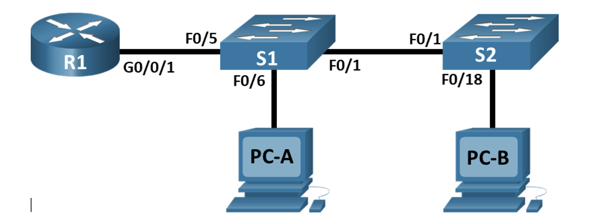
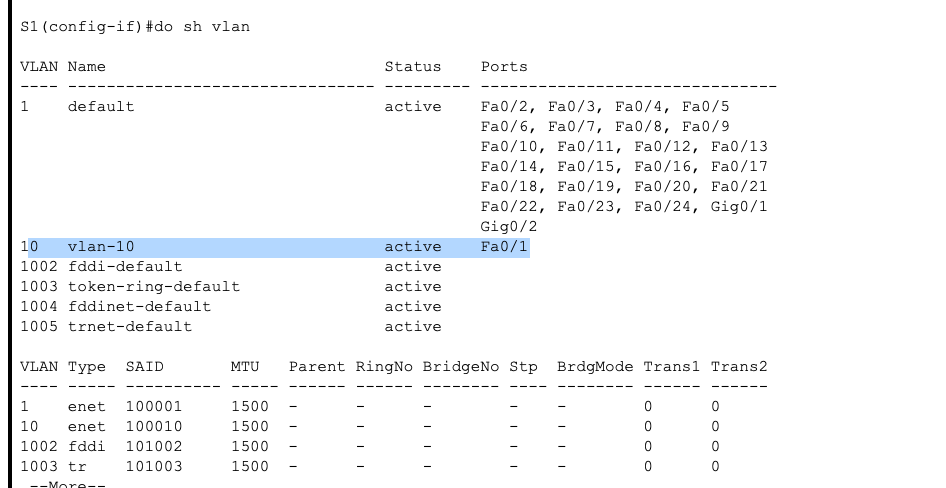
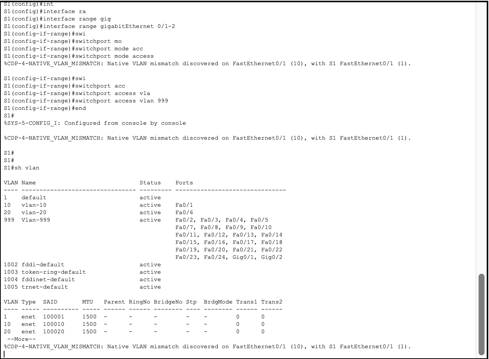
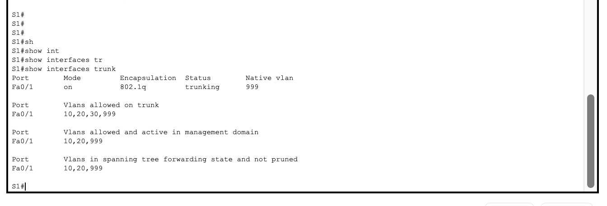

### Таблица адресации
| Устройство           |   Интерфейс     | 		IP-адрес        |   Маска подсети             | 	Шлюз по умолчанию     |
|:---------------------|:---------------:|:---------------------|:---------------------------:|:--------------------------|
|R1                    |G0/0/1.10        | 192.168.10.1         |  255.255.255.0              | -                         |
|                      |G0/0/1.20        | 192.168.20.1         |255.255.255.0                |                           |
|                      |G0/0/1.30        | 192.168.30.1         |255.255.255.0                |                           |
|                      |G0/0/1.1000      | ---                  |                             |                           |
|S1                    |VLAN 10          |   192.168.10.11      |  255.255.255.0              | 192.168.10.1              |
|S2                    |VLAN 10          |   192.168.10.12      |  255.255.255.0              | 192.168.10.1              |
|PC-B                  |NIC              |   192.168.20.3       |  255.255.255.0              | 192.168.20.1              |
|PC-A                  |NIC              |   192.168.20.3       |  255.255.255.0              | 192.168.30.1              |


### Таблица VLAN
| VLAN                 |   Имя           | 		Назначенный интерфейс        |
|:---------------------|:---------------:|:----------------------------------|
|10                    |Управление       | S1: VLAN 10; S2: VLAN 10          |
|20                    |Sales            | S1: F0/6                          |
|30                    |Operations       | S2: F0/18                         |
|999                   |Parking_Lot      | С1: F0/2-4, F0/7-24, G0/1-2       |
|                      |                 | С2: F0/2-17, F0/19-24, G0/1-2     |

### Задачи
+ Часть 1. Создание сети и настройка основных параметров устройства
+ Часть 2. Создание сетей VLAN и назначение портов коммутатора
+ Часть 3. Настройка транка 802.1Q между коммутаторами.
+ Часть 4. Настройка маршрутизации между сетями VLAN
+ Часть 5. Проверка, что маршрутизация между VLAN работает

### При первом подключении к устройствам, необходимо провести первоначальную настройку:

+ Задание паролей пользователя
+ Настройка ssh для подключения
+ Задания баннера


Сам перечень набора команд для R1:

```
en
conf t
hostname R1
banner motd ^The device is the property of the company, any unauthorized change to the configuration is punishable by law.^
ip domain-name otus.ru
no ip domain-lookup
enable secret class
username cisco secret class
service password-encryption 
crypto key generate rsa 
2048
ip ssh version 2
username admin privilege 15 secret Adm1nP@55
line vty 0
logging synchronous
exit
line vty 0 4 
login local
transport input ssh
exit
line vty 5 15
login local
transport input ssh
exit
security password min-length 14
exit
wr mem
```

Сам перечень набора команд для S1:

```
en
conf t
hostname S1
banner motd ^The device is the property of the company, any unauthorized change to the configuration is punishable by law.^
ip domain-name otus.ru
no ip domain-lookup
enable secret class
username cisco secret class
service password-encryption 
crypto key generate rsa 
2048
ip ssh version 2
username admin privilege 15 secret Adm1nP@55
line vty 0
logging synchronous
exit
line vty 0 4 
login local
transport input ssh
exit
line vty 5 15
login local
transport input ssh
exit
security password min-length 14
exit
wr mem
```

Сам перечень набора команд для S2:

```
en
conf t
hostname S1
banner motd ^The device is the property of the company, any unauthorized change to the configuration is punishable by law.^
ip domain-name otus.ru
no ip domain-lookup
enable secret class
username cisco secret class
service password-encryption 
crypto key generate rsa 
2048
ip ssh version 2
username admin privilege 15 secret Adm1nP@55
line vty 0
logging synchronous
exit
line vty 0 4 
login local
transport input ssh
exit
line vty 5 15
login local
transport input ssh
exit
security password min-length 14
exit
wr mem
```
Далее необходимо назначить VLAN на коммутаторы S1 и S2 согласно таблице.
Рассмотрим пример создания VLAN на примере S1, настройка на коммутаторе S2 производится аналогично:

```
S1#conf t
Enter configuration commands, one per line.  End with CNTL/Z.
S1(config)#vlan 10
S1(config-vlan)#na
S1(config-vlan)#name vlan-10
S1(config-vlan)#exit
S1(config)#interface fastEthernet 0/1
S1(config-if)#swi
S1(config-if)#switchport acc
S1(config-if)#switchport mod
S1(config-if)#switchport mode acc
S1(config-if)#switchport mode access ?
  <cr>
S1(config-if)#switchport mode access 
S1(config-if)#swi
S1(config-if)#switchport acc
S1(config-if)#switchport access vl
S1(config-if)#switchport access vlan 10
S1(config-if)#
```
Убедимся что vlan назначен на нужный порт



Далее по аналогии назначаем соответствующие vlan на интерфейсы коммутатора согласно таблице:

```
S1(config-if)#exit
S1(config)#vlan 20
S1(config-vlan)#na
S1(config-vlan)#name vlan-20
S1(config-vlan)#exit
S1(config)#int fa0/6
S1(config-if)#switchport mode access
S1(config-if)#switchport access vlan 20
S1(config-if)#exit
S1(config)#int
S1(config)#interface ra
S1(config)#interface range fa
S1(config)#interface range fastEthernet 0/2-5
S1(config-if-range)#swi
S1(config-if-range)#switchport mo
S1(config-if-range)#switchport mode acc
S1(config-if-range)#switchport mode access 
S1(config-if-range)#swi
S1(config-if-range)#switchport 
%CDP-4-NATIVE_VLAN_MISMATCH: Native VLAN mismatch discovered on FastEthernet0/1 (10), with S1 FastEthernet0/1 (1).
acc
S1(config-if-range)#switchport access vla
S1(config-if-range)#switchport access vlan 999
S1(config-if-range)#
S1(config-if-range)#exit
S1(config)#int
S1(config)#interface ra
S1(config)#interface range gig
S1(config)#interface range gigabitEthernet 0/1-2
S1(config-if-range)#swi
S1(config-if-range)#switchport mo
S1(config-if-range)#switchport mode acc
S1(config-if-range)#switchport mode access 
%CDP-4-NATIVE_VLAN_MISMATCH: Native VLAN mismatch discovered on FastEthernet0/1 (10), with S1 FastEthernet0/1 (1).

S1(config-if-range)#swi
S1(config-if-range)#switchport acc
S1(config-if-range)#switchport access vla
S1(config-if-range)#switchport access vlan 999
S1(config-if-range)#
```
Проверяем таблицу VLAN



После чего необходимо задать режим trunk для магистральных портов коммутатора:
```
S1(config-if)#switchport trunk native vlan 999
S1(config-if)#switchport trunk allowed vlan 10,20,30,999
S1(config-if)#switchport mode trunk
```
таким образом между коммутаторами разрешаем прохождения трафика для соответствующих Vlan
Проверим транки:



Аналогично проводим настройки согласно таблице и для коммутатора S2.


