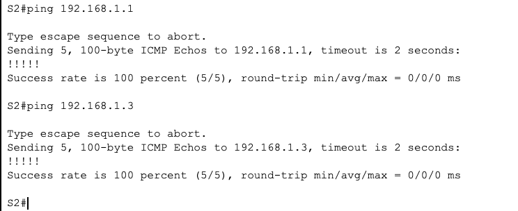
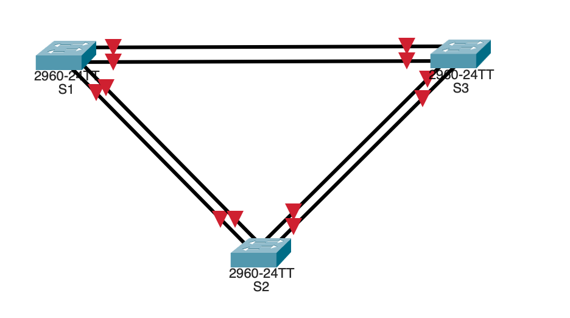
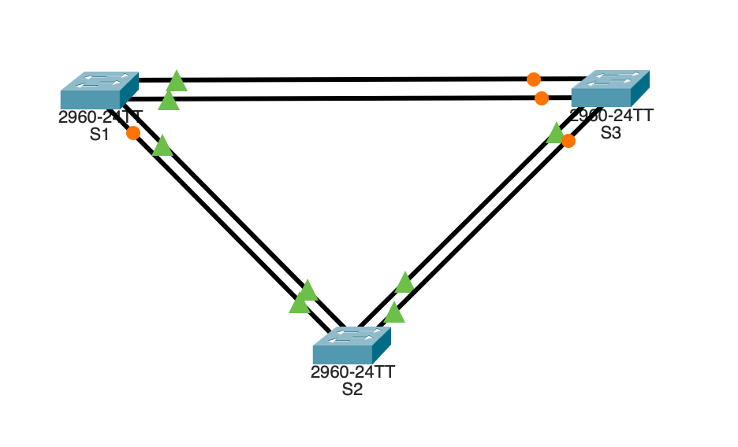
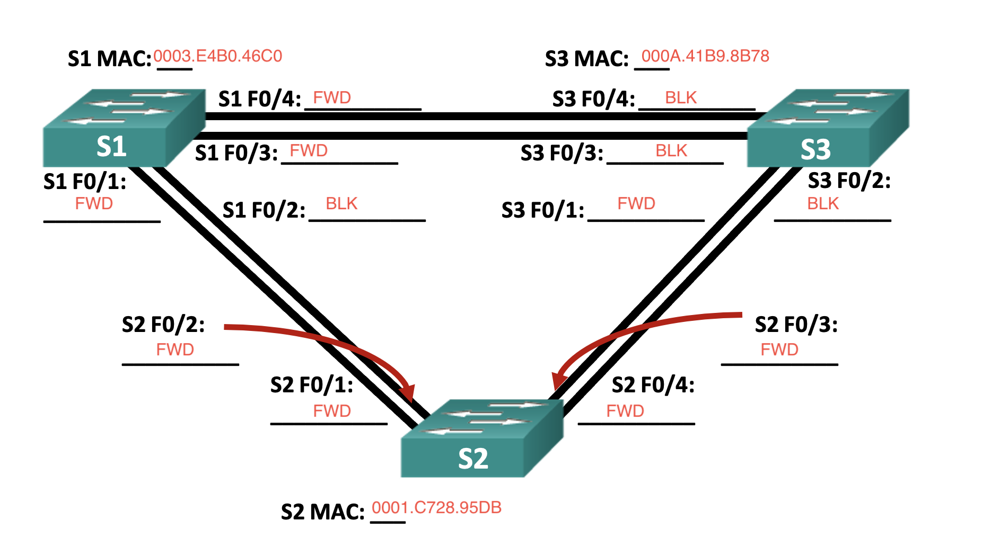
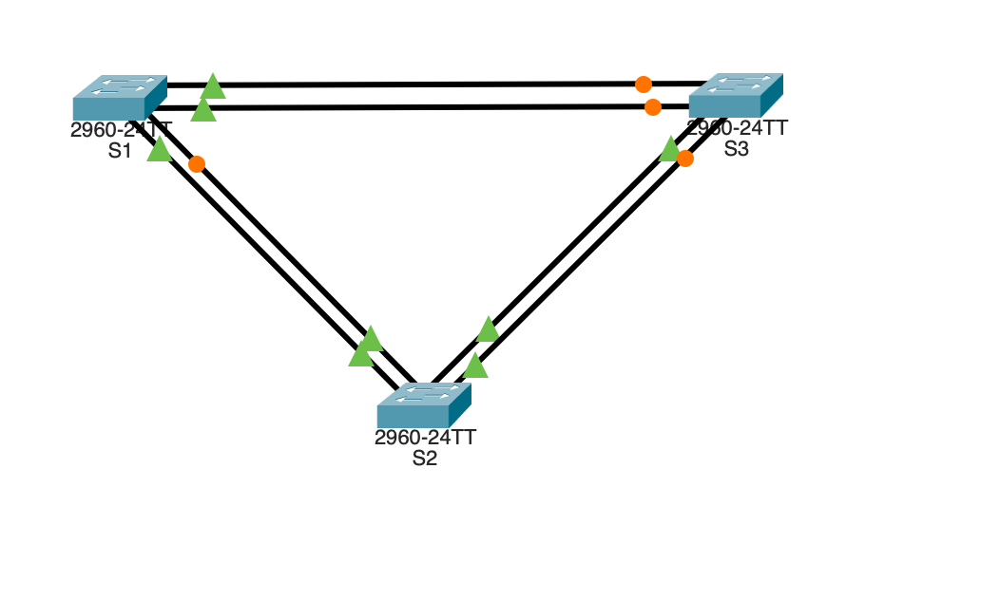
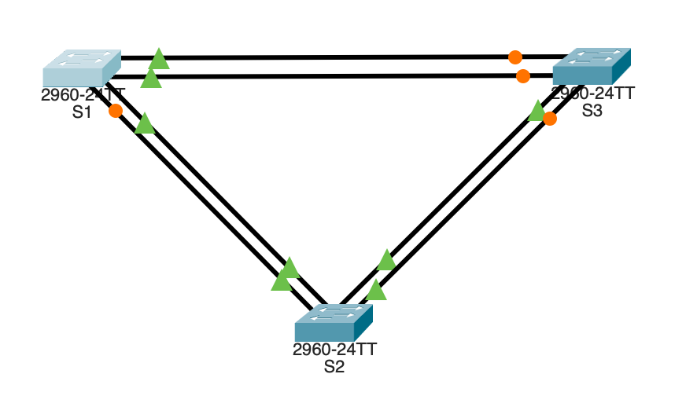

### Таблица адресации
| Устройство           |   Интерфейс     | 		IP-адрес        |   Маска подсети             | 	Шлюз по умолчанию     |
|:---------------------|:---------------:|:---------------------|:---------------------------:|:--------------------------|
|R1                    |G0/0/1.10        | 192.168.10.1         |  255.255.255.0              | -                         |
|                      |G0/0/1.20        | 192.168.20.1         |255.255.255.0                |                           |
|                      |G0/0/1.30        | 192.168.30.1         |255.255.255.0                |                           |
|                      |G0/0/1.1000      | ---                  |                             |                           |
|S1                    |VLAN 10          |   192.168.10.11      |  255.255.255.0              | 192.168.10.1              |
|S2                    |VLAN 10          |   192.168.10.12      |  255.255.255.0              | 192.168.10.1              |
|PC-B                  |NIC              |   192.168.20.3       |  255.255.255.0              | 192.168.20.1              |
|PC-A                  |NIC              |   192.168.20.3       |  255.255.255.0              | 192.168.30.1              |


### Таблица VLAN
| VLAN                 |   Имя           | 		Назначенный интерфейс        |
|:---------------------|:---------------:|:----------------------------------|
|10                    |Управление       | S1: VLAN 10; S2: VLAN 10          |
|20                    |Sales            | S1: F0/6                          |
|30                    |Operations       | S2: F0/18                         |
|999                   |Parking_Lot      | С1: F0/2-4, F0/7-24, G0/1-2       |
|                      |                 | С2: F0/2-17, F0/19-24, G0/1-2     |

### Задачи
+ Часть 1. Создание сети и настройка основных параметров устройства
+ Часть 2. Создание сетей VLAN и назначение портов коммутатора
+ Часть 3. Настройка транка 802.1Q между коммутаторами.
+ Часть 4. Настройка маршрутизации между сетями VLAN
+ Часть 5. Проверка, что маршрутизация между VLAN работает

### При первом подключении к устройствам, необходимо провести первоначальную настройку:

+ Задание паролей пользователя
+ Настройка ssh для подключения
+ Задания баннера


Сам перечень набора команд для R1:

```
en
conf t
hostname R1
banner motd ^The device is the property of the company, any unauthorized change to the configuration is punishable by law.^
ip domain-name otus.ru
no ip domain-lookup
enable secret class
username cisco secret class
service password-encryption 
crypto key generate rsa 
2048
ip ssh version 2
username admin privilege 15 secret Adm1nP@55
line vty 0
logging synchronous
exit
line vty 0 4 
login local
transport input ssh
exit
line vty 5 15
login local
transport input ssh
exit
security password min-length 14
exit
wr mem
```

Сам перечень набора команд для S1:

```
en
conf t
hostname S1
banner motd ^The device is the property of the company, any unauthorized change to the configuration is punishable by law.^
ip domain-name otus.ru
no ip domain-lookup
enable secret class
username cisco secret class
service password-encryption 
crypto key generate rsa 
2048
ip ssh version 2
username admin privilege 15 secret Adm1nP@55
line vty 0
logging synchronous
exit
line vty 0 4 
login local
transport input ssh
exit
line vty 5 15
login local
transport input ssh
exit
security password min-length 14
exit
wr mem
```

Сам перечень набора команд для S2:

```
en
conf t
hostname S1
banner motd ^The device is the property of the company, any unauthorized change to the configuration is punishable by law.^
ip domain-name otus.ru
no ip domain-lookup
enable secret class
username cisco secret class
service password-encryption 
crypto key generate rsa 
2048
ip ssh version 2
username admin privilege 15 secret Adm1nP@55
line vty 0
logging synchronous
exit
line vty 0 4 
login local
transport input ssh
exit
line vty 5 15
login local
transport input ssh
exit
security password min-length 14
exit
wr mem
```
Подключаем устройства согласно схеме.

Далее необходимо проверить работоспособность сетевой связанности со всеми узлами
Эхо-запрос от коммутатора S1 на коммутатор S3?


Эхо-запрос от коммутатора S1 на коммутатор S2?

Эхо-запрос от коммутатора S2 на коммутатор S3?

Далее на каждом коммутаторе необходимо отключить интерфейсы.
Ниже приведен примеер на коммутаторе S1:
```
S1# conf t
Enter configuration commands, one per line.  End with CNTL/Z.
S1(config)#int ran
S1(config)#int range fa
S1(config)#int range fastEthernet 0/1-24
S1(config-if-range)#shut
S1(config-if-range)#shutdown 
```


После чего необходимо настроить подключенные порты в качестве транков и включить порты F0/2 и F0/4 на всех коммутаторах.
Настройка транков осуществляется следующей командой

включение портов можно произвести командой:
```
no shutdown
```


Проверяем данные протокола на каждом коммутаторе

S1:
```
S1#show spanning-tree
VLAN0001
  Spanning tree enabled protocol ieee
  Root ID    Priority    32769
             Address     0001.C728.95DB
             Cost        19
             Port        1(FastEthernet0/1)
             Hello Time  2 sec  Max Age 20 sec  Forward Delay 15 sec

  Bridge ID  Priority    32769  (priority 32768 sys-id-ext 1)
             Address     0003.E4B0.46C0
             Hello Time  2 sec  Max Age 20 sec  Forward Delay 15 sec
             Aging Time  20

Interface        Role Sts Cost      Prio.Nbr Type
---------------- ---- --- --------- -------- --------------------------------
Fa0/1            Root FWD 19        128.1    P2p
Fa0/2            Altn BLK 19        128.2    P2p
Fa0/3            Desg FWD 19        128.3    P2p
Fa0/4            Desg FWD 19        128.4    P2p
```
S2:
```
S2#show spanning-tree
VLAN0001
  Spanning tree enabled protocol ieee
  Root ID    Priority    32769
             Address     0001.C728.95DB
             This bridge is the root
             Hello Time  2 sec  Max Age 20 sec  Forward Delay 15 sec

  Bridge ID  Priority    32769  (priority 32768 sys-id-ext 1)
             Address     0001.C728.95DB
             Hello Time  2 sec  Max Age 20 sec  Forward Delay 15 sec
             Aging Time  20

Interface        Role Sts Cost      Prio.Nbr Type
---------------- ---- --- --------- -------- --------------------------------
Fa0/1            Desg FWD 19        128.1    P2p
Fa0/2            Desg FWD 19        128.2    P2p
Fa0/3            Desg FWD 19        128.3    P2p
Fa0/4            Desg FWD 19        128.4    P2p

S2#
```
S3
```
S3#show spanning-tree
VLAN0001
  Spanning tree enabled protocol ieee
  Root ID    Priority    32769
             Address     0001.C728.95DB
             Cost        19
             Port        1(FastEthernet0/1)
             Hello Time  2 sec  Max Age 20 sec  Forward Delay 15 sec

  Bridge ID  Priority    32769  (priority 32768 sys-id-ext 1)
             Address     000A.41B9.8B78
             Hello Time  2 sec  Max Age 20 sec  Forward Delay 15 sec
             Aging Time  20

Interface        Role Sts Cost      Prio.Nbr Type
---------------- ---- --- --------- -------- --------------------------------
Fa0/1            Root FWD 19        128.1    P2p
Fa0/2            Altn BLK 19        128.2    P2p
Fa0/3            Altn BLK 19        128.3    P2p
Fa0/4            Altn BLK 19        128.4    P2p
```


Какой коммутатор является корневым мостом? 
Ответ:
S2
В логах указано:
Root ID    Priority    32769
...
Bridge ID  Priority    32769 
...
Fa0/1            Desg FWD 19        128.1    P2p
Fa0/2            Desg FWD 19        128.2    P2p
Fa0/3            Desg FWD 19        128.3    P2p
Fa0/4            Desg FWD 19        128.4    P2p

###Почему этот коммутатор был выбран протоколом spanning-tree в качестве корневого моста?
###Ответ:
Коммутатор оказался с самым низким значением MAC-адреса, стал корневым мостом
###Какие порты на коммутаторе являются корневыми портами? 
###Ответ:
Fa0/1            Root FWD 19        128.1    P2p
###Какие порты на коммутаторе являются назначенными портами? 
###ответ:
Fa0/3            Desg FWD 19        128.3    P2p
Fa0/4            Desg FWD 19        128.4    P2p
###Какой порт отображается в качестве альтернативного и в настоящее время заблокирован? 
###Ответ:
Fa0/2            Altn BLK 19        128.2    P2p


###Почему протокол spanning-tree выбрал этот порт в качестве невыделенного (заблокированного) порта?
###Ответ
Порт получил более хороший (приоритетный) BPDU (Bridge Protocol Data Unit), чем тот, который он мог бы отправить сам.
Т.е. простыми словами: Fa0/2 проиграл выборы другому порту в том же сегменте сети.

Далее необходимо изменить стоимость порта.

```
S1(config)#int
S1(config)#interface fas
S1(config)#interface fastEthernet 0/2
S1(config-if)#spanning-tree vlan 1 cost 15
S1(config-if)#no spanning-tree vlan 1 cost 15
S1(config-if)#spanning-tree vlan 1 cost 15
S1(config-if)#end
S1#
%SYS-5-CONFIG_I: Configured from console by console
sh
S1#show spa
S1#show spanning-tree 
VLAN0001
  Spanning tree enabled protocol ieee
  Root ID    Priority    32769
             Address     0001.C728.95DB
             Cost        15
             Port        2(FastEthernet0/2)
             Hello Time  2 sec  Max Age 20 sec  Forward Delay 15 sec

  Bridge ID  Priority    32769  (priority 32768 sys-id-ext 1)
             Address     0003.E4B0.46C0
             Hello Time  2 sec  Max Age 20 sec  Forward Delay 15 sec
             Aging Time  20

Interface        Role Sts Cost      Prio.Nbr Type
---------------- ---- --- --------- -------- --------------------------------
Fa0/1            Altn BLK 19        128.1    P2p
Fa0/2            Root LSN 15        128.2    P2p
Fa0/3            Desg FWD 19        128.3    P2p
Fa0/4            Desg FWD 19        128.4    P2p

S1#
```


После чего необходимо убрать изменения стоимости порта
```
S1(config)#interface fa
S1(config)#interface fastEthernet 0/1
S1(config-if)#no sp
S1(config-if)#no spa
S1(config-if)#no spanning-tree vlan 1 cost 15
S1(config-if)#end
```



