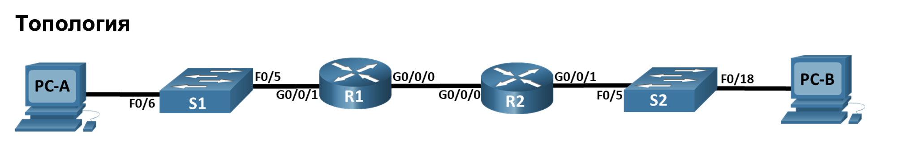
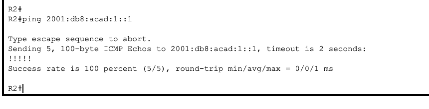
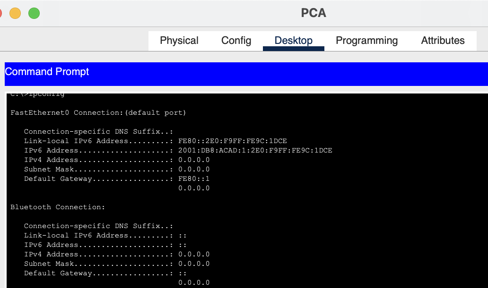
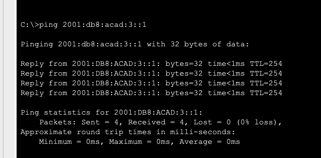

### Таблица адресации
| Устройство           |   Интерфейс     | 		IPv6-адрес      |   
|:---------------------|:---------------:|:---------------------|
|R1                    |G0/0/0           | 2001:db8:acad:2::1/64|  
|                      |                 | fe80::1              |
|                      |G0/0/1           | 2001:db8:acad:1::1/64|
|                      |                 | fe80::1              |
|R2                    |G0/0/0           | 2001:db8:acad:2::2/64|                                                
|                      |                 |fe80::2               |
|                      |G0/0/1           |2001:db8:acad:3::1/64 |  
|                      |                 |fe80::1               | 
|PC-B                  |NIC              |DHCP                  |  
|PC-A                  |NIC              |DHCP                  |  


### Задачи
+ Часть 1. Создание сети и настройка основных параметров устройства
+ Часть 2. Проверка назначения адреса SLAAC от R1
+ Часть 3. Настройка и проверка сервера DHCPv6 без гражданства на R1
+ Часть 4. Настройка и проверка состояния DHCPv6 сервера на R1
+ Часть 5. Настройка и проверка DHCPv6 Relay на R2

### При первом подключении к устройствам, необходимо провести первоначальную настройку на всех сетевых устройствах:

+ Задание паролей пользователя
+ Настройка ssh для подключения
+ Задания баннера


Сам перечень набора команд для R1:

```
en
conf t
hostname R1
banner motd ^The device is the property of the company, any unauthorized change to the configuration is punishable by law.^
ip domain-name otus.ru
no ip domain-lookup
enable secret class
username cisco secret class
service password-encryption 
crypto key generate rsa 
2048
ip ssh version 2
username admin privilege 15 secret Adm1nP@55
line vty 0
logging synchronous
exit
line vty 0 4 
login local
transport input ssh
exit
line vty 5 15
login local
transport input ssh
exit
security password min-length 14
exit
wr mem
```

Сам перечень набора команд для R2:

```
en
conf t
hostname R2
banner motd ^The device is the property of the company, any unauthorized change to the configuration is punishable by law.^
ip domain-name otus.ru
no ip domain-lookup
enable secret class
username cisco secret class
service password-encryption 
crypto key generate rsa 
2048
ip ssh version 2
username admin privilege 15 secret Adm1nP@55
line vty 0
logging synchronous
exit
line vty 0 4 
login local
transport input ssh
exit
line vty 5 15
login local
transport input ssh
exit
security password min-length 14
exit
wr mem
```

Сам перечень набора команд для S1:

```
en
conf t
hostname S1
banner motd ^The device is the property of the company, any unauthorized change to the configuration is punishable by law.^
ip domain-name otus.ru
no ip domain-lookup
enable secret class
username cisco secret class
service password-encryption 
crypto key generate rsa 
2048
ip ssh version 2
username admin privilege 15 secret Adm1nP@55
line vty 0
logging synchronous
exit
line vty 0 4 
login local
transport input ssh
exit
line vty 5 15
login local
transport input ssh
exit
security password min-length 14
exit
wr mem
```

Сам перечень набора команд для S2:

```
en
conf t
hostname S2
banner motd ^The device is the property of the company, any unauthorized change to the configuration is punishable by law.^
ip domain-name otus.ru
no ip domain-lookup
enable secret class
username cisco secret class
service password-encryption 
crypto key generate rsa 
2048
ip ssh version 2
username admin privilege 15 secret Adm1nP@55
line vty 0
logging synchronous
exit
line vty 0 4 
login local
transport input ssh
exit
line vty 5 15
login local
transport input ssh
exit
security password min-length 14
exit
wr mem
```
Далее необходимо настроить на маршрутизаторе R1 согласно таблице ip6 адрес на интерфейсе и задать маршрут по умолчению:

```
R1#conf t
Enter configuration commands, one per line.  End with CNTL/Z.
R1(config)#ipv6 ?
  access-list      Configure access lists
  cef              Cisco Express Forwarding
  dhcp             Configure Ipv6 DHCP
  general-prefix   Configure a general IPv6 prefix
  host             Configure static hostnames
  inspect          Context-based Access Control Engine
  local            Specify local options
  nat              NAT-PT Configuration commands
  neighbor         Neighbor
  route            Configure static routes
  router           Enable an IPV6 routing process
  unicast-routing  Enable unicast routing
R1(config)#ipv6 un
R1(config)#ipv6 unicast-routing 
R1(config)#int giga0/0/0
R1(config-if)#ipv6 add
R1(config-if)#ipv6 address 2001:db8:acad:2::1/64
R1(config-if)#ipv6 add
R1(config-if)#ipv6 address fe80::1 link-local
R1(config-if)#no shu
R1(config-if)#no shutdown 

R1(config-if)#
%LINK-5-CHANGED: Interface GigabitEthernet0/0/0, changed state to up

R1(config-if)#exit
R1(config)#int
R1(config)#interface gi
R1(config)#interface gigabitEthernet 0/0/1
R1(config-if)#ipv6 add
R1(config-if)#ipv6 address 2001:db8:acad:1::1/64
R1(config-if)#ipv6 address fe80::1 link-local
R1(config-if)#no shu
R1(config-if)#no shutdown 

R1(config-if)#
%LINK-5-CHANGED: Interface GigabitEthernet0/0/1, changed state to up

%LINEPROTO-5-UPDOWN: Line protocol on Interface GigabitEthernet0/0/1, changed state to up

R1(config-if)#exit
R1(config)#ipv6 ?
  access-list      Configure access lists
  cef              Cisco Express Forwarding
  dhcp             Configure Ipv6 DHCP
  general-prefix   Configure a general IPv6 prefix
  host             Configure static hostnames
  inspect          Context-based Access Control Engine
  local            Specify local options
  nat              NAT-PT Configuration commands
  neighbor         Neighbor
  route            Configure static routes
  router           Enable an IPV6 routing process
  unicast-routing  Enable unicast routing
R1(config)#ipv6 r
R1(config)#ipv6 ro
R1(config)#ipv6 rou
R1(config)#ipv6 route ::/0 2001:db8:acad:2::2
R1(config)#do wr mem
Building configuration...
[OK]
```

По аналогии настраиваем маршрутизатор R2:

```
ipv6 unicast-routing
interface g0/0/0
ipv6 address 2001:db8:acad:2::2/64
ipv6 address fe80::2 link-local
no shutdown
exit
interface g0/0/1
ipv6 address 2001:db8:acad:3::1/64
ipv6 address fe80::1 link-local
no shutdown
exit
ipv6 route ::/0 2001:db8:acad:2::1
```

Проверяем сетевую связанность с R1:




Проверяем SLAAC:



Как видно на PC-A был назначен ipv6 адрес используя информацию, полученную от маршрутизатора R1

### Шаг 2. Настройте R1 для предоставления DHCPv6 без состояния для PC-A

Для этого необходимо задать имя пула DHCP и прописать доменное имя и диапазон адресов исходя из маски:
Настройки будем проводить на R1:

```
R1#conf t
Enter configuration commands, one per line.  End with CNTL/Z.
R1(config)#ipv6
R1(config)#ipv6 dh
R1(config)#ipv6 dhcp poo
R1(config)#ipv6 dhcp pool R1-STATELESS
R1(config-dhcpv6)#?
  address            IPv6 address allocation
  dns-server         DNS servers
  domain-name        Domain name to complete unqualified host names
  exit               Exit from DHCPv6 configuration mode
  no                 Negate a command or set its defaults
  prefix-delegation  IPv6 prefix delegation
R1(config-dhcpv6)#dn
R1(config-dhcpv6)#dns-server 2001:db8:acad::254
R1(config-dhcpv6)#dom
R1(config-dhcpv6)#domain-name STATELESS.com
R1(config-dhcpv6)#exit
R1(config)#int
R1(config)#interface gig
R1(config)#interface gigabitEthernet 0/0/1
R1(config-if)#ipv6 ?
  address          Configure IPv6 address on interface
  authentication   authentication subcommands
  crypto           Encryption/Decryption commands
  dhcp             IPv6 DHCP interface subcommands
  eigrp            Configure EIGRP IPv6 on interface
  enable           Enable IPv6 on interface
  flow             NetFlow Related commands
  hello-interval   Configures IP-EIGRP hello interval
  inspect          Apply inspect name
  mtu              Set IPv6 Maximum Transmission Unit
  nat              Enable IPv6 NAT on interface
  nd               IPv6 interface Neighbor Discovery subcommands
  ospf             OSPF interface commands
  rip              Configure RIP routing protocol
  summary-address  Summary prefix
  traffic-filter   Access control list for packets
  unnumbered       Preferred interface for source address selection
R1(config-if)#ipv6 n
R1(config-if)#ipv6 nd
R1(config-if)#ipv6 nd ?
  managed-config-flag  Hosts should use DHCP for address config
  other-config-flag    Other stateful configuration flag
  ra                   Router Advertisement control
R1(config-if)#ipv6 nd ot
R1(config-if)#ipv6 nd other-config-flag 
R1(config-if)#ipv6 dh
R1(config-if)#ipv6 ?
  address          Configure IPv6 address on interface
  authentication   authentication subcommands
  crypto           Encryption/Decryption commands
  dhcp             IPv6 DHCP interface subcommands
  eigrp            Configure EIGRP IPv6 on interface
  enable           Enable IPv6 on interface
  flow             NetFlow Related commands
  hello-interval   Configures IP-EIGRP hello interval
  inspect          Apply inspect name
  mtu              Set IPv6 Maximum Transmission Unit
  nat              Enable IPv6 NAT on interface
  nd               IPv6 interface Neighbor Discovery subcommands
  ospf             OSPF interface commands
  rip              Configure RIP routing protocol
  summary-address  Summary prefix
  traffic-filter   Access control list for packets
  unnumbered       Preferred interface for source address selection
R1(config-if)#ipv6 dh
R1(config-if)#ipv6 dhcp ?
  client  Act as an IPv6 DHCP client
  server  Act as an IPv6 DHCP server
R1(config-if)#ipv6 dhcp se
R1(config-if)#ipv6 dhcp server ?
  WORD  Name of IPv6 DHCP pool
R1(config-if)#ipv6 dhcp server R1-STATELESS
R1(config-if)#do wr mem
Building configuration...
[OK]
R1(config-if)#end
R1#
```
После чего проверяем сетевую связанность с PC-A:



Далее настраивам Stateful DHCPv6 на R1 (для R2):

```
R1#
R1#conf t
Enter configuration commands, one per line.  End with CNTL/Z.
R1(config)#ipv6 dh
R1(config)#ipv6 dhcp pool R2-STATEFUL
R1(config-dhcpv6)#app
R1(config-dhcpv6)#dd
R1(config-dhcpv6)#add
R1(config-dhcpv6)#address ?
  prefix  IPv6 address allocation prefix
R1(config-dhcpv6)#address pre
R1(config-dhcpv6)#address prefix 2001:db8:acad:3:aaa::/80
R1(config-dhcpv6)#dn
R1(config-dhcpv6)#dns-server 2001:db8:acad::254
R1(config-dhcpv6)#domain-name STATEFUL.com
R1(config-dhcpv6)#exit
R1(config)#interface g0/0/0
R1(config-if)#ipv6 dhcp server R2-STATEFUL
R1(config-if)#exit
R1(config)#
```
### Настройка DHCPv6 Relay на R2:

```
configure terminal
interface g0/0/1
ipv6 nd managed-config-flag
ipv6 dhcp relay destination 2001:db8:acad:2::1 g0/0/0
exit
end
```


